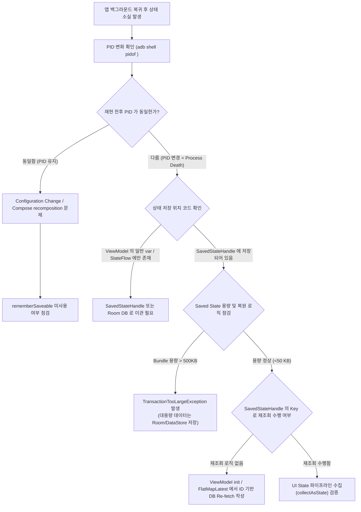

## process death 뒤 화면 상태가 사라진다

### 1. 증상 및 징후 (Symptoms & Diagnostic Signals)

다음 중 하나 이상이 관찰된다.

- 사용자가 앱을 백그라운드로 보낸 뒤 다른 앱을 사용하거나 화면을 끄고 일정 시간이 지나 돌아왔을 때, 폼 입력 내용, 스크롤 위치, 탭 선택 상태, 딥링크 이동 경로가 초기화되어 첫 화면(또는 초기 상태)으로 돌아간다.
- 화면 회전(Configuration Change) 시에는 상태가 유지되지만, 백그라운드에서 오랜 시간 지난 후 재진입 시에는 상태가 파괴된다.
- 앱 재진입 시 화면이 순간적으로 하얗게 깜빡이며 이전 화면 데이터를 불러오지 못하고 빈 화면(Empty View)이 표시되거나, `TransactionTooLargeException` 크래시가 발생한다.

---

### 2. 재현 조건 및 환경 격리 (Reproduction & Isolation)

- **Configuration Change vs True Process Death 명확한 구분**:
  - **Configuration Change (설정 변경)**: 화면 회전, 다크모드 전환, 언어 변경. Activity 는 파괴되지만 `ViewModel` 및 메모리 인스턴스는 그대로 유지됨.
  - **Process Death (프로세스 사멸)**: 메모리 압박(Low Memory Killer, LMK)으로 인해 OS 가 백그라운드 프로세스를 강제 종료. Activity 및 `ViewModel` 을 포함한 프로세스 내 모든 인스턴스가 파괴됨.
- **재현 도구의 올바른 선택**:
  - **"활동 유지 안함" (Don't keep activities)**: 개발자 옵션의 이 기능은 화면을 벗어나는 즉시 Activity 만 파괴하고 프로세스는 남겨둔다. Configuration Change 복구 로직 검증에는 유용하나, **진짜 Process Death 재현 도구가 아니다**.
  - **`adb shell am kill <package>`**: 백그라운드에 있는 앱 프로세스만 안전하게 킬(Kill)하여 OS 의 LMK 동작을 100% 동일하게 시뮬레이션한다. (주의: `am force-stop` 은 저장된 state Bundle 까지 전부 삭제하므로 Process Death 재현에 사용하면 안 된다).
- **PID(Process ID) 검증 필수**:
  - 재현 전후로 `adb shell pidof <package>` 를 실행하여 PID 가 변경되었는지 반드시 확인한다. PID 가 달라졌다면 Process Death 가 성공적으로 재현된 것이다.

---

### 3. 실패 경계 및 원인 우선순위 (Failure Boundaries & Priority)

1. **상태가 `ViewModel` 메모리 프로퍼티에만 존재함 (우선순위 1)**
   - 가장 흔한 원인. `ViewModel` 은 Configuration Change 동안은 인스턴스가 유지되지만, Process Death 시 프로세스와 함께 파괴되므로 `SavedStateHandle` 이나 영속 DB 저장이 없으면 초기화됨.
2. **상태가 `rememberSaveable` 또는 `SavedStateHandle` 로 감싸지지 않은 일반 변수임 (우선순위 2)**
   - 화면 구성 요소에 단순 `remember { mutableStateOf(...) }` 로 선언된 경우. Configuration Change 에서조차 상태가 소실됨.
3. **`SavedStateHandle` 에 ID/식별자는 저장되었으나, 복원 시점에 데이터를 재조회하는 로직이 없음 (우선순위 3)**
   - `SavedStateHandle` 에 `itemId` 는 정상적으로 복원되었으나, Activity/Fragment/ViewModel 이 재생성될 때 해당 `itemId` 로 Repository/Room DB 를 조회하여 화면 UI State 로 맵핑하는 Flow 래더가 빠져 있음.
4. **Saved State Bundle 크기 초과 (`TransactionTooLargeException`) (우선순위 4)**
   - `SavedStateHandle` 이나 `onSaveInstanceState` Bundle 에 거대한 리스트 데이터, Bitmap, 대용량 Parcelable 객체를 직렬화하여 넣어 OS Binder 전송 제한 용량(~500KB)을 초과함.
5. **백그라운드 비동기 작업이 `viewModelScope` 에 결합되어 파괴됨 (우선순위 5)**
   - 화면 상태 소실과 함께 실행 중이던 데이터 업로드/다운로드 태스크가 취소됨. 백그라운드 태스크는 `WorkManager` 로 분리해야 함 ([Worked Example 05](../worked-examples/05-process-death-recovery-of-edit-state-and-background-work.md) 참고).

---

### 4. 진단 의사결정 흐름도 (Diagnostic Decision Flowchart)



---

### 5. 단계별 조사 절차 및 CLI 검증 (Step-by-Step CLI Investigation)

#### 1단계: PID 추적으로 Process Death 발생 여부 확정
```bash
# 1. 앱을 연 상태에서 PID 확인
adb shell pidof com.example.app
# 출력 예: 15820

# 2. Home 버튼을 눌러 앱을 백그라운드로 전환 후 Process Kill 시뮬레이션
adb shell am kill com.example.app

# 3. 앱 아이콘을 다시 탭하여 복귀 후 PID 재확인
adb shell pidof com.example.app
# 출력 예: 16104 (PID 가 변경되었으므로 Process Death 복구 경로 작동 확인)
```

#### 2단계: ApplicationExitInfo 를 이용한 LMK / Process Death 원인 시스템 조회 (Android 11+)
```bash
adb shell dumpsys activity exit-info com.example.app
```
*출력 예시:*
```text
ApplicationExitInfo #0:
  timestamp=2026-08-04 15:50:12
  pid=15820 realUid=10182 package=com.example.app
  reason=3 (LOW_MEMORY)
  subreason=0 (SUBREASON_UNKNOWN)
  status=0
  description=lmk
```
- `reason=3 (LOW_MEMORY)`: LMK 에 의한 정지.
- `reason=13 (FREEZER)`: Android 14+ Cached Apps Freezer 에 의한 동결 후 파괴.

#### 3단계: Activity 및 Process oom_adj 상태 확인
앱이 백그라운드로 이동할 때 `oom_adj` 스코어가 `CACHED_APP` (900 이상)으로 올라가는지 확인한다.
```bash
adb shell dumpsys activity processes com.example.app | grep -E "procState|adj"
```

#### 4단계: 개발자 옵션 "Don't Keep Activities" CLI 로 토글하여 빠른 검증
```bash
# Don't keep activities 활성화 (1 = true, 0 = false)
adb shell settings put global always_finish_activities 1

# 검증 후 반드시 0 으로 복구
adb shell settings put global always_finish_activities 0
```

---

### 6. 성공 / 실패 판정 신호 기준표 (Signal Criteria Matrix)

| 진단 항목 / 상태 | 정상 기준 (Success Criteria) | 실패 기준 (Failure Criteria) | 주 원인 및 즉시 조치 (Action Boundary) |
| :--- | :--- | :--- | :--- |
| **PID 변경 후 UI 상태** | 입력 텍스트, 선택 탭, 스크롤 위치 100% 복원 | 초기 빈 화면, 첫 화면으로 이탈, 텍스트 초기화 | UI 컴포넌트에 `rememberSaveable`, ViewModel 에 `SavedStateHandle` 적용 |
| **SavedStateHandle 용량** | Bundle 총 크기 < 50KB | Bundle 크기 > 500KB (또는 `TransactionTooLargeException`) | 대용량 객체 직렬화 중단. ID/Key 식별자만 Bundle 에 저장하고 실제 데이터는 Room/DataStore 저장 |
| **Process Death 후 비동기 작업** | 작업이 중단되지 않고 영속 백그라운드에서 완료 | 프로세스 사망과 함께 업로드/다운로드 태스크 취소됨 | UI ViewModelScope 비동기 작업을 `WorkManager` 파이프라인으로 분리 |
| **복원 데이터 조회** | ID 기반 DB/Repository Re-fetch 자동 트리거 | `SavedStateHandle` 값은 존재하나 UI State 업데이트 없음 | `SavedStateHandle.getStateFlow()` 기반 `flatMapLatest` DB 반응형 쿼리 연결 |

---

### 7. OS / API (Android 14 / 15 / 16) 특화 제약 및 진단 신호

- **Android 14 (API 34)**:
  - **Cached Apps Freezer 강화 (`REASON_FREEZER`)**: 백그라운드로 이동한 앱은 수 초 내에 프로세스가 동결(Frozen)되어 CPU 타임을 전혀 얻지 못함. 이 상태에서 LMK 에 의해 사멸할 경우 `onDestroy` 나 저장 콜백이 일체 실행되지 않으므로, 모든 UI 상태 저장은 화면을 떠나는 시점이 아니라 **상태 변경 즉시(Real-time)** `SavedStateHandle` 및 DB 에 쓰여야 함.
  - **Saved State 용량 가이드라인**: OS 차원에서 Binder 버퍼 타이트 관리가 적용되어 `onSaveInstanceState()` 에 과도한 Bundle 을 담으면 세션 복구 실패율이 급증함.
- **Android 15 (API 35)**:
  - **Predictive Back (예측 뒤로 가기) 상태 보존**: 예측 뒤로 가기 제스처 중 Activity 파괴 및 복구 애니메이션 시 상태 손실이 발생하지 않도록 `OnBackPressedCallback` 과 `SavedStateHandle` 의 동기화 보장 필수.
- **Android 16 (API 36)**:
  - **Desktop / Multi-Window 모드 동적 창 리사이징**: 태블릿 및 ChromeOS 환경에서 창 크기 조절 시 프로세스 사망에 준하는 화면 파괴/재생성이 빈번하게 발생하므로 `rememberSaveable` 및 `SavedStateHandle` 적용 검증이 더욱 중요해짐.

---

### 8. 다음 조사 경로 (Next Investigation Paths)

- 화면 상태 소실 외에 백그라운드 데이터 처리 작업까지 함께 끊기거나 취소된 경우 → [background delay runbook](05-background-work-delayed-or-not-running.md) 로 이동.
- 특정 기기나 OEM 제조사 환경에서만 LMK 백그라운드 프로세스 사멸이 유독 극심하게 보고되는 경우 → Android Vitals 현장 분포 및 OEM 킬러 정책 확인 ([Learning Spine 11장](../learning-spine/11-observation-testing-and-quality-feedback.md)).
- Process Death 복구 코드 구현 패턴의 완전한 레퍼런스가 필요한 경우 → [Worked Example 05](../worked-examples/05-process-death-recovery-of-edit-state-and-background-work.md) 의 상세 가이드 확인.

---

### 9. 관련 자료 및 연결 노트 (Related Notes & Worked Examples)

- [Worked Example: process death 뒤 편집 상태와 background work 복구](../worked-examples/05-process-death-recovery-of-edit-state-and-background-work.md)
- [ViewModel은 설정 변경 동안 유지되지만 프로세스 사망 복원은 보장하지 않는다](../../02_app_framework/architecture/state-management/viewmodel/viewmodel-survives-configuration-change-not-process-death.md)
- [SavedStateHandle은 프로세스 사망 후 복원해야 하는 작은 상태에 사용한다](../../02_app_framework/architecture/state-management/viewmodel/savedstatehandle-restores-small-process-death-state.md)
- [프로세스 종료 복구에는 saved state와 영속 source of truth가 필요하다](../../02_app_framework/architecture/app-components/app-component-contracts/process-death-recovery-needs-saved-state-and-persistent-source-of-truth.md)
- [Learning Spine 5장 화면, 프로세스, task와 사용자 상태는 독립적인 lifetime을 가진다](../learning-spine/05-independent-lifetimes-of-screen-process-task-and-state.md)

---

### 10. 공식 근거 (Official References)

- [Activity state changes (Android Developers)](https://developer.android.com/guide/components/activities/state-changes)
- [Save UI states (Android Developers)](https://developer.android.com/topic/libraries/architecture/saving-states)

검증일: 2026-08-04. `am kill` 과 `am force-stop` 의 차이점, `pidof` 검증 절차, ApplicationExitInfo LMK/Freezer 사유 조회 및 Android 14/15/16 Cached Apps Freezer 동작은 공식 문서 및 테스트 환경 CLI 를 통해 검증 완료함.
