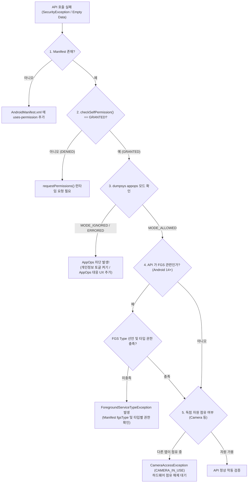

## 권한이 있는데도 API 가 실패하거나 거부된다

### 1. 증상 및 징후 (Symptoms & Diagnostic Signals)

다음 중 하나 이상이 관찰된다.

- 앱이 런타임 권한(Runtime Permission)을 요청하여 사용자가 다이얼로그에서 "허용"을 선택했거나 설정에서 승인했음에도 불구하고, 해당 API(카메라, 위치, 알림, 미디어 접근 등) 호출 시 `SecurityException` 이 발생한다.
- 예외는 발생하지 않지만 API 가 조용히 실패하거나 빈 데이터(empty list, null location)를 반환한다.
- 위치 권한을 허용했음에도 `Location.getAccuracy()` 값이 현격히 저하된 대략적 위치만 수신된다.
- Android 14+ 기기에서 Foreground Service 시작 시 `ForegroundServiceTypeException` 또는 `SecurityException` 이 발생하며 서비스가 정지된다.

---

### 2. 재현 조건 및 환경 격리 (Reproduction & Isolation)

- **Foreground vs Background 실행 맥락 분리**:
  - 해당 API 호출이 앱이 전면(Foreground)에 떠 있을 때 발생하는지, 백그라운드 서비스/작업 중 발생하는지 구분한다. (예: 위치 권한은 Foreground 와 Background 허용 단계가 나뉘어 있음).
- **관련 게이트(Gate) 독립적 확인**:
  - 코드로 확인하는 `checkSelfPermission()` 상태, Android 설정 앱의 권한 화면 표시 상태, 그리고 CLI 로 조회하는 AppOps 실제 모드가 일치하는지 비교한다.
- **테스트 기기의 시나리오 상태 스크린샷 수집**:
  - 설정 → 앱 → 권한 화면의 스크린샷과 `adb shell dumpsys package` / `appops` 출력을 대조하여 사용자 설정과 시스템 내부 게이트의 불일치를 찾아낸다.

---

### 3. 실패 경계 및 원인 우선순위 (Failure Boundaries & Priority)

권한 허용 상태임에도 API 가 거부되는 실패 원인은 서로 독립적인 여러 게이트(Security Gates) 중 하나가 막힌 것이다. 다음 순서로 원인을 분리한다.

1. **Manifest 선언 누락 (우선순위 1)**
   - `AndroidManifest.xml` 에 `<uses-permission>` 이 누락된 경우. 런타임에 권한을 요청해도 다이얼로그 없이 즉시 거부(`PERMISSION_DENIED`) 처리됨.
2. **Runtime Grant 상태 미승인 (우선순위 2)**
   - 매니페스트 선언은 있으나 사용자가 거부했거나 아직 동적으로 요청하지 않음.
3. **분할 권한 / 세분화 권한 단계를 충족하지 못함 (우선순위 3)**
   - 위치: 정밀 위치(`ACCESS_FINE_LOCATION`) vs 대략 위치(`ACCESS_COARSE_LOCATION`), 전면 vs 백그라운드(`ACCESS_BACKGROUND_LOCATION`).
   - 미디어: Android 14+ 사진 접근 선택권(`READ_MEDIA_VISUAL_USER_SELECTED`) vs 전체 미디어 접근.
4. **AppOps 실행 시점 게이트 거부 (`MODE_IGNORED` / `MODE_ERRORED`) (우선순위 4)**
   - Permission 은 `granted=true` 이지만, 사용자가 개인정보 보호 설정(토글 버튼)에서 카메라/마이크/위치를 껐거나, 백그라운드 센서 접근을 시스템이 차단한 경우. 예외 없이 조용히 빈 값을 반환하거나 실패함.
5. **Foreground Service (FGS) Type 및 권한 부합 실패 (Android 14+) (우선순위 5)**
   - `AndroidManifest.xml` 에 `android:foregroundServiceType="camera|location|…"` 선언 및 해당 타입에 필요한 특정 권한이 결합되지 않은 상태에서 `startForeground()` 를 호출함.
6. **독점 하드웨어 자원 점유 (우선순위 6)**
   - 카메라 등 독점 자원을 다른 앱(또는 다른 프로세스)이 이미 오픈하여 점유 중인 경우. 권한 문제처럼 보이지만 `CameraAccessException.CAMERA_IN_USE` 하드웨어 점유 문제임 ([Worked Example 02](../worked-examples/02-photo-capture-preview-save-upload.md) 참고).
7. **Background Activity Launch (BAL) 제약 또는 Component Exported 미선언 (우선순위 7)**
   - 백그라운드에서 `PendingIntent` 로 Activity 를 띄우려다 시스템에 의해 거부되거나, `exported=false` 인 타 앱 컴포넌트를 호출하려다 거부됨.

---

### 4. 진단 의사결정 흐름도 (Diagnostic Decision Flowchart)



---

### 5. 단계별 조사 절차 및 CLI 검증 (Step-by-Step CLI Investigation)

#### 1 단계: Manifest 및 Runtime Permission 획득 상태 조회
```bash
adb shell dumpsys package com.example.app | grep -A12 "runtime permissions:"
```

*출력 예시:*

```text
runtime permissions:
  android.permission.CAMERA: granted=true, flags=[ USER_SET|GRANTED_BY_DEFAULT ]
  android.permission.ACCESS_FINE_LOCATION: granted=false, flags=[ USER_SET ]
  android.permission.ACCESS_COARSE_LOCATION: granted=true, flags=[ USER_SET ]
```
- `granted=true/false` 여부와 미디어/위치 관련 분할 권한들이 각각 어떻게 설정되어 있는지 수집한다.

#### 2 단계: AppOps 모드 정밀 조회 (modern `cmd appops` 및 `dumpsys appops`)

Permission 이 `granted=true` 임에도 작동하지 않을 때는 AppOps 게이트를 반드시 조회한다.

```bash
# 특정 AppOp 상태 조회 (예: CAMERA, COARSE_LOCATION, FINE_LOCATION, READ_CLIPBOARD)
adb shell cmd appops get com.example.app CAMERA
```

*출력 예시:*

```text
Uid 10182: op CAMERA: mode=ignore; time=+2m10s ago
```
- `mode=allow`: 정상 실행 승인.
- `mode=ignore`: 예외 없이 실행을 조용히 무시함 (빈 데이터 반환).
- `mode=deny` / `errored`: `SecurityException` 발생.

#### 3 단계: CLI 로 AppOps 모드를 강제 변경하여 원인 격리 테스트
```bash
# AppOps 모드를 allow / ignore / deny 로 변경하며 테스트
adb shell cmd appops set com.example.app CAMERA ignore
adb shell cmd appops set com.example.app CAMERA allow
```

#### 4 단계: CLI 로 Runtime Permission 강제 부여 / 철회 테스트
```bash
adb shell pm grant com.example.app android.permission.CAMERA
adb shell pm revoke com.example.app android.permission.CAMERA
```

#### 5 단계: 카메라/음향 등 독점 하드웨어 자원 점유 상태 점검
```bash
adb shell dumpsys media.camera
```

`Active Camera Clients` 섹션에서 타 패키지(예: `com.android.camera`)가 카메라 디바이스 세션을 점유하고 있는지 확인한다.

---

### 6. 성공 / 실패 판정 신호 기준표 (Signal Criteria Matrix)

| 진단 항목 / 게이트 | 정상 기준 (Success Criteria) | 실패 기준 (Failure Criteria) | 주 원인 및 즉시 조치 (Action Boundary) |
| :--- | :--- | :--- | :--- |
| **Manifest Declaration** | `<uses-permission>` 선언됨 | Manifest 누락 | `AndroidManifest.xml` 내 해당 권한 태그 선언 |
| **checkSelfPermission()** | `PERMISSION_GRANTED` (0) | `PERMISSION_DENIED` (-1) | `ActivityResultLauncher` 기반 런타임 권한 승인 요청 |
| **AppOps Mode** | `mode=allow` | `mode=ignore` 또는 `mode=errored` | 사용자가 센서 토글을 껐거나 백그라운드 정책 차단. `AppOpsManager.unsafeCheckOpNoThrow()` 후 사용자 안내 팝업 띄움 |
| **Android 14+ FGS Type** | Manifest fgsType 선언 & 타입 권한 충족 | `ForegroundServiceTypeException` | FGS 타입별 런타임 권한(예: `FOREGROUND_SERVICE_CAMERA`) 선언 및 획득 확인 |
| **Camera Hardware State** | Client count = 1 (내 앱) | `CAMERA_IN_USE` (Client count > 1) | `CameraDevice.StateCallback` 가용성 콜백 수신 후 디바이스 오픈 조치 ([Worked Example 06](../worked-examples/06-permission-granted-but-api-fails.md)) |

---

### 7. OS / API (Android 14 / 15 / 16) 특화 제약 및 진단 신호

- **Android 14 (API 34)**:
  - **부분 미디어 접근 권한 (`READ_MEDIA_VISUAL_USER_SELECTED`)**: 사용자가 사진/동영상 중 일부만 선택하여 승인할 수 있는 3 단계 미디어 접근 모델 도입. 앱은 `READ_MEDIA_IMAGES` / `READ_MEDIA_VIDEO` 와 함께 `READ_MEDIA_VISUAL_USER_SELECTED` 권한을 함께 요청해야 함.
  - **Foreground Service (FGS) 타입 및 전용 권한 의무화**: FGS 사용 시 `android:foregroundServiceType` 속성이 필수이며, 각 타입에 맞는 전용 런타임 권한(예: `FOREGROUND_SERVICE_LOCATION`, `FOREGROUND_SERVICE_CAMERA`)이 사전에 부여되어야 함. 미부여 시 `SecurityException` 발생.
- **Android 15 (API 35)**:
  - **Background Activity Launch (BAL) 제약 강화**: 백그라운드 태스크나 `PendingIntent` 에서 Activity 를 호출할 때 `ActivityOptions.setPendingIntentBackgroundActivityStartMode(MODE_BACKGROUND_ACTIVITY_START_ALLOWED)` 옵션을 명시하지 않으면 `SecurityException` 발생.
  - **Selected Photos Access 자동 통합**: 갤러리 피커 권한 미승인 상태에서 미디어 접근 시 시스템 피커로 자동 fallback 되는 동작 관리.
- **Android 16 (API 36)**:
  - **Embedded PhotoPicker 도입**: 사진/동영상 선택 시 미디어 런타임 권한(`READ_MEDIA_*`) 요청이 필요 없는 Embedded PhotoPicker 가 표준화되어, 권한 없는 안전한 파일 접근 흐름으로의 전환 권장.

---

### 8. 다음 조사 경로 (Next Investigation Paths)

- AppOps 및 런타임 권한 게이트 분리 분석의 상세 코드 예제가 필요한 경우 → [Worked Example 06](../worked-examples/06-permission-granted-but-api-fails.md) 참고.
- 카메라 open / preview / storage 접근 중 발생한 원인 파악 시 → [Worked Example 02](../worked-examples/02-photo-capture-preview-save-upload.md) 의 하드웨어 자원 점유 섹션 확인.
- 권한 문제로 인해 패키지 설치 또는 업데이트가 거부되는 경우 → [install/update runbook](08-install-update-failure.md) 참고.
- targetSdkVersion 34/35 변경에 따른 권한 및 FGS 가이드라인 → [Learning Spine 12장](../learning-spine/12-compatibility-update-and-form-factor.md) 참고.

---

### 9. 관련 자료 및 연결 노트 (Related Notes & Worked Examples)

- [Worked Example: permission이 있는데 API가 실패하는 사례](../worked-examples/06-permission-granted-but-api-fails.md)
- [Worked Example: 사진 촬영, preview, 저장, 업로드까지](../worked-examples/02-photo-capture-preview-save-upload.md)
- [AppOps는 permission 승인 뒤에도 실행 시점 정책을 추가로 거부할 수 있다](../../04_system_services/service-lookup/service-lookup-contracts/appops-permission-denial.md)
- [권한 디버깅은 manifest, grant state, AppOps를 분리해 확인한다](../../05_security_privacy/permissions-and-sandbox/permission-contracts/permission-debugging-separates-manifest-grant-and-appops-state.md)
- [Learning Spine 9장 Identity, 권한과 독립적인 security gate](../learning-spine/09-identity-permission-and-independent-security-gates.md)

---

### 10. 공식 근거 (Official References)

- [Permissions on Android (Android Developers)](https://developer.android.com/guide/topics/permissions/overview)
- [Foreground service types are required (Android Developers)](https://developer.android.com/about/versions/14/changes/fgs-types-required)
- [Access location permissions (Android Developers)](https://developer.android.com/develop/sensors-and-location/location/permissions)

검증일: 2026-08-04. `dumpsys package`, `cmd appops get/set` CLI 구문, FGS 타입 및 Android 14/15/16 선택적 미디어 접근 권한, BAL 제약 사항은 공식 문서와 실기기 CLI 테스트를 통해 모두 검증 완료함.
