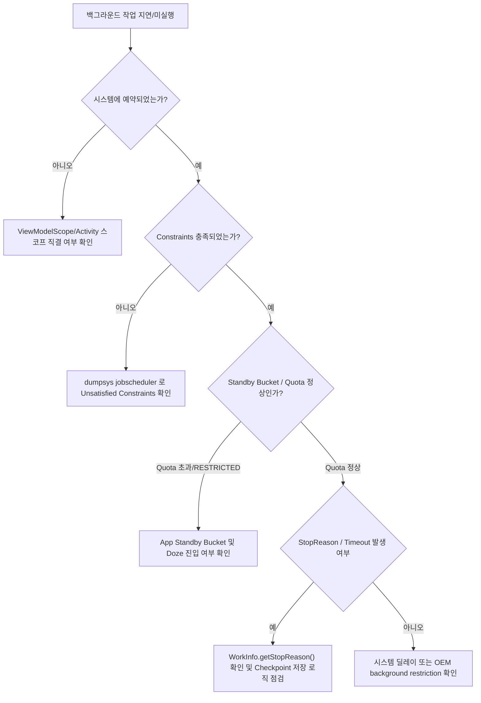

## 백그라운드 작업이 지연되거나 실행되지 않는다

### 증상

화면을 닫으면 동기화·업로드 같은 작업이 멈추거나, WorkManager/JobScheduler 에 예약한 작업이 기대한 시점에 실행되지 않는다.

### 재현 조건

- **작업의 영속성(durability) 및 타임라인 특성을 구분한다**: 이 작업이 정밀 시각이 중요한 작업(AlarmManager)인지, 지연 가능한 보장 작업(WorkManager/JobScheduler)인지 구분한다.
- **Doze / 앱 대기(App Standby) 상태를 재현한다**:
  - 화면 끄기 및 강제 Doze 진입: `adb shell dumpsys deviceidle force-idle deep` (해제: `adb shell dumpsys deviceidle unforce`)
  - 강제 App Standby Bucket 변경: `adb shell am set-standby-bucket <pkg> rare` (또는 `restricted`)

### 가능한 실패 경계와 우선순위

1. **작업이 화면의 UI 스코프(`viewModelScope`/`lifecycleScope`)에 묶여 있었다.** 화면이 닫히면 코루틴이 취소된 것이지 시스템 지연이 아니다.
2. **작업은 예약됐지만 제약 조건(Constraints)이 미충족됐다.** 네트워크(Unmetered), 충전 상태, 저장 공간 등 제약 조건 미충족.
3. **Standby Bucket 등급이 낮거나 백그라운드 Quota 가 고갈됐다.** 최근 앱 사용 빈도가 낮아 `RARE` 또는 `RESTRICTED` 버킷으로 강등된 경우 execution quota 제약을 받는다.
4. **Doze mode / Power Saver 가 실행을 차단했다.** Maintenance window 까지 실행이 지연되는 정상적인 배터리 보호 동작이다.
5. **프로세스 중단(StopReason) 발생 및 상태 미저장.** 시스템에 의해 작업이 수시로 중단될 수 있으나 `checkpoint` 저장이 없어 매번 처음부터 재실행되다 지연/실패하는 경우.

### 진단 플로우차트 및 신호 판정 기준



#### 신호 판정 기준 (Success / Failure Signals)

| 진단 항목 | 정상 신호 (Success Signal) | 실패 신호 (Failure Signal) |
| --- | --- | --- |
| **Job Constraints** | `Unsatisfied constraints: NONE` | `Unsatisfied constraints: CONNECTIVITY` / `CHARGING` |
| **Quota Status** | `WITHIN_QUOTA: true` | `WITHIN_QUOTA: false` |
| **Standby Bucket** | `Standby bucket: ACTIVE` 또는 `WORKING_SET` | `Standby bucket: RARE` 또는 `RESTRICTED` |
| **Work State** | `WorkInfo.state = RUNNING` / `SUCCEEDED` | `WorkInfo.state = ENQUEUED` (무한 대기) 또는 `BLOCKED` |
| **Stop Reason** | `STOP_REASON_NONE` (0) | `STOP_REASON_CONSTRAINT_CANCELLED` / `STOP_REASON_QUOTA` / `STOP_REASON_TIMEOUT` |

### 조사 절차

1. **작업이 실제로 시스템에 예약되었는지 및 Constraints 상태 확인**
   ```bash
   adb shell dumpsys jobscheduler <pkg>
   ```
   - `Required constraints` vs `Unsatisfied constraints` 확인.
   - `WITHIN_QUOTA` 필드 및 `Standby bucket` 상태 확인.

2. **Standby Bucket 확인 및 테스트용 강제 변경**
   ```bash
   adb shell am get-standby-bucket <pkg>
   adb shell am set-standby-bucket <pkg> active
   ```
   - 10: `ACTIVE`, 20: `WORKING_SET`, 30: `FREQUENT`, 40: `RARE`, 45: `RESTRICTED`.

3. **WorkManager 진단 브로드캐스트 및 상세 로그 확인**
   ```bash
   adb shell am broadcast -a "androidx.work.diagnostics.REQUEST_DIAGNOSTICS" -p <pkg>
   adb logcat -s WM-DiagnosticsWrkr WM-WorkerWrapper WM-JobScheduler JobScheduler
   ```
   - `WorkInfo.getStopReason()` (WorkManager 2.9.0+ / API 31+)으로 작업 중단 원인 분석.

4. **Job 강제 실행 및 Timeout 테스트**
   ```bash
   adb shell cmd jobscheduler run -f <pkg> <job_id>
   adb shell cmd jobscheduler timeout <pkg> <job_id>
   ```
   - `timeout` 실행 후 `onStopJob()` 호출 여부와 checkpoint 저장 상태 확인.

5. **AlarmManager 정밀 시각 작업 진단 (Exact Alarms 사용 시)**
   ```bash
   adb shell dumpsys alarm <pkg>
   ```
   - `SCHEDULE_EXACT_ALARM` 권한 허용 여부 및 Inexact Alarm 전환 여부 확인.

### OS/API/target SDK 조건

- **Android 14 (API 34)**:
  - User-Initiated Data Transfer (UIDT) job 추가 (`JobInfo.Builder.setUserInitiated(true)` + `RUN_USER_INITIATED_DATA_TRANSFER` 권한 및 알림 필수).
  - Target SDK 34+ 에서 `SCHEDULE_EXACT_ALARM` 권한이 신규 설치 앱에 대해 기본 거부(Denied)됨 (`USE_EXACT_ALARM` 또는 사용자 권한 동의 필요).
- **Android 15 (API 35)**:
  - Foreground Service (FGS) 6 시간 실행 제한: `dataSync` 및 `mediaProcessing` FGS 타입은 24 시간 중 누적 6 시간 초과 시 타임아웃 예외 발생 (`JSException` / FGS timeout). WorkManager/UIDT 전환 필수.
- **Android 16**:
  - Background Job execution quota 통합 관리 강화 및 battery saver 상태 diagnostic signal 세분화.

### 다음 조사 경로

- constraint 미충족이 원인이면 → 요구 조건이 제품 요구사항과 맞는지 재검토 (예: unmetered network 가 꼭 필요한지)
- 화면 lifetime 에 잘못 묶여 있었다면 → [Learning Spine 6장](../learning-spine/06-main-thread-binder-coroutine-and-durable-work-lifetime.md) 의 durable scheduler 선택 기준으로
- 알림으로 결과를 보여줘야 하는 작업이라면 → [notification missing runbook](06-notification-missing.md) 과 함께 조사

### 관련 자료

- [백그라운드 실행 수단은 실패 비용으로 결정한다](../../04_system_services/background-and-notifications/background-work/background-api-selection.md)
- [WorkManager는 지연 가능한 보장 작업의 기본 선택이다](../../04_system_services/background-and-notifications/background-work/work-manager.md)
- [백그라운드 제한은 작업 상태를 영속적으로 설계하게 만든다](../../04_system_services/background-and-notifications/background-work/background-restrictions-state.md)
- [Worked Example: process death 뒤 편집 상태와 background work 복구](../worked-examples/05-process-death-recovery-of-edit-state-and-background-work.md)
- [Learning Spine 6장 메인 스레드, Binder, coroutine과 durable scheduler](../learning-spine/06-main-thread-binder-coroutine-and-durable-work-lifetime.md)

### 공식 근거

- [Background tasks overview](https://developer.android.com/develop/background-work/background-tasks)
- [Debug WorkManager](https://developer.android.com/develop/background-work/background-tasks/testing/persistent/debug)
- [Optimize battery use for task scheduling APIs](https://developer.android.com/develop/background-work/background-tasks/optimize-battery)

검증일: 2026-08-04. `dumpsys jobscheduler`, WorkManager 2.9.0+ `stopReason`, Android 14 UIDT 및 Android 15 FGS 6 시간 제한 스펙을 반영해 검증 완료.
