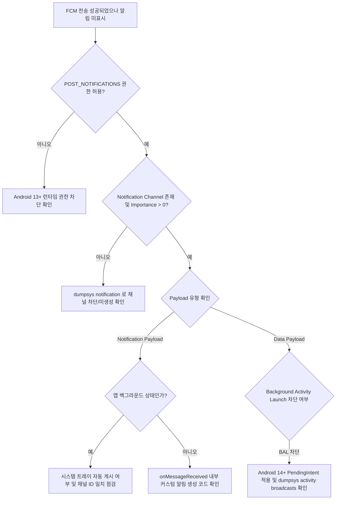

## 알림이 오지 않는다(FCM 전달은 성공했는데 표시되지 않는다)

### 증상

서버는 FCM 전송에 성공했다고 기록하는데, 사용자 기기에는 알림이 표시되지 않는다.

### 재현 조건

- **수신 및 표시 단계를 분리한다**: 서버 전송 -> FCM 백엔드 전달 -> 기기 OS 수신 (`onMessageReceived`) -> NotificationManager 게시 -> 트레이 표시 단계 중 어디서 누락되는지 특정한다.
- **앱 상태별 재현 시나리오를 고정한다**: 앱이 포그라운드, 백그라운드, 프로세스가 회수된 상태, 사용자가 강제 종료한 상태일 때 FCM `notification` payload와 `data` payload의 처리 경로가 다르므로 각각 테스트한다. 단순 프로세스 회수와 설정의 강제 종료를 같은 상태로 취급하지 않는다.

### 가능한 실패 경계와 우선순위

1. **`POST_NOTIFICATIONS` 런타임 권한(Android 13+, API 33+)이 거부됐다.** 가장 흔한 표시 실패 원인. 메시지가 기기에 수신되어도 시스템이 표시를 차단한다.
2. **알림 채널(Notification Channel)이 미생성되었거나 차단(Importance: NONE)되었다.** Android 8.0+ 에서는 유효한 채널 없이는 게시 자체가 전면 무시된다.
3. **백그라운드에서 수신한 메시지로 Activity를 직접 시작하려다 Background Activity Launch 제약에 막혔다.** 이는 FCM 수신 실패가 아니라 표시·탭 UX 설계 오류다. 알림과 사용자가 누르는 `PendingIntent`를 사용한다.
4. **`notification` payload 수신 시 백그라운드에서 `onMessageReceived` 가 호출되지 않아 커스텀 알림 처리 로직이 건너뛰어졌다.** FCM 의 기본 동작(백그라운드 시 시스템이 트레이에 자동 게시)을 이해하지 못해 발생.
5. **Doze, App Standby, 네트워크 상태 또는 FCM 우선순위로 전달이 지연됐다.** Normal-priority 메시지는 Doze 중 지연될 수 있다. High-priority는 즉시 전달을 시도하지만 도착 시각을 보장하지 않으며, 사용자에게 보이는 알림으로 이어지지 않는 패턴은 우선순위가 낮아질 수 있다.
6. **등록 토큰이 만료·해지됐거나 대상 설치와 연결되지 않는다.** HTTP v1의 `UNREGISTERED`(404)는 해당 등록을 삭제할 신호다. `INVALID_ARGUMENT`(400)은 payload가 유효하다고 확인된 경우에만 잘못된 토큰 신호로 판단한다. High-priority 메시지나 data-only 메시지는 기기 상태(Doze 등)에 따라 전달이 지연되거나 백그라운드 처리가 제한될 수 있으므로, 서버의 전송 요청 성공과 최종 기기 전달은 같은 신호가 아니다.

### 진단 플로우차트 및 신호 판정 기준



#### 신호 판정 기준 (Success / Failure Signals)

| 진단 항목 | 정상 신호 (Success Signal) | 실패 신호 (Failure Signal) |
| --- | --- | --- |
| **POST_NOTIFICATIONS** | `android.permission.POST_NOTIFICATIONS: granted=true` | `granted=false` 또는 USER_SET_DENIED |
| **Channel Importance** | `Importance: 3` (DEFAULT) 또는 `4` (HIGH) | `Importance: 0` (NONE / Blocked) 또는 `Channel Not Found` |
| **Notification Record** | `Notification Record: pkg=<pkg> id=…` (dumpsys) | `Notification Record` 생성 기록 없음 / Suppressed |
| **FCM client signal** | `onMessageReceived()` 또는 SDK 수신 로그 관찰 | 앱에서 수신 신호가 없고 FCM Data API에 지연·드롭 지표 존재 |
| **FCM send response** | 메시지 ID 반환 후 전달 지표와 함께 확인 | `UNREGISTERED`, 또는 payload가 유효한데 `INVALID_ARGUMENT` |
| **FCM Priority** | HIGH가 Doze 중 즉시 전달을 시도 | NORMAL은 Doze 중 지연될 수 있음. HIGH도 전달을 보장하지 않음 |

### 조사 절차

1. **`POST_NOTIFICATIONS` 런타임 권한 상태 확인**
   ```bash
   adb shell dumpsys package <pkg> | grep -A5 "POST_NOTIFICATIONS"
   ```
   - Android 13(API 33) 이상 기기에서 `granted=true` 인지 확인.

2. **`dumpsys notification` 으로 알림 채널 및 게시 상태 확인**
   ```bash
   adb shell dumpsys notification <pkg>
   ```
   - 출력에서 `Notification List`, `Channels`, `User sentiment`, `Importance` 수치를 확인한다.
   - `Importance: 0` 이면 사용자가 설정에서 해당 채널을 끈 상태다.

3. **FCM 디버그 로그 활성화 및 logcat 관찰**
   ```bash
   adb shell setprop log.tag.FCM VERBOSE
   adb logcat -s FirebaseMessagingService FCM NotificationManagerService
   ```
   - 메시지가 앱 프로세스에 전달되는 순간의 SDK 로그와 `onMessageReceived()` 진입을 확인한다. 서버 응답의 메시지 ID만으로 최종 전달을 판정하지 않는다.

4. **Doze Mode 강제 진입 후 FCM Priority 테스트**
   ```bash
   adb shell dumpsys deviceidle force-idle deep
   ```
   - Normal priority는 Doze 중 지연될 수 있다. High priority는 즉시 전달을 시도하지만 네트워크·기기 상태에 따른 지연 가능성이 있으므로 단일 발송으로 성공을 단정하지 않는다.

5. **Payload 형태별 동작 확인 (Notification vs Data)**
   - `notification` payload: 백그라운드 시 OS 가 직접 알림을 트레이에 생성 (`onMessageReceived` 호출 안 됨).
   - `data`-only payload: 앱 코드가 `onMessageReceived()`에서 처리한다. 백그라운드 실행 시간은 제한되며 지연·드롭 가능성이 있으므로 durable work가 필요하면 WorkManager 등으로 넘긴다. 강제 종료 상태까지 호출을 보장한다고 가정하지 않는다.

### OS/API/target SDK 조건

- **Android 13 (API 33)**:
  - `POST_NOTIFICATIONS` 런타임 권한 도입. 권한 미허용 시 모든 알림 게시가 거부된다.
- **Android 14 (API 34)**:
  - Background Activity Launch (BAL) 제약 강화: 백그라운드 FCM `onMessageReceived` 수신 시 액티비티 직접 실행(`startActivity`)이 거부되므로, 반드시 Notification 과 `PendingIntent` 로 전달해야 한다.
  - non-dismissible 알림 정책 변경: 포그라운드 서비스 알림이 아닌 경우 사용자가 대부분 스와이프로 닫을 수 있도록 변경됨.
- **Android 15 (API 35)**:
  - 앱이 stopped state에 들어가면 system이 pending intent를 취소하고, 직접·간접적인 사용자 동작으로 stopped state가 해제될 때까지 동작이 제한된다. 일반적인 process reclaim과 stopped state를 구분한다.

### 다음 조사 경로

- 탭 이후 잘못된 화면으로 이동한다면 → 알림 자체는 표시된 것이므로 [Worked Example 4의 탭/task 구성](../worked-examples/04-fcm-to-notification-display-and-tap-recovery.md) 절차로
- 메시지 자체가 기기에 도달하지 않는다면 → [background delay runbook](05-background-work-delayed-or-not-running.md) 의 Doze/standby 확인 절차와 겹친다
- 특정 기기·제조사에서만 발생한다면 → OEM 의 자체 알림/전력 관리 정책 차이를 의심 ([Learning Spine 12장](../learning-spine/12-compatibility-update-and-form-factor.md))

### 관련 자료

- [Worked Example: FCM 전송에서 notification 표시와 탭 복구까지](../worked-examples/04-fcm-to-notification-display-and-tap-recovery.md)
- [FCM notification payload와 data payload는 처리 지점이 다르다](../../04_system_services/background-and-notifications/fcm-payload-handling.md)
- [Android 알림은 권한과 채널이 표시 가능성을 결정한다](../../04_system_services/background-and-notifications/notification-permission-channel.md)
- [FCM 운영은 전달, 표시, 탭, 복구를 분리해 관측한다](../../04_system_services/background-and-notifications/fcm-delivery-lifecycle.md)
- [Learning Spine 10장 기기 기능 발견과 background execution](../learning-spine/10-device-capability-discovery-and-background-execution.md)

### 공식 근거

- [FCM 메시지 전달 이해](https://firebase.google.com/docs/cloud-messaging/understand-delivery)
- [알림 런타임 권한](https://developer.android.com/develop/ui/compose/notifications/notification-permission)
- [알림 채널 생성과 관리](https://developer.android.com/develop/ui/compose/notifications/channels)
- [FCM 메시지 처리와 우선순위](https://firebase.google.com/docs/cloud-messaging/android/receive)
- [FCM 등록 관리와 invalid response](https://firebase.google.com/docs/cloud-messaging/manage-tokens)
- [Android 15 stopped-state 변경](https://developer.android.com/about/versions/15/behavior-changes-all)

검증일: 2026-08-06. `dumpsys notification`, `POST_NOTIFICATIONS`, notification/data payload 차이, FCM 우선순위와 invalid token 판정 경계를 공식 문서 기준으로 검증했다.
