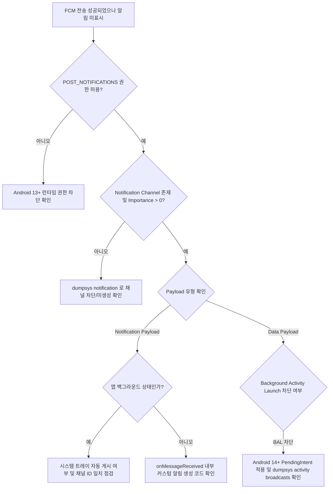

## 알림이 오지 않는다(FCM 전달은 성공했는데 표시되지 않는다)

### 증상

서버는 FCM 전송에 성공했다고 기록하는데, 사용자 기기에는 알림이 표시되지 않는다.

### 재현 조건

- **수신 및 표시 단계를 분리한다**: 서버 전송 -> FCM 백엔드 전달 -> 기기 OS 수신 (`onMessageReceived`) -> NotificationManager 게시 -> 트레이 표시 단계 중 어디서 누락되는지 특정한다.
- **앱 상태별 재현 시나리오를 고정한다**: 앱이 포그라운드 / 백그라운드 / 강제 종료(Killed) 상태일 때 FCM `notification` payload 와 `data` payload 의 동작 파이프라인이 전면 다르므로 각 상태에서 개별 테스트한다.

### 가능한 실패 경계와 우선순위

1. **`POST_NOTIFICATIONS` 런타임 권한(Android 13+, API 33+)이 거부됐다.** 가장 흔한 표시 실패 원인. 메시지가 기기에 수신되어도 시스템이 표시를 차단한다.
2. **알림 채널(Notification Channel)이 미생성되었거나 차단(Importance: NONE)되었다.** Android 8.0+ 에서는 유효한 채널 없이는 게시 자체가 전면 무시된다.
3. **백그라운드 상태에서 `data`-only 메시지 수신 시 백그라운드 액티비티 실행(BAL) 제약으로 실패했다 (Android 14+).** `onMessageReceived` 에서 알림 대신 `startActivity()` 를 직접 호출하려는 코드가 시스템에 의해 차단된 경우.
4. **`notification` payload 수신 시 백그라운드에서 `onMessageReceived` 가 호출되지 않아 커스텀 알림 처리 로직이 건너뛰어졌다.** FCM 의 기본 동작(백그라운드 시 시스템이 트레이에 자동 게시)을 이해하지 못해 발생.
5. **OEM 전력 관리 정책 또는 Doze Mode 로 인해 FCM 수신 자체가 지연/차단됐다.** High-priority 메시지가 아닌 Normal-priority 메시지의 경우 Doze maintenance window 까지 전달이 지연된다.
6. **등록 토큰(Registration Token) 만료 또는 유효하지 않은 대상.** 서버 응답은 성공(200 OK)이나 메시지가 엉뚱한 토큰으로 전송된 경우.

### 진단 플로우차트 및 신호 판정 기준



#### 신호 판정 기준 (Success / Failure Signals)

| 진단 항목 | 정상 신호 (Success Signal) | 실패 신호 (Failure Signal) |
| --- | --- | --- |
| **POST_NOTIFICATIONS** | `android.permission.POST_NOTIFICATIONS: granted=true` | `granted=false` 또는 USER_SET_DENIED |
| **Channel Importance** | `Importance: 3` (DEFAULT) 또는 `4` (HIGH) | `Importance: 0` (NONE / Blocked) 또는 `Channel Not Found` |
| **Notification Record** | `Notification Record: pkg=<pkg> id=…` (dumpsys) | `Notification Record` 생성 기록 없음 / Suppressed |
| **FCM Logcat** | `FCM: MessagingService received message` | `FCM: Delivery failed` / `UNREGISTERED` |
| **FCM Priority** | `Priority: HIGH` (Immediate delivery in Doze) | `Priority: NORMAL` (Deferred in Doze) |

### 조사 절차

1. **`POST_NOTIFICATIONS` 런타임 권한 상태 확인**
   ```bash
   adb shell dumpsys package <pkg> | grep -A5 "POST_NOTIFICATIONS"
   ```
   - Android 13(API 33) 이상 기기에서 `granted=true` 인지 확인.

2. **`dumpsys notification` 으로 알림 채널 및 게시 상태 확인**
   ```bash
   adb shell dumpsys notification <pkg>
   ```
   - 출력에서 `Notification List`, `Channels`, `User sentiment`, `Importance` 수치를 확인한다.
   - `Importance: 0` 이면 사용자가 설정에서 해당 채널을 끈 상태다.

3. **FCM 디버그 로그 활성화 및 logcat 관찰**
   ```bash
   adb shell setprop log.tag.FCM VERBOSE
   adb logcat -s FirebaseMessagingService FCM NotificationManagerService
   ```
   - 메시지가 기기에 수신되는 순간 logcat 출력으로 FCM 백엔드 수신 여부를 확인한다.

4. **Doze Mode 강제 진입 후 FCM Priority 테스트**
   ```bash
   adb shell dumpsys deviceidle force-idle deep
   ```
   - Normal priority 메시지는 Doze 중 수신되지 않고 멈추는 것이 정상 동작이다. High priority 메시지만 즉시 전달된다.

5. **Payload 형태별 동작 확인 (Notification vs Data)**
   - `notification` payload: 백그라운드 시 OS 가 직접 알림을 트레이에 생성 (`onMessageReceived` 호출 안 됨).
   - `data`-only payload: 포그라운드/백그라운드 모두 `onMessageReceived` 가 호출됨. 백그라운드 상태에서 직접 알림 게시 코드가 작성되어 있는지 확인한다.

### OS/API/target SDK 조건

- **Android 13 (API 33)**:
  - `POST_NOTIFICATIONS` 런타임 권한 도입. 권한 미허용 시 모든 알림 게시가 거부된다.
- **Android 14 (API 34)**:
  - Background Activity Launch (BAL) 제약 강화: 백그라운드 FCM `onMessageReceived` 수신 시 액티비티 직접 실행(`startActivity`)이 거부되므로, 반드시 Notification 과 `PendingIntent` 로 전달해야 한다.
  - non-dismissible 알림 정책 변경: 포그라운드 서비스 알림이 아닌 경우 사용자가 대부분 스와이프로 닫을 수 있도록 변경됨.
- **Android 15 (API 35)**:
  - Notification Cooldown 및 채널 그룹 제한: 짧은 시간 내 과도한 알림 발생 시 시스템이 진동/소리를 자동 감쇄(Cooldown)한다.
- **Android 16**:
  - 알림 영역 UI 컴팩트화 및 알림 상태 쿼리 API 세분화.

### 다음 조사 경로

- 탭 이후 잘못된 화면으로 이동한다면 → 알림 자체는 표시된 것이므로 [Worked Example 4의 탭/task 구성](../worked-examples/04-fcm-to-notification-display-and-tap-recovery.md) 절차로
- 메시지 자체가 기기에 도달하지 않는다면 → [background delay runbook](05-background-work-delayed-or-not-running.md) 의 Doze/standby 확인 절차와 겹친다
- 특정 기기·제조사에서만 발생한다면 → OEM 의 자체 알림/전력 관리 정책 차이를 의심 ([Learning Spine 12장](../learning-spine/12-compatibility-update-and-form-factor.md))

### 관련 자료

- [Worked Example: FCM 전송에서 notification 표시와 탭 복구까지](../worked-examples/04-fcm-to-notification-display-and-tap-recovery.md)
- [FCM notification payload와 data payload는 처리 지점이 다르다](../../04_system_services/background-and-notifications/notification-messaging-contracts/fcm-notification-and-data-payloads-have-different-handling-points.md)
- [Android 알림은 권한과 채널이 표시 가능성을 결정한다](../../04_system_services/background-and-notifications/notification-messaging-contracts/android-notification-permission-and-channel-control-visibility.md)
- [FCM 운영은 전달, 표시, 탭, 복구를 분리해 관측한다](../../04_system_services/background-and-notifications/notification-messaging-contracts/fcm-operations-observe-delivery-display-tap-and-recovery-separately.md)
- [Learning Spine 10장 기기 기능 발견과 background execution](../learning-spine/10-device-capability-discovery-and-background-execution.md)

### 공식 근거

- [FCM 메시지 전달 이해](https://firebase.google.com/docs/cloud-messaging/understand-delivery)
- [알림 런타임 권한](https://developer.android.com/develop/ui/compose/notifications/notification-permission)
- [알림 채널 생성과 관리](https://developer.android.com/develop/ui/compose/notifications/channels)

검증일: 2026-08-04. `dumpsys notification`, `POST_NOTIFICATIONS` 권한, FCM notification vs data payload 처리 차이 및 Android 14 BAL 제약을 반영해 검증 완료.
