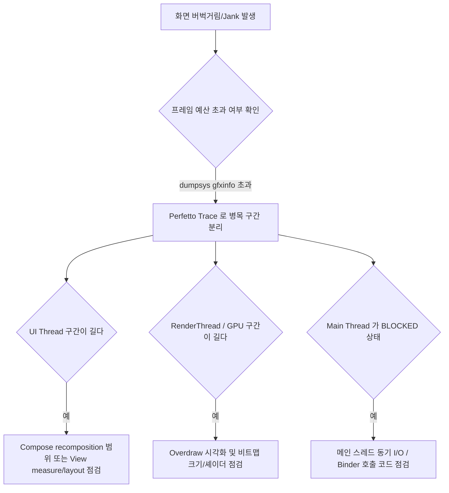

## 화면이 끊긴다(jank, dropped frames)

### 증상

스크롤, 애니메이션, 화면 전환 중 프레임이 끊기거나 버벅거림이 느껴진다.

### 재현 조건

- **측정 대상 여정 및 Refresh Rate 를 고정한다**: 특정 사용자 여정(목록 스크롤, 화면 진입, 탭 전환)과 기기의 디스플레이 주사율(60Hz, 90Hz, 120Hz)을 확인하고 고정한다.
- **Release 유사 빌드 및 동일 조건 재현**: 디버그 빌드(R8 미적용, 디버깅 모니터 오버헤드)는 프레임 드랍을 왜곡하므로 반드시 Release 또는 Benchmark 빌드(Macrobenchmark)로 재현한다.

### 가능한 실패 경계와 우선순위

1. **UI 스레드(Compose [recomposition](../../02_app_framework/jetpack-compose/runtime/recomposition.md)/layout 또는 View measure/layout/draw) 병목.** 가장 흔한 원인. 상위 노드 상태 읽기로 인한 광범위 recomposition 또는 heavy layout 계산.
2. **RenderThread / GPU 병목.** 대형 비트맵 디코딩, 과도한 Overdraw, 복잡한 Canvas 렌더링 노드, 셰이더 컴파일 지연 (Jank during shader compilation).
3. **`BufferQueue` 및 SurfaceFlinger frame deadline 초과.** App (Producer) 이 렌더링을 제때 닫지 못해 SurfaceFlinger (Consumer) 합성 시점을 놓침.
4. **Main Thread 가 비렌더링 작업(동기 I/O, 무거운 JSON 파싱, [binder ipc](../../01_system_internals/ipc-and-process/binder-ipc.md))으로 블록됨.** 렌더링 계산 자체는 가벼우나 메인 스레드 작업 큐가 밀린 경우.

### 진단 플로우차트 및 신호 판정 기준



#### 신호 판정 기준 (Success / Failure Signals)

| 디스플레이 주사율 | 프레임 예산 (Frame Deadline) | 정상 신호 (Success) | 실패 신호 (Jank Failure) |
| --- | --- | --- | --- |
| **60 Hz** | 16.6 ms | Janky Frames < 5% / `frameOverrunMs` <= 0 | Janky Frames > 10% / `frameOverrunMs` > 0 |
| **90 Hz** | 11.1 ms | Janky Frames < 5% / `frameOverrunMs` <= 0 | Janky Frames > 10% / `frameOverrunMs` > 0 |
| **120 Hz** | 8.33 ms | Janky Frames < 5% / `frameOverrunMs` <= 0 | Janky Frames > 10% / `frameOverrunMs` > 0 |

| 진단 항목 | 정상 신호 (Success Signal) | 실패 신호 (Failure Signal) |
| --- | --- | --- |
| **`dumpsys gfxinfo`** | `95th percentile < Frame Deadline` | `95th percentile` 또는 `99th percentile` 의 현격한 예산 초과 |
| **Macrobenchmark** | `frameDurationCpuMs` 이 예산 이내 | `frameOverrunMs` 가 양수(+)로 초과 프레임 다수 발생 |
| **Compose Tracing** | recompose scope 최소화 & defer read 적용 | 상위 상태 읽기로 전체 화면 recomposition 반복 |

### 조사 절차

1. **`dumpsys gfxinfo` 로 프레임 요약 통계 수집**
   ```bash
   adb shell dumpsys gfxinfo <pkg>
   ```
   - `Janky frames` 비율, `50th / 90th / 95th / 99th percentile` 프레임 처리 시간을 확인한다.

2. **`framestats` 옵션으로 정밀 프레임 타임라인 분석**
   ```bash
   adb shell dumpsys gfxinfo <pkg> framestats
   ```
   - `IntendedVsync`, `Vsync`, `FrameCompleted` 타임스탬프 간격으로 각 프레임의 latency 와 deadline 초과 여부를 계산한다.

3. **Perfetto Trace 수집으로 UI Thread / RenderThread 병목 구간 식별**
   ```bash
   adb shell perfetto -o /data/misc/perfetto-traces/trace.perfetto-trace -t 5s sched freq idle am wm gfx view binder_driver
   adb pull /data/misc/perfetto-traces/trace.perfetto-trace
   ```
   - [ui.perfetto.dev](https://ui.perfetto.dev) 에서 오픈 후 `Choreographer#doFrame` 슬라이스와 `RenderThread` 슬라이스의 길이를 비교한다.

4. **GPU Profiling 오버레이 활성화 (Overdraw 및 Frame rendering visualizer)**
   ```bash
   adb shell setprop debug.hwui.profile visual_bars
   ```
   - 화면 하단에 프레임별 바 그래프를 띄워 녹색 선(Frame budget)을 넘는 프레임을 실시간 관찰한다.

5. **Macrobenchmark `FrameTimingMetric` 으로 수정 전후 정량 측정**
   - Release 빌드 상에서 `frameDurationCpuMs` 및 `frameOverrunMs` 지표로 수정 전후 개선도를 자동 검증한다.

### OS/API/target SDK 조건

- **Android 14 (API 34)**:
  - Macrobenchmark 지표에 `frameOverrunMs` 신규 추가: 프레임이 지정된 Presentation Deadline 을 얼마나 넘겼는지(양수일수록 심각한 Jank) 정밀 측정 가능.
  - Variable Refresh Rate (VRR) 동적 주사율 디바이스 증가로 타겟 디바이스의 주사율 변동 특성 감안 필요.
- **Android 15 (API 35)**:
  - HWUI pipeline 및 Vulkan rendering backend 최적화. 16KB 메모리 페이지 사이즈 미지원 C++ 그래픽 엔진/라이브러리(Skia, Native Rendering) 연결 시 성능 저하 및 크래시 유발 가능성 검증 필요.
- **Android 16**:
  - Perfetto UI Trace 트랙 표준화 및 Compose Runtime recomposition trace marker 자동 연동 강화.

### 다음 조사 경로

- 데이터 로딩이 UI thread 를 막고 있다면 → [Learning Spine 6장](../learning-spine/06-main-thread-binder-coroutine-and-durable-work-lifetime.md) 의 main thread/Binder 모델 확인
- 냉시작 직후의 jank 라면 → [app launch runbook](01-app-launch-slow-or-fails.md) 과 함께 조사
- 특정 기기·GPU 에서만 재현되면 → SurfaceFlinger/HWC 합성 조합 문제일 수 있으므로 기기별 실기기 검증으로 전환

### 관련 자료

- [Worked Example: Compose jank를 UI state에서 SurfaceFlinger까지 좁히는 사례](../worked-examples/07-compose-jank-from-ui-state-to-surfaceflinger.md)
- [Jank는 UI, RenderThread, SurfaceFlinger 전 구간의 frame deadline 실패다](../../01_system_internals/graphics-and-media/jank-frame-deadlines.md)
- [Compose 상태 읽기 위치는 recomposition 범위를 결정한다](../../02_app_framework/jetpack-compose/performance/compose-state-read-scope.md)
- [Profiler, Perfetto, dumpsys는 벤치마크가 아니라 진단 도구다](../../06_testing_performance/performance/profiler-perfetto-diagnosis.md)
- [Learning Spine 7장 입력, 리소스 선택과 화면 프레임](../learning-spine/07-input-resource-selection-and-display-frame.md)

### 공식 근거

- [Jetpack Compose performance](https://developer.android.com/develop/ui/compose/performance)
- [Inspect trace events with the System Trace app](https://developer.android.com/topic/performance/tracing)

검증일: 2026-08-04. `dumpsys gfxinfo`, `framestats`, Perfetto tracing, Android 14 `frameOverrunMs` 및 주사율별(60/90/120Hz) 프레임 예산 기준 검증 완료.
