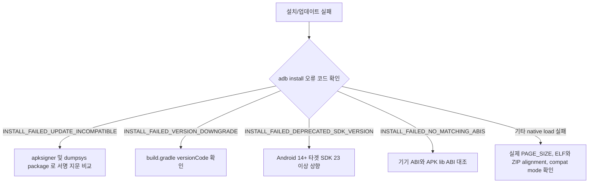

## 설치 또는 업데이트가 실패한다

### 증상

`adb install` 이 오류를 반환하거나, Play 를 통한 업데이트가 진행되지 않거나, 사용자가 "업데이트할 수 없습니다" 다이얼로그를 본다.

### 재현 조건

- **신규 설치(Fresh Installation) vs 기존 설치 위 업데이트(Update) 구분**: 신규 설치 실패는 아키텍처/최저 SDK 부재가 주원인이며, 업데이트 실패는 서명/버전코드 불일치가 주원인이다.
- **기존 설치 빌드 성격 파악**: 기기에 로컬 Debug 서명, QA Internal 서명, 또는 Play App Signing 재서명 빌드가 설치되어 있는지 서명 지문을 대조한다.

### 가능한 실패 경계와 우선순위

1. **서명 인증서 불일치 (`INSTALL_FAILED_UPDATE_INCOMPATIBLE`).** 가장 흔한 원인. `applicationId` 가 동일해도 APK 서명이 다르면 패키지 매니저는 업데이트를 거부한다. (Play App Signing 서명 vs 로컬 서명 충돌).
2. **`versionCode` 다운그레이드 (`INSTALL_FAILED_VERSION_DOWNGRADE`).** 설치하려는 APK 의 `versionCode` 가 이미 설치된 버전보다 낮거나 같음.
3. **최저 타겟 SDK 미달 (`INSTALL_FAILED_DEPRECATED_SDK_VERSION`).** Android 14(API 34)+ 부터 보안 강화를 위해 `targetSdkVersion < 23` (Android 6.0 미만) 앱의 설치를 플랫폼 차원에서 차단한다.
4. **기기와 APK의 ABI가 맞지 않는다 (`INSTALL_FAILED_NO_MATCHING_ABIS`).** 예를 들어 APK에 `arm64-v8a` 라이브러리가 없는데 arm64 전용 기기에 설치하는 경우다.
5. **16KB page-size 호환성이 없다.** Android 15부터 16KB page-size 기기가 지원된다. 4KB ELF/ZIP 정렬만 가진 앱은 호환 모드로 실행될 수도 있으므로 설치 실패나 `UnsatisfiedLinkError` 하나로 단정하지 않는다. 실제 page size, package compat mode, ELF segment와 ZIP alignment를 함께 확인한다.
6. **Manifest 또는 split 구성이 잘못됐다.** `android:exported` 누락은 target SDK 31+ 앱을 빌드할 때 manifest merge 오류가 되는 것이 보통이며, 이미 빌드된 artifact의 설치 오류와 혼동하지 않는다.

### 진단 플로우차트 및 신호 판정 기준



#### 신호 판정 기준 (Success / Failure Signals)

| 오류 코드 / 필드 | 정상 신호 (Success) | 실패 원인 및 신호 (Failure Signal) |
| --- | --- | --- |
| **`adb install` 상태** | `Success` | `INSTALL_FAILED_UPDATE_INCOMPATIBLE` (서명 불일치) |
| **`versionCode`** | `New versionCode > Installed versionCode` | `INSTALL_FAILED_VERSION_DOWNGRADE` |
| **`targetSdkVersion`** | `targetSdkVersion >= 23` | `INSTALL_FAILED_DEPRECATED_SDK_VERSION` (Android 14+) |
| **Native ABI** | 기기 지원 ABI에 해당하는 `lib/<abi>/` 존재 | `INSTALL_FAILED_NO_MATCHING_ABIS` |
| **16KB page size** | ELF LOAD segment와 APK ZIP이 16KB 호환 정렬 | compat-mode 경고, linker 오류 또는 native crash. 설치 오류 코드는 구현·artifact 상태별로 확인 |
| **Signature Fingerprint** | `SHA-256 Fingerprint 일치` | `Signatures mismatch between APK and installed package` |

### 조사 절차

1. **`adb install` 오류 코드 수집 및 분리**
   ```bash
   adb install -r app-release.apk
   ```
   - 단일 APK 가 아닌 분할(Split) APK / App Bundle 테스트 시:
   ```bash
   adb install-multiple -r base.apk split_config.apk
   ```

2. **설치된 앱과 신규 APK 서명 지문(SHA-256) 정밀 비교**
   - 설치된 패키지 서명 확인:
     ```bash
     adb shell dumpsys package <pkg> | grep -E "signatures|versionCode|targetSdk"
     ```
   - 신규 APK 인증서 서명 확인:
     ```bash
     apksigner verify --print-certs app-release.apk
     ```
   - 두 SHA-256 Digest 지문이 정확히 일치하는지 대조한다.

3. **PackageManager 시스템 로그 실시간 추적**
   ```bash
   adb logcat -s PackageManager PackageInstaller
   ```
   - 설치 거부 시점에 PackageManager 가 남기는 구체적 파싱 실패 사유(Manifest error, signature error 등) 확인.

4. **16KB Page Alignment 상태 검증 (Android 15+, C/C++ 네이티브 라이브러리 사용 시)**
   ```bash
   readelf -l libapp.so | grep LOAD
   ```
   - 먼저 `adb shell getconf PAGE_SIZE`로 기기가 실제 16KB mode인지 확인한다.
   - ELF LOAD segment의 `Align`뿐 아니라 `zipalign -c -P 16 -v 4 app.apk` 또는 APK Analyzer로 ZIP alignment도 확인한다.
   - 4KB 정렬 라이브러리가 있더라도 Android 16KB backcompat mode가 앱을 실행할 수 있다. 경고·호환 모드 여부와 실제 linker/crash 로그를 함께 본다.

### OS/API/target SDK 조건

- **Android 14 (API 34)**:
  - `INSTALL_FAILED_DEPRECATED_SDK_VERSION`: `targetSdkVersion < 23` 앱 설치 차단 (`adb install --bypass-low-target-sdk-block` 으로 디버깅 시만 우회 가능).
- **Android 15 (API 35)**:
  - AOSP가 16KB page-size 기기를 지원한다. 2025년 11월 1일부터 Google Play에 제출하면서 Android 15+ 기기를 target하는 새 앱·업데이트에는 16KB 지원 요구사항이 적용된다. 이는 모든 Android 15 설치가 즉시 거부된다는 뜻이 아니다.
- **Android 17**:
  - 16KB backcompat mode를 기기 또는 앱별로 제어할 수 있으며, 호환되지 않는 binary를 즉시 중단시키는 테스트 설정도 제공한다.

### 다음 조사 경로

- 서명 불일치가 QA/개발 환경에서 반복적으로 발생한다면 → 로컬 서명 빌드와 Play 트랙 빌드를 같은 기기에서 혼용하지 않는 팀 규칙을 검토
- 특정 targetSdkVersion 업데이트 이후 새로 발생했다면 → [Learning Spine 12장](../learning-spine/12-compatibility-update-and-form-factor.md) 의 compatibility 축 판단 모델로
- 설치는 성공했는데 앱 실행이 실패한다면 → [app launch runbook](01-app-launch-slow-or-fails.md)

### 관련 자료

- [Worked Example: signed artifact가 Play delivery를 거쳐 update되는 과정](../worked-examples/08-signed-artifact-through-play-delivery-to-update.md)
- [Play App Signing은 업로드 키와 앱 서명 키를 분리한다](../../03_packaging_deployment/distribution/release-distribution-contracts/play-app-signing-separates-upload-key-and-app-signing-key.md)
- [앱 업데이트는 applicationId, versionCode, 서명 호환성을 요구한다](../../03_packaging_deployment/distribution/release-distribution-contracts/app-updates-require-application-id-version-code-and-signature-compatibility.md)
- [Play 릴리스 체크리스트는 산출물, 서명, 트랙, 롤백 조건을 고정한다](../../03_packaging_deployment/distribution/release-distribution-contracts/play-release-checklist-freezes-artifact-signing-track-and-rollback-conditions.md)
- [Learning Spine 3장 소스에서 설치된 패키지까지](../learning-spine/03-source-to-installed-package.md)

### 공식 근거

- [앱 서명](https://developer.android.com/studio/publish/app-signing)
- [Play App Signing 사용](https://support.google.com/googleplay/android-developer/answer/9842756)
- [16KB page size 지원과 검증](https://developer.android.com/guide/practices/page-sizes)

검증일: 2026-08-06. `adb install`, `apksigner`, Android 14 low-target 차단, ABI mismatch와 16KB 호환성의 서로 다른 실패 경계를 공식 문서 기준으로 검증했다.
