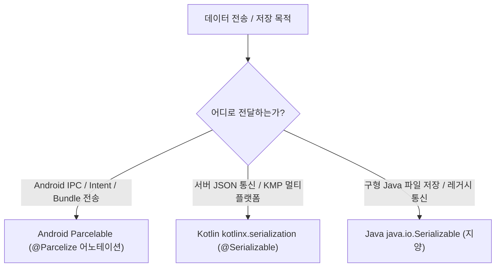

## Serializable (직렬화: Java vs Kotlin)

## 1. Serializable 이란 무엇인가 (Overview)

소프트웨어 개발에서 **직렬화(Serialization)** 는 메모리 상의 객체를 파일 저장, 네트워크 전송, 프로세스 간 통신(IPC)이 가능한 바이트 스트림(Byte Stream) 또는 JSON/Text 형식으로 변환하는 과정이다.

안드로이드 및 코틀린(Kotlin) 환경에서 개발자는 크게 두 가지 형태의 `Serializable` 을 접하게 된다.

1. **`java.io.Serializable` (Java 표준 마커 인터페이스)**
2. **`kotlinx.serialization.Serializable` (`@Serializable` - Kotlin 공식 컴파일러 직렬화)**

---

## 2. Java `java.io.Serializable` vs Kotlin `kotlinx.serialization` 비교

### 1) Java `java.io.Serializable` (구형 표준)

- **특징**: JDK 기본 제공 마커 인터페이스. Kotlin 에서도 `class User : java.io.Serializable` 형태로 선언 가능하다.
- **동작 방식**: 런타임 **[Reflection (런타임 리플렉션)](../../../../../computer-science/reflection.md)** 을 통해 객체 구조와 필드를 탐색하여 바이트로 변환한다.
- **단점**: 리플렉션으로 인해 속도가 느리고, 안드로이드 런타임에서 수많은 임시 객체를 생성하여 가비지 컬렉션(GC) 프레임 드롭(Jank)을 유발한다.

### 2) Kotlin `kotlinx.serialization` (`@Serializable` 어노테이션)

- **특징**: Kotlin 멀티플랫폼(KMP) 공식 직렬화 라이브러리. 클래스 위에 `@Serializable` 어노테이션을 붙여 사용한다.
- **동작 방식**: **컴파일 타임 코틀린 컴파일러 플러그인**이 직렬화 코드(`KSerializer`)를 미리 자동 생성한다.
- **장점**: 런타임 [Reflection (런타임 리플렉션)](../../../../../computer-science/reflection.md) 을 전혀 사용하지 않아 **속도가 매우 빠르고 타입 안전(Type-Safe)** 하며, JSON, Protobuf, CBOR 등 다양한 포맷으로 쉽게 변환된다.

---

## 3. 안드로이드에서의 직렬화 선택 가이드

안드로이드 앱 개발 시 목적에 따라 올바른 기술을 선택해야 한다.

1. **Android 화면 간 데이터 전달 (Intent / Bundle / Binder IPC)**:
   - Kotlin 사용자라면 `kotlinx.parcelize` 어노테이션인 **`@Parcelize`** 와 `Parcelable` 인터페이스 조합을 사용하는 것이 안드로이드 메모리 전달 시 가장 빠르고 권장된다.
2. **REST API / 네트워크 JSON 통신 & 로컬 파일 저장**:
   - Kotlin 공식 라이브러리인 **`kotlinx.serialization` (`@Serializable`)** 또는 Gson/Moshi 를 사용하는 것이 바람직하다.

---

## 4. 직렬화 메커니즘 삼대장 비교표

| 구분 | Java `java.io.Serializable` | Kotlin `kotlinx.serialization` | Android `Parcelable` (`@Parcelize`) |
| :--- | :--- | :--- | :--- |
| **어노테이션 / 타입** | `interface java.io.Serializable` | `@Serializable` 어노테이션 | `@Parcelize` & `interface Parcelable` |
| **처리 시점** | 런타임 리플렉션 (Reflection) | 컴파일 타임 (Kotlin Compiler Plugin) | 컴파일 타임 (Kotlin Parcelize Plugin) |
| **주요 출력 포맷** | Java 전용 바이트 스트림 | JSON, CBOR, Protobuf 등 | Android IPC `Parcel` 메모리 버퍼 |
| **Android IPC 적합성** | ❌ 비효율적 (GC 부담) | ⚠️ 네트워크/JSON 전달에 적합 | **⭕ 최고 성능 (IPC 메모리 전송 최적화)** |

---

## 5. 연결 문서 (Related Links)

- [Parcelable](18-parcelable.md) - Android 메모리/Binder IPC 전송 최적화 직렬화 규약
- [Binder IPC](../../../01_system_internals/binder-ipc.md) - 직렬화된 데이터 객체를 수신 프로세스로 전달하는 백본 IPC
