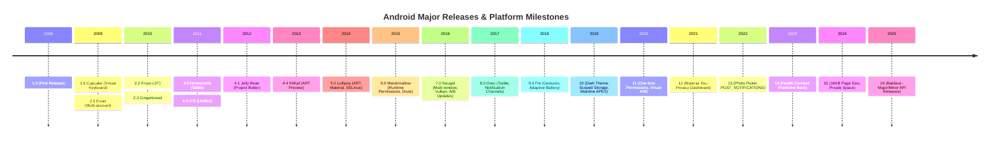

## Android Release History 는 안드로이드 플랫폼의 주요 기술 진화와 버전별 계약 변화를 정리한 정본 기록이다

안드로이드는 2008년 1.0 첫 출시 이후 모바일 환경, 프라이버시, 빌드/배포, 하드웨어 폼 팩터의 변화에 맞춰 지속적으로 진화해왔다. 이 문서는 안드로이드의 주요 기술적 전환점(Runtime, Language, Packaging, Security, Architecture, UI)과 버전별 계약 변화를 연대순으로 정리한다.

### Timeline

---

## 주요 기술 전환점 (Major Architectural Transitions)

### 1. 런타임: Dalvik (JIT) → ART (AOT & Profile-Guided)
- **배경 (Dalvik)**: 앱 시작 시마다 DEX 패킷을 Interpretation/JIT 컴파일하여 앱 실행이 느리고 CPU/배터리 소모가 심함.
- **전환 (ART, Android 5.0+)**: 앱 설치 시점에 DEX를 미리 Native ARM64 기계어로 컴파일하는 AOT(Ahead-Of-Time) 도입 (`dex2oat`).
- **현대 ART (Profile-Guided, Android 7.0+)**: 설치 시 부분 컴파일 + JIT 프로파일 수집(`primary.prof`) + 기기 유휴 시 배경 컴파일로 설치 시간과 저장 공간 최적화.

### 2. 언어: Java → Kotlin-First (2017+)
- **배경**: Java 6 기반의 길고 장황한 보일러플레이트 코드 및 람다 부재.
- **전환 (Google I/O 2017)**: Kotlin 공식 언어 채택 및 Kotlin-first 프레임워크 설계 권장. Coroutine을 통한 비동기 처리 단권화.

### 3. 배포 포맷: APK → Android App Bundle (AAB, 2018)
- **Before (Monolithic APK)**: 모든 CPU ABI(arm64, armv7, x86)와 모든 화면 밀도(xxhdpi, xxxhdpi) 리소스를 하나의 파일에 포함하여 용량이 비대함.
- **After (AAB & Dynamic Delivery)**: 게시 산출물로 `.aab`를 제출하면 Google Play가 기기 사양에 맞는 Split APK만 맞춤 다운로드(평균 15% 이상 용량 절감).

### 4. HAL 아키텍처: HIDL → AIDL HAL (2019+)
- **HIDL (Android 8.0 Treble)**: C++ 전용 프레임워크 인터페이스 언어로 Vendor와 System 분리.
- **AIDL HAL (Android 11+)**: Java, C++, Rust 멀티 언어를 공식 지원하며 Binder IPC 인프라로 HAL 통신 단일화.

### 5. 보안 & 프라이버시: 권한 및 저장소 모델의 진화
- **설치 시 권한 (Android 1.0~5.1)**: 앱 설치 시 모든 권한을 일괄 승인받아 오남용 우려.
- **런타임 권한 (Android 6.0)**: 민감 권한을 기능 사용 시점에 유저가 직접 승인.
- **세분화 및 Scoped Storage (Android 10+)**: 전체 SDCard 파일 무제한 접근을 금지하고 `MediaStore` 및 Photo Picker 기반 세분화 권한으로 전환.

### 6. 시스템 업데이트: Non-A/B → A/B → Virtual A/B (2016-2020)
- **A/B Seamless Update (Android 7.0)**: Slot A(현재 실행) / Slot B(백그라운드 업데이트 설치) 두 개의 파티션을 두고 재부팅 시 원스톱 전환.
- **Virtual A/B (Android 11)**: 2배의 저장 공간 낭비를 막기 위해 변경된 차분(Snapshot)만 동적 파티션에 저장하여 저장 공간 50% 절감.

---

## 버전별 주요 핵심 패러다임 변화

- **Android 5.0 Lollipop (2014)**: ART 런타임 기본 적용, Material Design, SELinux Enforcing.
- **Android 6.0 Marshmallow (2015)**: 런타임 권한(Runtime Permissions), Doze 배터리 절약 모드.
- **Android 7.0 Nougat (2016)**: 멀티 윈도우 지원, Vulkan 그래픽 API, A/B Seamless Update.
- **Android 8.0 Oreo (2017)**: **Project Treble** (System/Vendor 아키텍처 분리), 알림 채널, 백그라운드 서비스 제약.
- **Android 9.0 Pie (2018)**: 제스처 네비게이션, Adaptive Battery, BiometricPrompt API 통합.
- **Android 10 (2019)**: Scoped Storage, 시스템 Dark Theme, **Project Mainline** (APEX 모듈식 업데이트).
- **Android 11 (2020)**: 일회성 권한, Virtual A/B 업데이트.
- **Android 12 (2021)**: Material You (동적 컬러 시스템), Privacy Dashboard, 카메라/마이크 활성 표시등.
- **Android 13 (2022)**: Photo Picker, `POST_NOTIFICATIONS` 알림 권한, 앱별 언어 설정.
- **Android 14 (2023)**: Health Connect, 예측적 뒤로가기 제스처.
- **Android 15 (2024)**: 16KB Page Size 지원, Private Space.
- **Android 16 (2025/2026)**: 빠른 minor/major API release 축 분리.

---

### Version 축 구분 가이드

1. `compileSdk`: 앱 빌드 시 참조하는 API 마운트 스펙.
2. `targetSdkVersion`: 앱이 최신 OS의 파괴적 동작 변경(Behavior Changes)을 적용받을 지 판별하는 계약 축.
3. `minSdkVersion` / `SDK_INT`: 런타임 실행 기기의 실제 OS API 레벨.

관련 상세 원자 노트: [API level, codename, extension level, targetSdkVersion은 서로 다른 version 축이다](history-contracts/api-level-codename-extension-level-and-target-sdk-are-different-version-axes.md)

### History Contracts
- [History Contracts](history-contracts/history-contracts.md)
