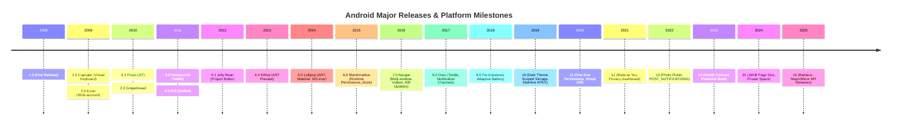

## Android Release History (안드로이드 플랫폼 진화사 & 연대기적 변화)

### 1. 개요 (Overview)

**Android Release History** 는 2008 년 1.0 첫 출시 이후 현재까지 모바일 환경, 보안/프라이버시, 런타임, 빌드/배포, 하드웨어 폼 팩터의 변화에 맞춰 진화해 온 **안드로이드 플랫폼의 주요 아키텍처 전환점(Runtime, Security, HAL, Packaging)과 연대기적 SDK API 레벨 계약 변화를 기록한 타임라인**이다.

본 문서는 버전을 파편화하여 나누기보다 플랫폼의 거시적 맥락을 한눈에 조망하는 타임라인 맵 역할을 수행하며, 각 기술적 전환점은 Vault 내부의 해당 원자 레퍼런스 노드와 촘촘히 엮여 있다.

---

#### Timeline (Major Platform Milestones)

---

### 2. 주요 아키텍처 기술 전환점 (Major Architectural Transitions)

#### 1. 런타임: Dalvik (JIT) → [ART](../../01_system_internals/boot-and-runtime/zygote-runtime/art.md) (AOT & Profile-Guided)

- **Dalvik (Android 1.0~4.4)**: 앱 실행 시마다 DEX 파이프라인을 JIT 컴파일하여 CPU/배터리 소모가 높음.
- **[ART (Android Runtime)](../../01_system_internals/boot-and-runtime/zygote-runtime/art.md) 전환 (Android 5.0+)**: 앱 설치 시점에 DEX 를 미리 Native 기계어로 컴파일하는 AOT(Ahead-Of-Time) 도입 (`dex2oat`).
- **Profile-Guided ART (Android 7.0+)**: 설치 시 부분 컴파일 + JIT 프로파일 수집(`primary.prof`) + 유휴 시 배경 컴파일로 설치 시간과 저장 공간 최적화.

#### 2. 언어 및 비동기: Java → Kotlin-First (2017+)

- **Java 6 시대**: 보일러플레이트 코드 가중 및 콜백 지옥.
- **Kotlin-First 전환**: 람다, Null-safety 및 [Kotlin Coroutines](../../02_app_framework/kotlin-coroutines.md) 기반 [StateFlow & SharedFlow](../../02_app_framework/stateflow-and-sharedflow.md) 비동기 수용.

#### 3. 배포 포맷: APK → Android App Bundle (AAB, 2018+)

- **Monolithic [APK](apk.md)**: 모든 CPU ABI(arm64, x86) 및 리소스를 포괄하여 용량 비대.
- **[AAB & Dynamic Delivery](apk-vs-aab.md)**: 게시 산출물로 `.aab` 를 수용하고 Google Play 가 기기 맞춤형 Dynamic Split APK 만 분할 다운로드.

#### 4. HAL 아키텍처: HIDL → AIDL HAL (2019+)

- HIDL (Android 8.0 [Project Treble](../../01_system_internals/platform-modularity/android-platform-modularity.md)): C++ 언어 기반 시스템과 Vendor 하드웨어 물리 분리.
- **AIDL HAL (Android 11+)**: Java, C++, Rust 지원 및 [Binder IPC](../../01_system_internals/ipc-and-process/binder-ipc.md) 인프라로 단일화.

#### 5. 보안 & 프라이버시: 권한 및 저장소 모델의 진화

- **[AppOps & 런타임 권한](../../05_security_privacy/appops-and-permissions.md) (Android 6.0+)**: 앱 설치 시점이 아닌 실제 실행 시점에 유저가 승인.
- **[Scoped Storage & FileProvider](../../02_app_framework/architecture/app-components/content-provider.md) (Android 10+)**: SDCard 전체 접근을 차단하고 `MediaStore` 및 `content://` 임시 권한 공유로 전환.
- **[CE vs DE Encrypted Storage](../../05_security_privacy/secure-storage/ce-vs-de-storage.md) (Android 7.0+)**: 기기 잠금 해제 전후의 파일 시스템 분리 암호화.

#### 6. 시스템 업데이트: Non-A/B → A/B → Virtual A/B (2016-2020)

- **A/B Seamless Update**: Slot A / Slot B 무중단 파티션 업데이트.
- **[Project Mainline (APEX)](../../01_system_internals/platform-modularity/android-platform-modularity.md)**: 구글 플레이를 통해 OS 커널/프레임워크 핵심 모듈을 개별 수석 업데이트.

---

### 3. 버전별 핵심 패러다임 연대기

- **Android 5.0 Lollipop (2014)**: [ART 런타임](../../01_system_internals/boot-and-runtime/zygote-runtime/art.md) 기본 적용, Material Design, SELinux Enforcing.
- **Android 6.0 Marshmallow (2015)**: [AppOps & 런타임 권한](../../05_security_privacy/appops-and-permissions.md), [Doze 배터리 모드](../../04_system_services/job-scheduler.md).
- **Android 7.0 Nougat (2016)**: [Activity 멀티 윈도우](../../02_app_framework/architecture/app-components/activity.md), Vulkan API, A/B Updates.
- **Android 8.0 Oreo (2017)**: [Project Treble](../../01_system_internals/platform-modularity/android-platform-modularity.md), [Foreground Service 제약](../../04_system_services/background-and-notifications/background-work/foreground-service.md).
- **Android 9.0 Pie (2018)**: 제스처 네비게이션, BiometricPrompt 통합.
- **Android 10 (2019)**: [Scoped Storage & ContentProvider](../../02_app_framework/architecture/app-components/content-provider.md), [Project Mainline APEX](../../01_system_internals/platform-modularity/android-platform-modularity.md).
- **Android 11 (2020)**: 일회성 권한, AIDL HAL 통합.
- **Android 12 (2021)**: Material You, Splash Screen, Privacy Dashboard.
- **Android 13 (2022)**: Photo Picker, `POST_NOTIFICATIONS` 알림 권한.
- **Android 14 (2023)**: [Foreground Service Type 선언](../../04_system_services/background-and-notifications/background-work/foreground-service.md), 예측적 뒤로가기.
- **Android 15 (2024)**: [16KB Page Size](android-16kb-page-alignment.md) 지원, Private Space.
- **Android 16 (2025/2026)**: Baklava - Major/Minor API release 분리.

---

### 4. 연결 문서 (Related Links)

- [ART 런타임](../../01_system_internals/boot-and-runtime/zygote-runtime/art.md)
- [Binder IPC](../../01_system_internals/ipc-and-process/binder-ipc.md)
- [Project Treble & Mainline APEX](../../01_system_internals/platform-modularity/android-platform-modularity.md)
- [Activity 컴포넌트](../../02_app_framework/architecture/app-components/activity.md)
- [Service 컴포넌트](../../02_app_framework/architecture/app-components/service.md)
- [ContentProvider 컴포넌트](../../02_app_framework/architecture/app-components/content-provider.md)
- [AppOps & Permissions](../../05_security_privacy/appops-and-permissions.md)
- [CE vs DE Secure Storage](../../05_security_privacy/secure-storage/ce-vs-de-storage.md)
- [android-16kb-page-alignment](../../01_system_internals/kernel-and-hal/android-16kb-page-alignment.md) - Android 15+ 16KB 가상 메모리 페이지 정렬 규약
