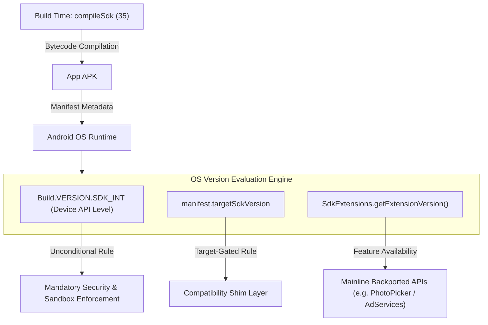

## API level, codename, extension level, targetSdkVersion 은 서로 다른 version 축이다

Android version 을 말할 때 API level, dessert codename, SDK Extension level, minor SDK version, `compileSdk`, `targetSdkVersion` 을 섞으면 판단이 흐려진다. API level 은 platform SDK surface 의 major 번호이고, codename 은 release 식별자다. extension level 은 Mainline module 을 통해 추가된 일부 API availability 를, `SDK_INT_FULL` 은 major/minor platform release 를 구분한다.

### 내부 동작 메커니즘 (Version Axis Distinction)

1. **Version Control Axes**:
   - **`compileSdk`**: 컴파일 타임 린터 및 바이트코드 빌더가 참조할 SDK API 마운트 클래스 스펙.
   - **`targetSdkVersion`**: OS 런타임 호환성 엔진(Compatibility Engine)이 앱 프로세스에 어떤 버전 게이팅 동작(Target-Gated Behavior Changes)을 강제할지 결정하는 계약 축.
   - **`minSdkVersion` / `Build.VERSION.SDK_INT`**: 런타임 디바이스 OS 의 하한선 API 레벨.
   - **`SdkExtensions`**: OS 업데이트 없이 Google Play System Update(Mainline APEX)를 통해 백포팅된 모듈형 API 레벨 (`ext.getExtensionVersion()`).
2. **Behavior Gating Logic**: OS 런타임은 `targetSdkVersion` 을 확인하여 레거시 앱에 호환성 심(Shim) 레이어를 제공하지만, 플랫폼 전역 보안/프라이버시 규제(예: Scoped Storage 강제)는 `targetSdkVersion` 과 무관하게 `SDK_INT` 수준에서 일괄 적용된다.



### 코드 예시 (Runtime Version Guard & Extension Check)

```kotlin
import android.os.Build
import android.os.ext.SdkExtensions
import android.provider.MediaStore

fun checkPhotoPickerAvailability(): Boolean {
    return when {
        // 1. Android 13 (API 33) 이상에서는 OS 기본 API 지원
        Build.VERSION.SDK_INT >= Build.VERSION_CODES.TIRAMISU -> true
        
        // 2. Android 11 (API 30) ~ 12 (API 32)에서는 R Extension 버전 확인
        Build.VERSION.SDK_INT >= Build.VERSION_CODES.R -> {
            SdkExtensions.getExtensionVersion(Build.VERSION_CODES.R) >= 2
        }
        
        else -> false
    }
}
```

### 관측 가능한 증거 (Observable Evidence)

`adb shell getprop` 명령을 사용하여 디바이스의 실제 API 레벨, 확장 릴리즈 버전 및 빌드 태그를 직접 조회할 수 있다:

```bash
# 디바이스 Major SDK API Level 관측
adb shell getprop ro.build.version.sdk

# OS 버전 명칭 및 Release Codename 관측
adb shell getprop ro.build.version.release

# Mainline SDK Extension 버전 확인
adb shell getprop ro.build.version.extensions.r
```

관련 노트: [SDK Extensions](../../../01_system_internals/platform-modularity/sdk-extensions.md), [packaging/deployment](../../../03_packaging_deployment/android-packaging-deployment.md).

공식 문서(2026-08-03 검증): [Build.VERSION](https://developer.android.com/reference/android/os/Build.VERSION), [Build.VERSION_CODES](https://developer.android.com/reference/android/os/Build.VERSION_CODES), [VERSION_CODES_FULL](https://developer.android.com/reference/kotlin/android/os/Build.VERSION_CODES_FULL)
