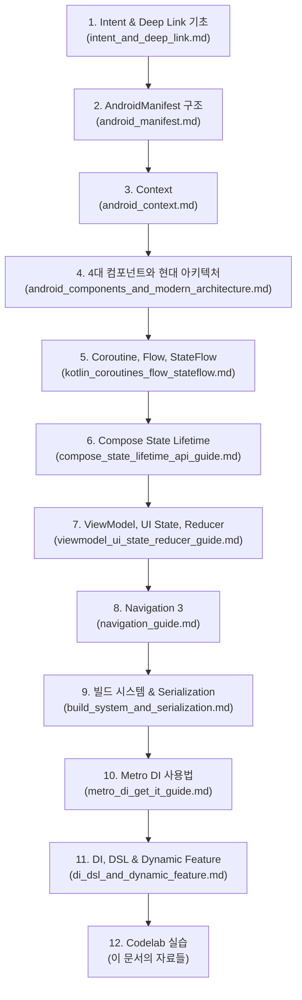

# 학습 순서 추천

```mermaid
graph TD
    A["1. Intent & Deep Link 기초<br/>(intent_and_deep_link.md)"] --> B["2. AndroidManifest 구조<br/>(android_manifest.md)"]
    B --> C["3. Context<br/>(android_context.md)"]
    C --> D["4. 4대 컴포넌트와 현대 아키텍처<br/>(android_components_and_modern_architecture.md)"]
    D --> E["5. Coroutine, Flow, StateFlow<br/>(kotlin_coroutines_flow_stateflow.md)"]
    E --> F["6. Compose State Lifetime<br/>(compose_state_lifetime_api_guide.md)"]
    F --> G["7. ViewModel, UI State, Reducer<br/>(viewmodel_ui_state_reducer_guide.md)"]
    G --> H["8. Navigation 3<br/>(navigation_guide.md)"]
    H --> I["9. 빌드 시스템 & Serialization<br/>(build_system_and_serialization.md)"]
    I --> J["10. Metro DI 사용법<br/>(metro_di_get_it_guide.md)"]
    J --> K["11. DI, DSL & Dynamic Feature<br/>(di_dsl_and_dynamic_feature.md)"]
    K --> L["12. Codelab 실습<br/>(이 문서의 자료들)"]
```

>[!TIP]
>Codelab 실습 시 단순 코드 복사 - 붙여넣기보다는 **"이 설정을 추가했을 때 `AndroidManifest.xml` 장부에 어떤 변화가 생기고, 안드로이드 OS 가 이를 어떻게 인식할까?"**라는 관점으로 접근하면 아키텍처 이해에 큰 도움이 됩니다.
