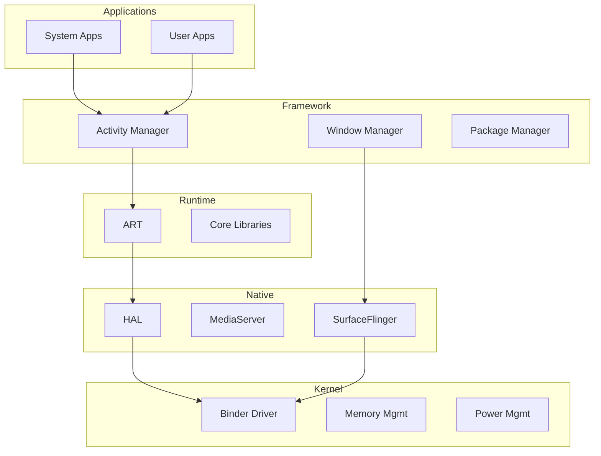

# 03 아키텍처 레이어 개요

---
title: 03-아키텍처-레이어
tags: []
aliases: []
date modified: 2026-07-31 15:30:25 +09:00
date created: 2026-07-31 15:29:55 +09:00
---

## 아키텍처 레이어

상위 노트: [[android-overview]]

```mermaid
graph TB
    subgraph Applications
        A1[System Apps]
        A2[User Apps]
    end
    
    subgraph Framework
        F1[Activity Manager]
        F2[Window Manager]
        F3[Package Manager]
    end
    
    subgraph Runtime
        R1[ART]
        R2[Core Libraries]
    end
    
    subgraph Native
        N1[SurfaceFlinger]
        N2[MediaServer]
        N3[HAL]
    end
    
    subgraph Kernel
        K1[Binder Driver]
        K2[Memory Mgmt]
        K3[Power Mgmt]
    end
    
    A1 --> F1
    A2 --> F1
    F1 --> R1
    F2 --> N1
    R1 --> N3
    N3 --> K1
    N1 --> K1
```
