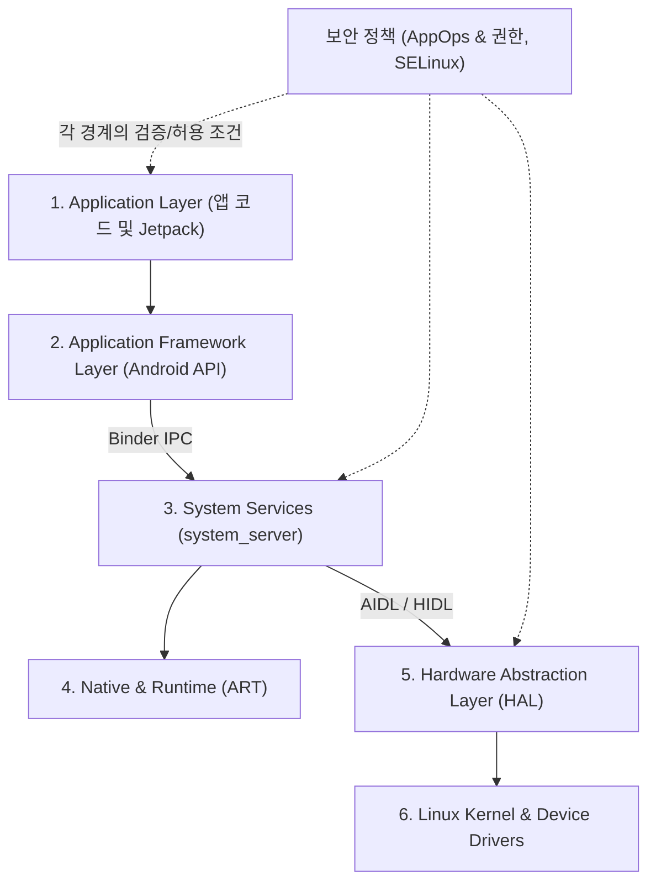

## Android 는 앱 SDK 만이 아니라 계층형 모바일 플랫폼이다

Android 를 단순한 UI 라이브러리나 앱 개발 API(SDK) 목록으로만 이해하면, 시스템의 실제 동작 원리와 장애 원인을 파악하기 어렵다.

Android 는 하드웨어부터 최상위 UI 애플리케이션까지 **책임과 보안 경계가 엄격히 분리된 계층형(Layered) 모바일 플랫폼**이다. 위 계층에서 API 를 호출하면, 요청이 경계를 지날 때마다 수명주기(Lifecycle), [보안 권한(Permissions)](../../../05_security_privacy/appops-and-permissions.md), [스레드(Thread)](../../../../../computer-science/thread.md), 그리고 하드웨어 조건이 겹겹이 적용된다.

---

## 1. 안드로이드 계층 아키텍처 개요 (Layer Stack)

### 각 계층별 역할과 책임

1. **Application Layer (애플리케이션 계층)**:
   - 개발자가 작성하는 카카오톡, 유튜브 등의 앱 코드와 Jetpack Compose, AppCompat 라이브러리가 위치하는 영역.
2. **Application Framework Layer (프레임워크 계층)**:
   - `Activity`, `ContentProvider`, `View` 등 앱 개발에 필요한 Java/Kotlin API 표준을 제공하는 자바 프레임워크 영역.
3. **System Services & [`system_server`](../../../04_system_services/system-server.md)**:
   - 안드로이드의 핵심인 `ActivityManagerService(AMS)`, `WindowManagerService(WMS)`, `PackageManagerService(PMS)` 등이 동작하는 핵심 프로세스. 앱과 시스템 서비스는 [`Binder IPC`](../../../01_system_internals/binder-ipc.md) 를 통해 통신한다.
4. **Android Runtime ([ART](../../../01_system_internals/art.md)) & Native Userspace**:
   - DEX 바이트코드를 실행하는 가상 머신 런타임. AOT/JIT 컴파일 및 [가비지 컬렉션(GC)](../../../../../computer-science/garbage-collection.md) 을 담당한다.
5. **Hardware Abstraction Layer ([HAL](../../../01_system_internals/hal.md))**:
   - 카메라, 블루투스, 오디오 등 하드웨어 제조사(Qualcomm, Samsung 등)의 구체적인 C/C++ 드라이버 코드를 안드로이드 프레임워크와 완전히 분리해 주는 추상화 인터페이스 계층.
6. **[Linux Kernel](../../../../../operating-systems/linux-kernel.md)**:
   - 디바이스 드라이버, 메모리 관리, [프로세스/스레드 스케줄링](../../../../../computer-science/thread.md), 전원 관리(Low Memory Killer, Ashmem 등)를 담당하는 하부 OS 기반.

---

## 2. 실전 사례: 앱에서 "카메라 미리보기(Preview)"를 요청할 때 일어나는 일

단순히 `cameraProvider.bindToLifecycle()` API 한 줄을 호출하더라도, 요청은 안드로이드 계층을 통과하며 다음과 같은 검증과 변환을 거친다:

1. **App Level**: 카메리가 열릴 수 있는 앱 수명주기([Lifecycle](android-is-layered-mobile-platform-not-just-an-app-sdk.md)) 및 Surface 화면 준비 상태 확인.
2. **Framework & [`system_server`](../../../04_system_services/system-server.md)**: [`Binder IPC`](../../../01_system_internals/binder-ipc.md)를 거쳐 `CameraService`로 호출 전달. 이때 사용자의 카메라 권한 및 [`AppOps`](../../../05_security_privacy/appops-and-permissions.md) 거부 여부를 검사한다.
3. **[`HAL`](../../../01_system_internals/hal.md) Level**: `CameraService`가 AIDL/HIDL 인터페이스를 통해 제조사의 `Camera HAL` 세션을 오픈.
4. **[`Kernel`](../../../../../operating-systems/linux-kernel.md) Level**: 리눅스 커널 카메라 디바이스 드라이버가 실물 이미지 센서 칩셋에 전원을 켜고 프레임 데이터를 획득.

### 에러 발생 시 원인 추적 경로
- `SecurityException` 발생 시 ➔ **2 단계 보안 영역**: [`AppOps 및 권한`](../../../05_security_privacy/appops-and-permissions.md) 설정 확인
- `CameraAccessException` 발생 시 ➔ **3 단계 하드웨어 점유 영역**: `CameraService` 또는 [`HAL`](../../../01_system_internals/hal.md) 상태 확인
- 화면만 검게 나올 때 ➔ **1 단계 UI 및 Surface 영역**: Surface, Graphic Buffer, Rendering 경계 확인

---

## 3. 계층별 원인 파악을 위한 디버깅 증거 수집 가이드

| 문제 상황 | 우선 확인할 시스템 증거 | 소유 및 담당 영역 |
| :--- | :--- | :--- |
| 프로세스 생성 및 메인 [스레드](../../../../../computer-science/thread.md) 동작 확인 | `logcat`, `dumpsys activity`, Perfetto 트레이스 | Boot / [`ART Runtime`](../../../01_system_internals/art.md) |
| Framework 호출이 거절되거나 권한 오류 발생 | Exception 로그, [`Binder`](../../../01_system_internals/binder-ipc.md) 호출 기록, [`dumpsys <service>`](../../../04_system_services/system-server.md), [`AppOps`](../../../05_security_privacy/appops-and-permissions.md) | [`system_server`](../../../04_system_services/system-server.md) & Security |
| 특정 기기에서만 센서/하드웨어 경로 실패 | Service/[`HAL`](../../../01_system_internals/hal.md) error 로그, [`Linux Kernel`](../../../../../operating-systems/linux-kernel.md) dmesg | [`Linux Kernel`](../../../../../operating-systems/linux-kernel.md) / [`HAL`](../../../01_system_internals/hal.md) |
| APK 서명 및 타겟 SDK 조건 오류 | APK metadata, `PackageManager`, Play Console | Packaging / Deployment |

---

## 연결 문서 (Reference Links)

- [Linux Kernel 레퍼런스](../../../../../operating-systems/linux-kernel.md) - 안드로이드 하부 토대가 되는 리눅스 커널 레퍼런스
- [HAL 레퍼런스](../../../01_system_internals/hal.md) - 안드로이드 하드웨어 추상화 계층 레퍼런스
- [ART Runtime 레퍼런스](../../../01_system_internals/art.md) - 안드로이드 가상 머신 및 DEX 런타임 레퍼런스
- [system_server 레퍼런스](../../../04_system_services/system-server.md) - 핵심 시스템 서비스 및 프로세스 레퍼런스
- [AppOps & 권한 레퍼런스](../../../05_security_privacy/appops-and-permissions.md) - 안드로이드 권한 및 보안 통제 레퍼런스
- [Binder IPC 레퍼런스](../../../01_system_internals/binder-ipc.md) - 계층 간 통신을 담당하는 Binder IPC 레퍼런스

공식 문서: [Platform architecture](https://developer.android.com/guide/platform), [Android architecture](https://source.android.com/docs/core/architecture)
