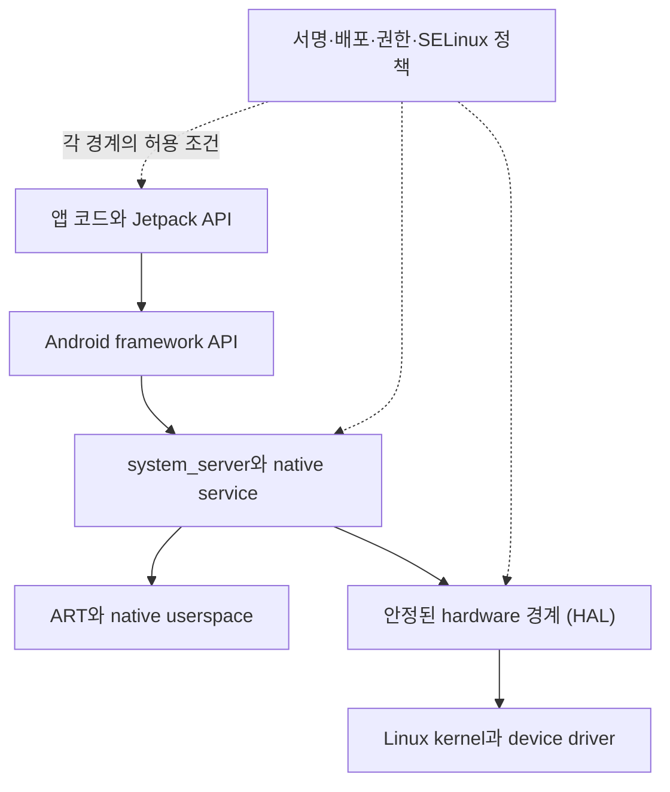

## Android 는 앱 SDK 만이 아니라 계층형 모바일 플랫폼이다

Android를 앱 API 목록으로만 보면 시스템 동작을 설명하기 어렵다. Android는 Linux kernel, hardware abstraction layer(HAL), native service, Android Runtime(ART), framework service, app framework, 배포·보안 정책이 서로 다른 책임으로 연결된 플랫폼이다. 위 계층의 API 호출은 아래 계층의 구현을 직접 노출하지 않지만, 요청이 경계를 지날 때마다 수명·권한·thread·hardware 조건이 추가된다.

예를 들어 앱이 camera preview를 요청하면 app lifecycle과 surface 상태, camera service의 권한·AppOps 검사, HAL session, driver와 sensor가 모두 관여한다. `SecurityException`이면 service 호출 전후의 접근 통제를 먼저 보고, `CameraAccessException`이나 service error면 camera service/HAL 상태를 보고, preview만 검다면 surface·buffer·rendering 경계를 본다. 같은 API에서 시작해도 최초 실패 경계가 다르면 소유 문서와 조사 도구가 달라진다.

### 계층별로 확인할 증거

| 질문 | 우선 확인할 증거 | 소유 영역 |
| --- | --- | --- |
| process가 만들어지고 callback이 도착했는가 | `logcat`, `dumpsys activity`, Perfetto process/thread track | boot/runtime |
| framework 호출이 service에서 거절됐는가 | exception, Binder call, `dumpsys <service>`, AppOps | system service·security |
| 특정 기기에서만 hardware 경로가 실패하는가 | service/HAL error, kernel log, capability query | kernel/HAL·device capability |
| 설치·target·서명 조건이 다른가 | APK metadata, PackageManager, Play Console | packaging/deployment |

### 문서 경계

이 노트의 역할은 계층 사이의 인과와 조사 출발점을 설명하는 원자 reference다. 저장소의 읽는 순서와 상세 목차는 [Foundation contracts](foundation-contracts.md)와 상위 map이 소유하고, 각 계층의 구현 상세는 아래 정본으로 넘긴다.

관련 노트: [kernel/runtime](../../../01_system_internals/kernel-and-hal/android-kernel-runtime.md), [HAL/native boundary](../../../01_system_internals/kernel-and-hal/hal-native-boundary.md), [app architecture](../../../02_app_framework/architecture/android-app-architecture.md), [security/privacy](../../../05_security_privacy/security-practices/security-practice-contracts/android-security-practice-is-defense-in-depth-not-client-trust.md).

공식 문서: [Platform architecture](https://developer.android.com/guide/platform), [Android architecture](https://source.android.com/docs/core/architecture)
