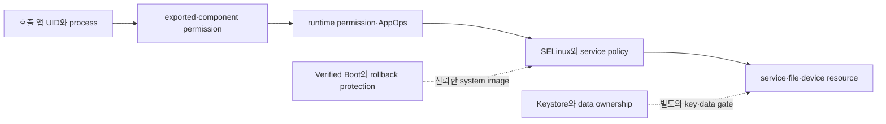

## Android 보안은 UID sandbox, permission, SELinux, verified boot 가 나뉜 계층이다

Android 보안을 "permission 팝업" 하나로 줄이면 부족하다. 요청 하나가 성공하려면 서로 독립적인 보안 gate를 모두 통과해야 한다. 앱 process는 UID와 sandbox로 분리되고, component 진입은 manifest의 exported·permission 계약을 거치며, 민감한 동작은 runtime permission과 AppOps 정책을 거친다. platform process와 object 접근에는 SELinux mandatory policy도 적용된다.

Verified Boot, dm-verity, rollback protection은 실행 중인 caller 권한이 아니라 boot할 software의 무결성을 다룬다. Keystore와 encrypted storage는 다시 key material의 export 가능성, hardware-backed 여부, data가 저장되는 위치를 나눈다. 한 계층을 통과했다고 다른 계층도 허용되는 것은 아니다.

### 실패 신호로 gate 찾기

| 신호 | 우선 조사할 gate | 혼동하지 않을 것 |
| --- | --- | --- |
| component resolution 실패, exported 관련 `SecurityException` | manifest/component 진입 | runtime permission dialog |
| `checkSelfPermission()` 거절 또는 permission callback | runtime permission | AppOps mode와 SELinux |
| permission은 허용됐지만 service가 동작을 거절 | AppOps 또는 service별 policy | permission grant가 전체 권한이라는 가정 |
| `avc: denied` | SELinux source/target type과 operation | 앱이 임의로 우회할 수 있는 runtime 설정 |
| verified boot state·rollback 오류 | boot chain과 image signing | 앱 process의 API 권한 |

예를 들어 camera permission이 `GRANTED`여도 AppOps가 거절하거나 camera가 privacy toggle로 비활성화되면 session은 열리지 않는다. 반대로 외부 camera Activity에 촬영을 위임하는 흐름은 앱 내부 CameraX session과 permission 경계가 다르다. 따라서 exception, AppOps, service state를 함께 관찰한다.

관련 노트: [sandbox](../../../05_security_privacy/platform-hardening/platform-security-contracts/android-app-sandbox-is-uid-and-process-boundary.md), [permissions](../../../05_security_privacy/permissions-and-sandbox/permission-contracts/permission-contracts.md), [SELinux](../../../05_security_privacy/platform-hardening/platform-security-contracts/selinux-enforces-mandatory-policy-beyond-linux-user-permissions.md), [Verified Boot](../../../05_security_privacy/platform-hardening/platform-security-contracts/verified-boot-establishes-device-software-chain-of-trust.md), [secure storage](../../../05_security_privacy/secure-storage/secure-storage-contracts/secure-storage-contracts.md).

### 판단 기준

보안 실패는 `adb shell dumpsys package <pkg>`, `adb shell appops get <pkg>`, service별 `dumpsys`, userdebug 환경의 `avc: denied`처럼 gate별 증거로 분류한다. 일반 앱에서 보이지 않는 privileged 신호는 bugreport나 platform 담당자에게 넘긴다.

### 경계

permission grant만으로 SELinux나 AppOps 거절을 설명하지 않는다. 이 노트는 독립 gate의 관계와 관찰 순서만 제공하고 정책별 version·API 조건은 security/privacy 정본이 소유한다.
