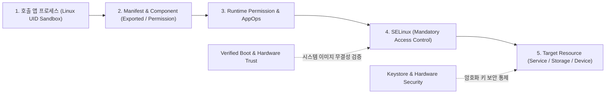

## Android 보안은 UID Sandbox, Permission, SELinux, Verified Boot 가 나뉜 심층 방어 계층이다

안드로이드 보안을 단순히 "사용자가 허용을 누르는 권한 팝업(Permission Dialog)" 하나로만 이해하면, 앱 개발이나 시스템 모니터링 시 발생하는 수많은 보안 거절 오류의 원인을 파악하기 어렵다.

안드로이드 보안은 특정 요청 하나가 성공하기 위해 **독립적인 5가지 보안 게이트(Security Gate)를 겹겹이 통과해야 하는 심층 방어(Defense in Depth) 계층 구조**로 설계되어 있다. 한 게이트를 통과했다고 해서 다른 게이트가 자동으로 허용되는 것이 아니다.

---

## 1. 안드로이드 5대 보안 게이트 (Security Gates)

### 각 보안 게이트별 독립적 역할

1. **Linux UID Sandbox (프로세스 격리 게이트)**:
   - 안드로이드는 각 앱마다 서로 다른 전용 [Linux UID(User ID)](../../../../../operating-systems/linux-kernel.md)를 부여하여, 기본적으로 타 앱의 파일이나 메모리 공간에 직접 접근하는 것을 하부 [Linux Kernel](../../../../../operating-systems/linux-kernel.md) 차원에서 완전 차단한다.
2. **Manifest & Component Access Gate (컴포넌트 진입 게이트)**:
   - 앱 내부의 Activity, Service, BroadcastReceiver 등을 외부로 노출할지 여부(`android:exported="true/false"`)와 컴포넌트 접근 권한을 정의한다.
3. **[Runtime Permission & AppOps](../../../05_security_privacy/appops-and-permissions.md) (동적 권한 및 세밀한 기능 통제)**:
   - 위치, 카메라, 마이크 등 민감한 기능에 접근할 때 사용자 동의를 받는 **Runtime Permission**과, 백그라운드 카메라 사용 금지/개인정보 토글 등을 개별 제어하는 **[AppOps](../../../05_security_privacy/appops-and-permissions.md)** 정책이 적용된다.
4. **SELinux (강제 접근 제어 - MAC)**:
   - 커널 수준에서 정의된 [SELinux](../../../../../../../../../../../dev/null) 정책으로, 루트(root) 권한을 가진 프로세스라 할지라도 허용되지 않은 시스템 리소스나 서비스에 접근할 수 없도록 강제 통제한다.
5. **Verified Boot & Hardware KeyStore (하드웨어 무결성 및 암호화)**:
   - 부팅 시 OS 시스템 이미지의 개조 여부를 암호학적으로 검증(Verified Boot)하고, 민감한 암호화 키를 보안 칩셋(TEE/StrongBox)에 안전하게 격리 보관한다.

---

## 2. 실전 사례: 카메라 권한이 `GRANTED` 여도 촬영이 거절되는 이유

카메라 권한을 얻었더라도 다음과 같은 보안 게이트 상태에 따라 동작 결과가 달라진다:

- **Permission 게이트**: 사용자 동의로 `CAMERA` 권한이 `GRANTED` 상태임.
- **[AppOps](../../../05_security_privacy/appops-and-permissions.md) 게이트**: 상단바의 "카메라 차단 토글"을 켜두어 AppOps 상태가 `MODE_IGNORED`로 설정됨 ➔ **결과**: 예외 없이 검은 화면만 반환됨.
- **SELinux 게이트**: 카메라 서비스가 잘못된 프로세스 도메인에서 호출됨 ➔ **결과**: 커널 `avc: denied` 에러 발생.

---

## 3. 보안 거절 신호별 우선 조사 가이드 (Debugging Guide)

| 예외 및 관찰 신호 | 우선 조사할 보안 게이트 | 확인 명령 / 도구 |
| :--- | :--- | :--- |
| `SecurityException: Permission Denial` | Manifest `exported` 및 [Permission](../../../05_security_privacy/appops-and-permissions.md) | `AndroidManifest.xml`, `dumpsys package <pkg>` |
| 권한 팝업 미노출 또는 `checkSelfPermission()` 거절 | [Runtime Permission](../../../05_security_privacy/appops-and-permissions.md) | `ContextCompat.checkSelfPermission()` |
| 권한은 있으나 시스템 기능 동작 미수행 | [AppOps](../../../05_security_privacy/appops-and-permissions.md) 및 기능 토글 | `adb shell appops get <pkg>` |
| `avc: denied { read/write }` 로그 발생 | SELinux 강제 정책 (MAC) | `adb logcat | grep avc` |
| 부팅 중 `RED / YELLOW` 보안 경고 발생 | Verified Boot 무결성 검증 실패 | Bootloader state / Keymaster status |

---

## 연결 문서 (Reference Links)

- [AppOps & 권한 레퍼런스](../../../05_security_privacy/appops-and-permissions.md) - 안드로이드 동적 권한 및 AppOps 통제 메커니즘
- [Linux Kernel 레퍼런스](../../../../../operating-systems/linux-kernel.md) - UID 샌드박스와 커널 레벨 보안 토대
- [system_server 레퍼런스](../../../04_system_services/system-server.md) - 시스템 권한 검사를 수행하는 프로세스
- [Binder IPC 레퍼런스](../../../01_system_internals/binder-ipc.md) - 보안 컨텍스트(UID/PID)를 전달하는 IPC

공식 문서: [Android security model](https://source.android.com/docs/security), [Permissions overview](https://developer.android.com/guide/topics/permissions/overview)
