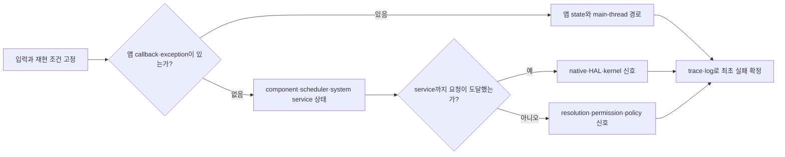

## Android stack boundary 는 문제가 어느 층에 속하는지 판단하게 해 준다

Android 문제를 진단할 때 첫 질문은 "어떤 API를 썼나"가 아니라 "마지막으로 성공한 경계와 최초로 실패한 경계는 어디인가"다. 같은 `CameraX`, `startActivity()`, `WorkManager` API도 caller 상태, Binder service, native implementation, kernel/device 중 어느 단계까지 갔는지에 따라 소유 영역이 달라진다.

Kernel 과 HAL 은 device capability 를 제공하고, native/service layer 는 system policy 를 구현하며, framework 는 app-facing API 와 lifecycle 을 노출한다. 앱 코드는 이 boundary 위에서 상태, navigation, data, background work 를 설계한다.

### 증거가 바뀌는 지점을 찾는 순서

| 마지막 성공 신호 | 최초 실패 신호 | 우선 소유 영역 |
| --- | --- | --- |
| Intent 생성 | resolution/exported/permission 오류 | app components·security |
| component callback 진입 | main thread block·state 불일치 | app framework |
| Binder 요청 도달 | service policy·queue·timeout | system service·IPC |
| native service session 생성 | HAL status·buffer·driver 오류 | graphics/media·kernel/HAL |
| frame 제출 | missed deadline·GPU fence 지연 | rendering/performance |

구체 예로 알림이 보이지 않을 때 서버의 FCM message ID는 기기 전달 성공이 아니다. `onMessageReceived()`가 관찰되면 delivery 경계는 통과했으므로 channel·permission·게시 기록으로 이동한다. callback이 없다면 token, priority, Doze와 FCM 전달 지표를 먼저 본다. 이처럼 한 증상을 계층 이름에 바로 매핑하지 않고 경계 양쪽의 증거를 짝지어야 한다.

관련 노트: [boot/runtime](../../../01_system_internals/boot-and-runtime/android-boot-and-runtime.md), [graphics/media](../../../01_system_internals/graphics-and-media/android-graphics-media-runtime.md), [app components](../../../02_app_framework/architecture/app-components/android-app-components.md), [debugging](../../../06_testing_performance/debugging/debugging-contracts/debugging-contracts.md).

### 판단 기준

재현 입력, 앱 callback·exception, `logcat`, 관련 service의 `dumpsys`, Perfetto thread/process track 순서로 증거를 모은다. 특정 기기에서만 재현될 때는 동일 app artifact와 OS/API 조건을 고정한 뒤 capability와 HAL 신호로 내려간다.

### 경계

경계 분류는 원인 확정이 아니다. `BinderProxy.transact` frame 하나만으로 system service 결함이라고 단정하거나 `avc: denied` 한 줄만으로 앱 permission 문제라고 단정하지 않는다. 실제 원인은 log, trace, service state, 재현 조건으로 검증하며 상세 진단 절차는 debugging/performance 정본으로 넘긴다.
