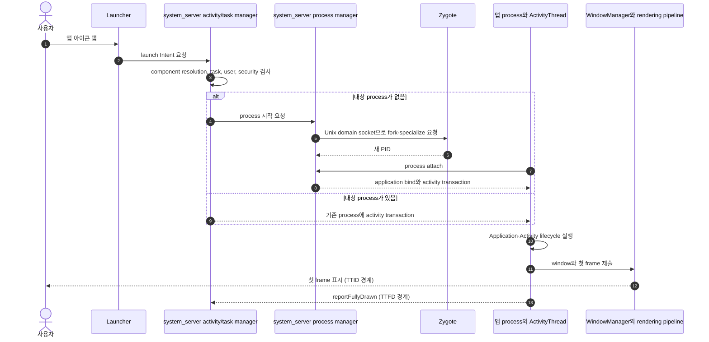

## 앱 실행은 Launcher, system_server, Zygote, ActivityThread 를 지나는 경로다

앱 아이콘을 탭하는 일은 단순히 `MainActivity.onCreate()`를 호출하는 것이 아니다. Launcher가 launch Intent를 Binder로 system_server에 보내면 activity/task 관리 계층이 대상 component, task와 사용자·보안 조건을 확인한다. 대상 process가 없으면 process 관리 계층이 Zygote에 생성을 요청하고, 이미 살아 있으면 기존 process로 activity transaction을 보낸다.

새 app process는 fork 뒤 UID, SELinux domain, cgroup, runtime option 등으로 specialization되고 `ActivityThread` main loop를 시작한다. process가 system_server에 attach된 뒤 application binding과 activity launch transaction을 받고, `Application`과 `Activity` lifecycle을 실행한다. window가 surface에 frame을 제출해 화면에 표시되는 시점이 TTID 관찰 경계이고, 앱이 `reportFullyDrawn()`으로 fully usable 상태를 알리는 시점이 TTFD 경계다.

### Cold launch의 호출 흐름



이 sequence는 안정된 책임 경계를 나타내며 내부 class·method 이름 전체를 고정하는 source-level 명세가 아니다. warm/hot launch에서는 process 생성, application 초기화, activity 재생성 여부가 달라질 수 있으므로 cold launch trace와 섞지 않는다.

### 실패 경계와 다음 조사

| 실패 경계 | 관찰 신호 | 다음 조사 |
| --- | --- | --- |
| Intent resolution·component 보안 | `ActivityNotFoundException`, `SecurityException`, `ActivityTaskManager` log | manifest, exported, enabled state, user/profile |
| process 생성·specialization | PID가 생기지 않음, `ActivityManager`·Zygote·SELinux log | process start reason, crash, ABI, policy |
| process attach·application 초기화 | PID는 있으나 첫 Activity callback 전 crash/ANR | `Application.onCreate()`, content provider와 SDK 초기화 trace |
| Activity lifecycle | `onCreate()` 진입 뒤 main thread block 또는 state 복원 오류 | lifecycle callback, saved state, synchronous I/O·lock |
| 첫 frame 제출 | Activity는 resumed지만 `Displayed`·frame 신호 지연 | layout/rendering, shader·resource load, WindowManager |
| fully usable 상태 | TTID는 정상이나 TTFD가 회귀하거나 미보고 | data loading critical path, `reportFullyDrawn()` 위치 |

### 관찰 절차

```bash
# force-stop은 stopped state까지 바꾸므로 cold launch 측정임을 명시한다.
adb shell am force-stop com.example.app
adb shell am start-activity -W -n com.example.app/.MainActivity

# process·task·activity 상태를 서로 다른 신호로 확인한다.
adb shell pidof com.example.app
adb shell dumpsys activity activities
adb logcat -d -s ActivityTaskManager ActivityManager Zygote
```

`am start-activity -W`의 timing field와 `Displayed` log는 OS version별 정의를 확인하고, 단일 숫자보다 동일 artifact·기기 조건의 반복 분포와 Perfetto `android_startup` trace를 사용한다. process가 생겼다는 사실은 첫 frame이나 fully usable 상태를 보장하지 않는다.

### 문서 경계

이 노트는 launcher부터 첫 frame까지 책임과 증거가 이동하는 end-to-end mechanism을 소유한다. Zygote 구현, Activity lifecycle 세부 callback, startup benchmark 방법은 각 정본이 소유한다.

관련 노트: [AMS lifecycle](../../../01_system_internals/boot-and-runtime/system-server-contracts/ams-coordinates-app-process-and-component-lifecycle.md), [Zygote/runtime](../../../01_system_internals/boot-and-runtime/zygote-runtime-contracts/zygote-runtime-contracts.md), [Activity/app components](../../../02_app_framework/architecture/app-components/android-app-components.md), [startup performance](../../../06_testing_performance/performance/performance-contracts/startup-performance-is-measured-by-ttid-and-ttfd.md).

공식 문서: [Application fundamentals](https://developer.android.com/guide/components/fundamentals), [App startup time](https://developer.android.com/topic/performance/vitals/launch-time), [Time to initial and full display](https://developer.android.com/topic/performance/vitals/ttid-ttfd), [Zygote processes](https://source.android.com/docs/core/runtime/zygote)
