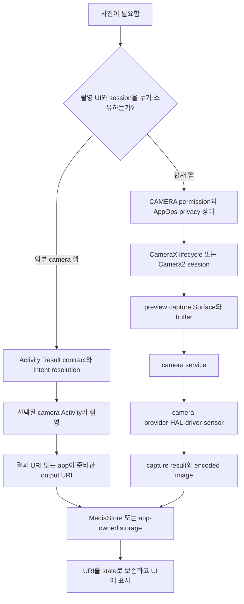

## 사진 찍기 예시는 permission, intent, UI, media, HAL, storage 경계를 함께 지난다

사진 찍기는 하나의 요구사항이지만 최소 두 경로가 있다. 다른 camera 앱에 촬영을 위임하는 Activity Result/Intent 경로와, 앱 안에서 CameraX 또는 Camera2 session을 소유하는 경로다. 전자는 외부 component resolution과 결과 URI 계약이 중심이고, 후자는 `CAMERA` runtime permission, lifecycle, preview Surface, camera service, HAL과 sensor가 중심이다. 두 경로를 하나의 permission·session 규칙으로 설명하면 잘못된다.

### 경로 선택과 end-to-end 흐름



외부 camera Activity에 위임하는 앱은 일반적으로 camera hardware를 직접 열지 않으므로 embedded camera와 같은 `CAMERA` permission 흐름을 요구하지 않는다. 반대로 CameraX/Camera2를 직접 사용하면 permission grant만으로 충분하지 않다. camera availability, 앱 lifecycle, surface 준비, 동시 사용 제한, privacy control과 device capability를 함께 확인한다.

### 성공 경로의 상태 예시

1. 앱이 요구사항에 따라 위임 또는 embedded 경로를 선택한다.
2. embedded 경로라면 permission과 camera availability를 확인한 뒤 visible lifecycle에 session을 bind한다.
3. preview Surface가 준비되면 capture request와 buffer가 camera service/HAL을 지난다.
4. 결과 byte나 output URI를 MediaStore 또는 app-owned 위치에 기록한다.
5. configuration change나 process recreation 뒤에도 raw bitmap이 아니라 URI와 필요한 metadata를 복원한다.

### 실패 경계와 관찰 신호

| 증상 | 최초로 의심할 경계 | 관찰 신호 |
| --- | --- | --- |
| 외부 촬영 UI가 열리지 않음 | Intent resolution·profile policy | `ActivityNotFoundException`, `resolveActivity()` 결과, ActivityTaskManager log |
| embedded camera open이 거절됨 | permission·AppOps·privacy control | permission state, `adb shell appops get <pkg> CAMERA`, `SecurityException` |
| open 요청 뒤 camera를 사용할 수 없음 | camera service·동시 사용·device availability | `CameraAccessException`, availability callback, `dumpsys media.camera` |
| preview만 검거나 멈춤 | lifecycle·Surface·buffer/rendering | Preview use case state, surface 생성/해제, frame과 CameraX log |
| 특정 기기·lens에서만 capture 실패 | capability·HAL/vendor implementation | `CameraCharacteristics`, capture failure/error callback, camera service/HAL log |
| 촬영은 됐지만 저장·재열기 실패 | URI grant·MediaStore·소유권 | resolver exception, MediaStore row, URI permission과 file existence |

```bash
# 앱 gate와 camera service 상태를 분리해 본다.
adb shell dumpsys package com.example.app
adb shell appops get com.example.app CAMERA
adb shell dumpsys media.camera
adb logcat -d -s CameraService CameraManager CameraX
```

`dumpsys media.camera`와 vendor log의 상세 출력은 build·OEM마다 다를 수 있다. 일반 앱에서 HAL/kernel 신호가 보이지 않으면 reproducible case, camera ID, OS build, capture error를 묶어 device/platform 담당자에게 넘긴다.

관련 노트: [graphics/media runtime](../../../01_system_internals/graphics-and-media/android-graphics-media-runtime.md), [file access](../../../02_app_framework/data/storage/file-access-contracts/file-access-contracts.md), [permissions](../../../05_security_privacy/permissions-and-sandbox/permission-contracts/permission-contracts.md), [app components](../../../02_app_framework/architecture/app-components/android-app-components.md).

### 판단 기준

preview가 없으면 Surface/lifecycle과 camera pipeline, 호출이 거절되면 permission/AppOps와 privacy control, 특정 기기만 실패하면 capability/HAL/vendor, 저장만 실패하면 MediaStore와 URI 소유권을 먼저 확인한다. 외부 camera 앱 위임인지 embedded session인지 가장 먼저 구분한다.

### 경계

이 노트는 두 camera 경로가 permission, component, media/HAL, storage 경계를 어떻게 다르게 지나는지와 failure routing을 소유한다. CameraX use-case 구성 코드, Camera2 request 세부, image encoding과 파일 schema는 각각 media, app component, storage 정본으로 분리한다.

공식 문서: [Camera intents](https://developer.android.com/media/camera/camera-intents), [CameraX architecture](https://developer.android.com/media/camera/camerax/architecture), [Camera2 capture sessions](https://developer.android.com/media/camera/camera2/capture-sessions-requests), [MediaStore](https://developer.android.com/training/data-storage/shared/media)
