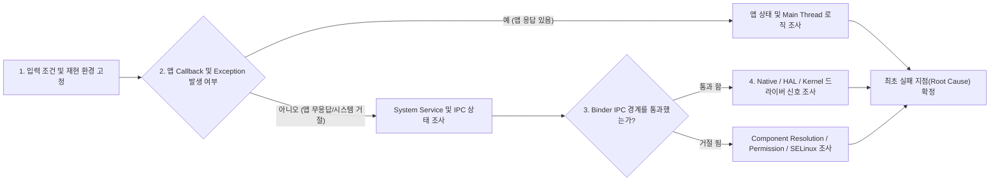

## Android Stack Boundary 는 문제 발생 시 책임 영역을 판단하는 핵심 기준이다

안드로이드 기반 애플리케이션이나 플랫폼을 진단할 때 가장 먼저 던져야 할 질문은 "내가 어떤 API를 호출했는가?"가 아니라, **"마지막으로 성공한 계층 경계와 최초로 실패한 계층 경계가 어디인가?"**이다.

동일한 `startActivity()`나 카메라 `takePicture()` API라 하더라도 호출이 막힌 지점에 따라 [앱 프레임워크](../../../02_app_framework/architecture/state-management/viewmodel/viewmodel.md) 문제인지, [시스템 서비스(`system_server`)](../../../04_system_services/system-server.md) 문제인지, [하드웨어 추상화 계층(`HAL`)](../../../01_system_internals/kernel-and-hal/hal-native/hal.md) 문제인지, [리눅스 커널](../../../../../operating-systems/linux-kernel.md) 디바이스 드라이버 문제인지 소유 책임 영역이 완전히 달라진다.

---

## 1. 실패 경계 탐색 4단계 흐름 (Boundary Routing Flow)

### 각 계층 경계별 관찰 증거 (Evidence Chain)

1. **App Layer Boundary (앱 계층 경계)**:
   - 앱 내 코드, UI State, [메인 스레드](../../../../../computer-science/thread.md) 블로킹(ANR), NPE/NullPointerException 등.
2. **Framework & IPC Boundary (프레임워크 및 IPC 경계)**:
   - [Binder IPC](../../../01_system_internals/ipc-and-process/binder-ipc.md)를 거치는 과정에서의 [권한 및 AppOps](../../../05_security_privacy/appops-and-permissions.md) 거부, `SecurityException`, `ActivityNotFoundException`.
3. **System Service Boundary (시스템 서비스 경계)**:
   - [`system_server`](../../../04_system_services/system-server.md) 내의 `ActivityManagerService(AMS)`, `WindowManagerService(WMS)` 등에서 발생한 큐 타임아웃, 교착 상태([Deadlock](../../../../../computer-science/thread.md)).
4. **Hardware & Kernel Boundary (하드웨어 및 커널 경계)**:
   - [`HAL`](../../../01_system_internals/kernel-and-hal/hal-native/hal.md) 하드웨어 세션 에러, [`Linux Kernel`](../../../../../operating-systems/linux-kernel.md) dmesg 에러, GPU 랜더링 펜스(Fence) 타임아웃.

---

## 2. 성공 신호 ➔ 실패 신호 교차 파악 가이드

| 마지막 성공 관찰 신호 | 최초 실패 발생 신호 | 소유 및 담당 영역 |
| :--- | :--- | :--- |
| Intent 객체 생성 완료 | `ActivityNotFoundException` 또는 `SecurityException` | Manifest / [권한 및 AppOps](../../../05_security_privacy/appops-and-permissions.md) |
| Component 콜백 진입 | [메인 스레드](../../../../../computer-science/thread.md) 멈춤 (ANR) 또는 UI State 불일치 | 앱 프레임워크 / [ViewModel](../../../02_app_framework/architecture/state-management/viewmodel/viewmodel.md) |
| [Binder IPC](../../../01_system_internals/ipc-and-process/binder-ipc.md) 요청 전송 | `TransactionTooLargeException` 또는 [system_server](../../../04_system_services/system-server.md) 타임아웃 | IPC / [system_server](../../../04_system_services/system-server.md) |
| Native Service 세션 생성 | `CameraAccessException` 또는 [HAL](../../../01_system_internals/kernel-and-hal/hal-native/hal.md) status 에러 | [HAL](../../../01_system_internals/kernel-and-hal/hal-native/hal.md) / Media Native Runtime |
| Window Frame 제출 | 화면에 픽셀 미출력 (Dropped Frame / Jank) | Rendering / [Linux Kernel Driver](../../../../../operating-systems/linux-kernel.md) |

---

## 3. 실전 예시: 푸시 알림(Notification)이 안 올 때의 경계 파악법

서버에서 FCM 푸시를 보냈는데 앱에 알림이 뜨지 않을 때:
1. `FirebaseMessagingService.onMessageReceived()`가 호출되었는가?
   - **호출 됨**: 네트워크 및 FCM 전달 경계 통과 ➔ 앱 내부 Notification Channel, 알림 권한([AppOps](../../../05_security_privacy/appops-and-permissions.md)) 설정 경계 조사.
   - **호출 안 됨**: 앱 프로세스가 죽었거나 Doze 모드 제약 ➔ FCM 서버 응답, 토큰 상태, 백그라운드 [Zygote](../../../01_system_internals/boot-and-runtime/zygote-runtime/zygote-runtime.md) 프로세스 상태 경계 조사.

---

## 연결 문서 (Reference Links)

- [Linux Kernel 레퍼런스](../../../../../operating-systems/linux-kernel.md) - 최하단 커널 및 디바이스 드라이버 경계
- [HAL 레퍼런스](../../../01_system_internals/kernel-and-hal/hal-native/hal.md) - 제조사 하드웨어 추상화 경계
- [system_server 레퍼런스](../../../04_system_services/system-server.md) - 안드로이드 핵심 시스템 서비스 경계
- [Binder IPC 레퍼런스](../../../01_system_internals/ipc-and-process/binder-ipc.md) - 프로세스 및 계층 간 통신 경계
- [AppOps & 권한 레퍼런스](../../../05_security_privacy/appops-and-permissions.md) - 보안 통제 및 권한 경계

공식 문서: [Android platform architecture](https://developer.android.com/guide/platform)
