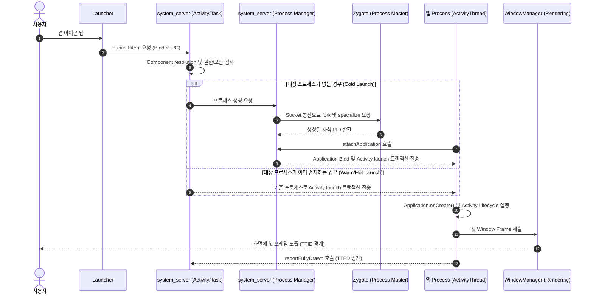

## 앱 실행은 Launcher, system_server, Zygote, ActivityThread 를 지나는 복합 경로다

스마트폰에서 앱 아이콘을 탭하는 동작은 단순히 `MainActivity.onCreate()` 라는 자바 함수 한 줄을 호출하는 것이 아니다.

안드로이드의 앱 실행(특히 프로세스가 완전히 새로 뜨는 **Cold Launch**)은 Launcher 앱부터 [시스템 서비스 (`system_server`)](../../../04_system_services/system-server.md), [마스터 프로세스 (`Zygote`)](../../../01_system_internals/boot-and-runtime/zygote-runtime/zygote-runtime.md), 그리고 앱의 메인 스레드인 [`ActivityThread`](../../../02_app_framework/activity-thread.md) 까지 시스템의 여러 계층을 교차하며 일어나는 정교한 프로세스 생명주기 여정이다.

---

## 1. 앱 실행 4 단계 주요 흐름 (Cold Launch Pipeline)

1. **Launcher ➔ [`system_server`](../../../04_system_services/system-server.md) (시작 요청)**:
   - 사용자가 앱 아이콘을 누르면, Launcher 가 [Binder IPC](../../../01_system_internals/ipc-and-process/binder-ipc.md)를 통해 `ActivityTaskManagerService (ATMS)` 로 앱 실행 Intent 를 전송한다.
   - `system_server`는 해당 앱의 [보안 권한](../../../05_security_privacy/appops-and-permissions.md)과 [앱 프로세스 존재 여부](../../../01_system_internals/boot-and-runtime/zygote-runtime/zygote-runtime.md) 를 검사한다.
2. **[`system_server`](../../../04_system_services/system-server.md) ➔ [`Zygote`](../../../01_system_internals/boot-and-runtime/zygote-runtime/zygote-runtime.md) (프로세스 생성 요청)**:
   - 앱 프로세스가 아직 없다면, Unix Domain Socket 을 통해 [Zygote](../../../01_system_internals/boot-and-runtime/zygote-runtime/zygote-runtime.md) 프로세스에게 `fork()` 를 요청한다.
   - [Zygote](../../../01_system_internals/boot-and-runtime/zygote-runtime/zygote-runtime.md)는 미리 로딩해 둔 [ART 가상 머신](../../../01_system_internals/boot-and-runtime/zygote-runtime/art.md) 과 시스템 리소스 메모리를 공유한 채 몇 ms 만에 자식 프로세스를 복제해 낸다.
3. **[`ActivityThread`](../../../02_app_framework/activity-thread.md) 메인 루프 시작 및 Attach**:
   - 새로 태어난 앱 프로세스는 메인 스레드인 [`ActivityThread.main()`](../../../02_app_framework/activity-thread.md) 을 실행하여 안드로이드 이벤트 루프([`Handler & Looper & MessageQueue`](../../../02_app_framework/handler-looper-message-queue.md))를 가동한다.
   - 앱 프로세스가 `system_server`에 "나 생성 완료되었음"을 알리는 `attachApplication()`을 호출하면, `system_server`가 `Application` 및 `Activity` 생성을 지시한다.
4. **`Application` 및 `Activity` 라이프사이클 실행 ➔ 화면 표시 ([TTID & TTFD](../../../06_testing_performance/ttid-and-ttfd.md))**:
   - `Application.onCreate()`와 `Activity.onCreate() ~ onResume()` 이 순차적으로 실행된다.
   - 첫 번째 프레임이 화면 렌더링 시스템(`WindowManager` / `SurfaceFlinger`)에 전달되어 첫 화면이 노출되는 시점을 [TTID (Time To Initial Display)](../../../06_testing_performance/ttid-and-ttfd.md) 라 부르며, 실제 사용 가능함을 알리는 시점을 [TTFD (Time To Fully Drawn)](../../../06_testing_performance/ttid-and-ttfd.md) 라 부른다.

---

## 2. Cold Launch 호출 시퀀스 다이어그램



---

## 3. 계층별 실행 실패 경계 및 디버깅 가이드

| 실패 발생 경계 | 대표적 오류 현상 (Sign) | 원인 및 디버깅 조사 포인트 |
| :--- | :--- | :--- |
| **Intent 및 권한 검사** | `ActivityNotFoundException`, `SecurityException` | `AndroidManifest.xml` 내 `exported` 설정 및 [AppOps / 권한](../../../05_security_privacy/appops-and-permissions.md) 확인 |
| **프로세스 Fork 실패** | PID 가 생기지 않고 앱 미실행 | [Zygote](../../../01_system_internals/boot-and-runtime/zygote-runtime/zygote-runtime.md) crash, SELinux 거부 정책, 메모리 부족([LMK](../../../01_system_internals/kernel-and-hal/kernel/lmkd-memory-pressure.md)) |
| **App Attach & 초기화** | PID 는 생성되나 화면 진입 전 바로 튕김 | `Application.onCreate()` 내 무거운 synchronous I/O, Third-party SDK 초기화 crash |
| **Activity Lifecycle** | `onCreate()` 진입 후 화면 멈춤 (ANR) | [ActivityThread 메인 스레드](../../../02_app_framework/activity-thread.md) 블로킹, 교착 상태([Deadlock](../../../../../computer-science/deadlock.md)) 또는 DB 락 |
| **렌더링 제출 (TTID)** | Activity 는 실행되었으나 검은 화면만 지속 | Layout/Rendering 파이프라인 과부하, `Surface` 뷰 초기화 지연 |

---

## 4. 관찰 및 측정 절차 (Command Line)

```bash
# 확실한 Cold Launch 상태를 만들기 위해 앱을 강제 종료 (Stopped State 전환)
adb shell am force-stop com.example.app

# 앱 시작 및 초기 렌더링 시간(TTID) 측정
adb shell am start-activity -W -n com.example.app/.MainActivity

# 실행 중인 프로세스 PID 및 프로세스/액티비티 상태 확인
adb shell pidof com.example.app
adb shell dumpsys activity activities
adb logcat -d -s ActivityTaskManager ActivityManager Zygote
```

---

## 연결 문서 (Reference Links)

- [ActivityThread 레퍼런스](../../../02_app_framework/activity-thread.md) - 안드로이드 앱 메인 스레드 총괄 지휘자
- [Handler & Looper & MessageQueue](../../../02_app_framework/handler-looper-message-queue.md) - 안드로이드 메인 이벤트 루프
- [TTID & TTFD 성능 지표](../../../06_testing_performance/ttid-and-ttfd.md) - 앱 구동 2 대 성능 측정 지표
- [LMK (Low Memory Killer)](../../../01_system_internals/kernel-and-hal/kernel/lmkd-memory-pressure.md) - 안드로이드 커널/데몬 메모리 회수 메커니즘
- [system_server 레퍼런스](../../../04_system_services/system-server.md) - 앱 실행 및 Lifecycle 관리 주체
- [Zygote 와 ART 런타임 심층 계약](../../../01_system_internals/boot-and-runtime/zygote-runtime/zygote-runtime.md) - 프로세스 fork 및 가상 머신 공유 주체
- [Binder IPC 레퍼런스](../../../01_system_internals/ipc-and-process/binder-ipc.md) - Launcher, system_server, App 간 통신 통로
- [AppOps & 권한 레퍼런스](../../../05_security_privacy/appops-and-permissions.md) - 앱 실행 시 권한 검사 통제
- [Thread 레퍼런스](../../../../../computer-science/thread.md) - 메인 스레드(ActivityThread) 및 동시성

공식 문서: [Application fundamentals](https://developer.android.com/guide/components/fundamentals), [App startup time](https://developer.android.com/topic/performance/vitals/launch-time), [Time to initial and full display](https://developer.android.com/topic/performance/vitals/ttid-ttfd)
