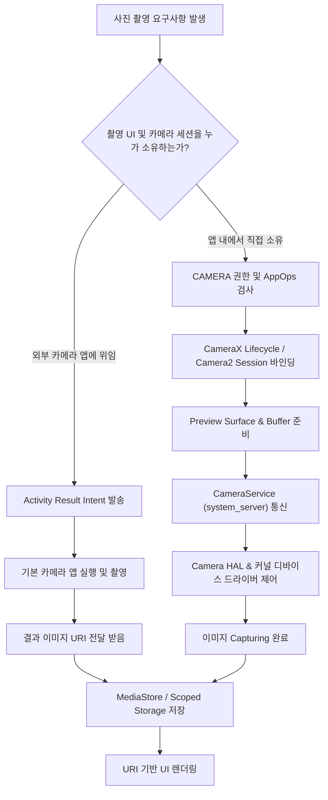

## 사진 찍기 요구사항은 Permission, Intent, UI, Media, HAL, Storage 경계를 교차하며 통과한다

앱에서 "사진을 찍어 사용자의 프로필로 등록한다"는 요구사항은 보기엔 단순하지만, 안드로이드 아키텍처 내부에서는 **최소 2가지 완전히 다른 기술 경로**로 나뉜다.

1. **외부 카메라 앱에 위임하는 경로 (Activity Result / Intent)**: 개발자가 카메라 뷰를 직접 만들지 않고, 기본 카메라 앱을 호출하여 이미지 URI 결과만 받아오는 방식.
2. **앱 내부에서 카메라를 직접 소유하는 경로 (CameraX / Camera2)**: 앱 화면 안에 미리보기(Preview) 뷰를 배치하고 직접 센서를 제어하는 방식.

두 경로는 요구하는 [권한(Permissions)](../../../05_security_privacy/appops-and-permissions.md), 수명주기([Lifecycle](../../../02_app_framework/architecture/state-management/viewmodel/viewmodel.md)), [HAL 계층](../../../01_system_internals/kernel-and-hal/hal-native/hal-userspace-boundary.md) 접근 수준이 완전히 다르므로, 이를 동일한 로직으로 다루면 큰 아키텍처 오류가 발생한다.

---

## 1. 두 가지 카메라 경로 비교 및 흐름도



### 경로별 아키텍처 차이점

- **외부 카메라 앱 위임 (Intent 경로)**:
  - 앱이 직접 하드웨어를 제어하지 않으므로 `CAMERA` [런타임 권한](../../../05_security_privacy/appops-and-permissions.md)을 요구하지 않는다.
  - 외부 카메라 앱과의 통신을 위한 [`Intent`](../../../04_system_services/system-server.md) 처리 및 저장소 접근권(URI Grant)이 핵심이다.
- **앱 내 직접 소유 (CameraX / Embedded 경로)**:
  - `CAMERA` [런타임 권한](../../../05_security_privacy/appops-and-permissions.md)과 [AppOps](../../../05_security_privacy/appops-and-permissions.md) 승인이 필수적이다.
  - 앱의 수명주기([Lifecycle](../../../02_app_framework/architecture/state-management/viewmodel/viewmodel.md))에 맞춰 카메라 세션을 준비해야 하며, [Camera Service (`system_server`)](../../../04_system_services/system-server.md) 및 [Camera HAL](../../../01_system_internals/kernel-and-hal/hal-native/hal-userspace-boundary.md)과 직접 데이터를 주고받는다.

---

## 2. 계층별 실패 증상 및 추적 포인트

| 장애 현상 | 최초 의심 계층 / 보안 게이트 | 디버깅 및 분석 명령 |
| :--- | :--- | :--- |
| 외부 카메라 앱이 실행되지 않음 | Intent Resolution 및 Manifest 설정 | `ActivityNotFoundException`, `adb shell dumpsys package` |
| 앱 내부 카메라 오픈 시 즉시 튕김 | [권한 및 AppOps](../../../05_security_privacy/appops-and-permissions.md) 거부 | `SecurityException`, `adb shell appops get <pkg> CAMERA` |
| 카메라 오픈은 되나 세션 열기 실패 | [Camera Service](../../../04_system_services/system-server.md) 또는 다른 앱의 카메라인점유 | `CameraAccessException`, `adb shell dumpsys media.camera` |
| 카메라 미리보기(Preview) 화면이 검게 나옴 | Surface 뷰 및 앱 수명주기([Lifecycle](../../../02_app_framework/architecture/state-management/viewmodel/viewmodel.md)) 불일치 | Preview UseCase state, Surface creation log |
| 특정 기기/렌즈에서만 촬영 실패 | 제조사 [Camera HAL](../../../01_system_internals/kernel-and-hal/hal-native/hal-userspace-boundary.md) 및 디바이스 드라이버 오류 | `CameraCharacteristics`, `adb logcat | grep CameraHAL` |
| 촬영 후 저장/갤러리 반영 실패 | Scoped Storage 및 MediaStore URI 권한 | `ContentResolver` Exception, MediaStore query |

---

## 3. 디버깅 명령줄 (CLI)

```bash
# 앱 권한 및 AppOps 상태 확인
adb shell dumpsys package com.example.app
adb shell appops get com.example.app CAMERA

# 미디어 카메라 서비스 상태 확인 (카메라 점유 상태 조사)
adb shell dumpsys media.camera
adb logcat -d -s CameraService CameraManager CameraX
```

---

## 연결 문서 (Reference Links)

- [AppOps & 권한 레퍼런스](../../../05_security_privacy/appops-and-permissions.md) - 카메라 권한 및 AppOps 동적 제어
- [HAL 레퍼런스](../../../01_system_internals/kernel-and-hal/hal-native/hal-userspace-boundary.md) - 하드웨어 카메라 센서 제어 인터페이스
- [system_server 레퍼런스](../../../04_system_services/system-server.md) - CameraService 관리 주체
- [ViewModel & Lifecycle 레퍼런스](../../../02_app_framework/architecture/state-management/viewmodel/viewmodel.md) - 뷰 수명주기에 맞춘 카메라 세션 관리

공식 문서: [Camera intents](https://developer.android.com/media/camera/camera-intents), [CameraX architecture](https://developer.android.com/media/camera/camerax/architecture), [MediaStore](https://developer.android.com/training/data-storage/shared/media)
