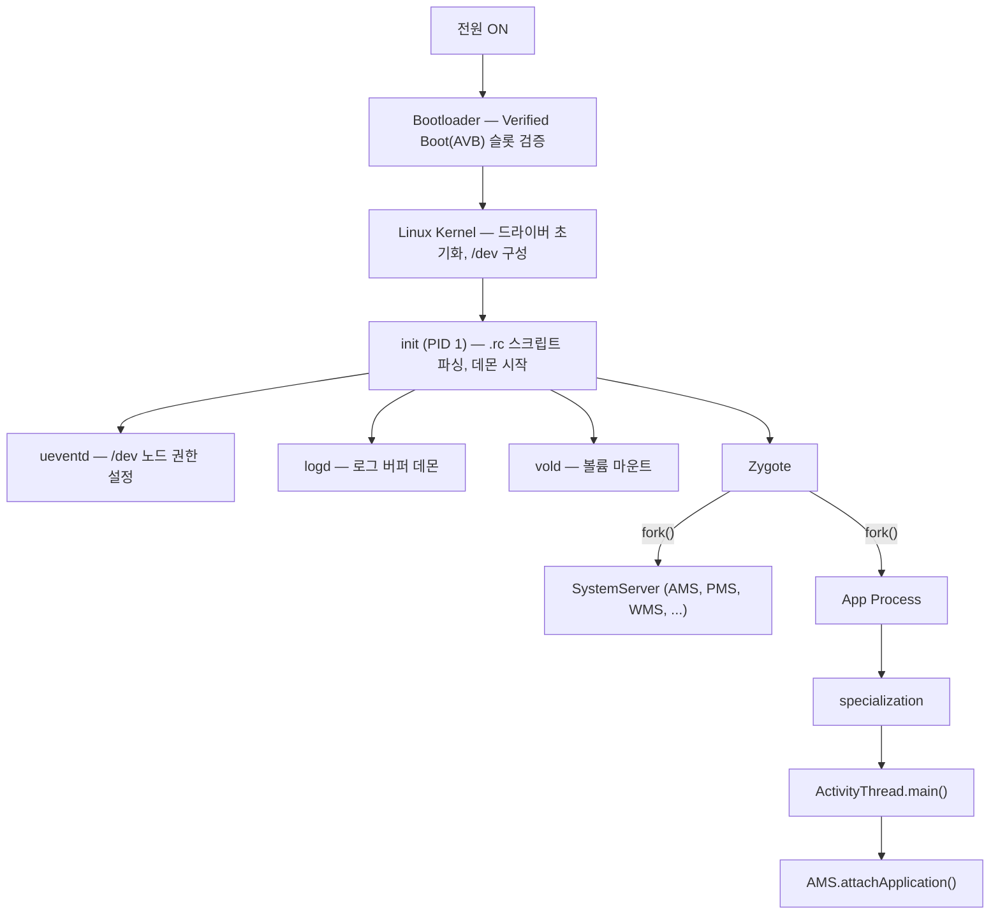

## A1 · Android 부팅과 프로세스 생성

>**이 문서의 목적**: Android 기기가 전원이 켜진 순간부터 앱 프로세스가 준비되는 순간까지 전체 부팅 흐름을 단일 진입점으로 이해한다. 각 단계가 왜 존재하는지, 각 단계에서 관찰 가능한 신호가 무엇인지를 중심으로 서술한다.

---

### 이 주제를 읽기 전에

| 선행 개념                                                                                                                            | 필요한 이유                               |     |
| -------------------------------------------------------------------------------------------------------------------------------- | ------------------------------------ | --- |
| Linux 프로세스 모델 (fork, PID, UID)                                                                                                   | Zygote fork 와 샌드박스 격리 이해             |     |
| [binder ipc](../../01_system_internals/binder-ipc.md) | AMS-Zygote, ActivityThread-AMS 통신 이해 |     |
| SELinux 기초                                                                                                                       | init 보안 도메인과 앱 격리 이해                 |     |

관련 토픽: [A2 · Binder 와 IPC](./A2-binder-and-ipc.md) · A3 · 커널·HAL·드라이버 계층(Phase 10 미착수, 아직 없음)

---

### 전체 조망도



**핵심 규칙**: 각 단계는 이전 단계가 준비한 환경 위에서만 시작한다. Zygote 는 init 이 시작하고, SystemServer 와 모든 앱 프로세스는 Zygote 가 fork 한다.

---

### 1. 부팅 신뢰 체인 (Bootloader → 커널)

전원이 켜지면 Bootloader 가 가장 먼저 실행된다. Bootloader 는 AVB(Android Verified Boot) 를 통해 부팅할 슬롯(A/B) 의 boot image 서명을 검증하고, dm-verity 로 system 파티션의 무결성을 확인한다. 이 검증이 실패하면 기기는 부팅을 멈추거나 롤백 슬롯으로 전환한다.

검증이 통과되면 커널이 메모리에 올라가 드라이버를 초기화하고, initramfs 를 마운트한 뒤 `/init` 을 PID 1 로 실행한다.

| 원자 노트 | 핵심 명제 |
|---|---|
| [부팅 신뢰 체인은 커널과 userspace 이전에 신뢰를 확인한다](../../01_system_internals/boot-and-runtime/boot-flow-contracts/boot-chain-confirms-trust-before-kernel-and-userspace.md) | Bootloader → AVB → dm-verity 신뢰 단계 |
| [Bootloader 는 검증된 슬롯을 선택하고 bootconfig 를 전달한다](../../01_system_internals/boot-and-runtime/boot-flow-contracts/bootloader-selects-verified-slot-and-passes-bootconfig.md) | A/B 슬롯 선택과 커널 파라미터 전달 |
| [AVB 는 boot image 를 검증하고 롤백 보호를 제공한다](../../01_system_internals/boot-and-runtime/boot-flow-contracts/avb-verifies-boot-images-and-rollback-protection.md) | 서명 검증과 롤백 인덱스 |

---

### 2. init (PID 1): userspace 부트스트랩 정책 엔진

init 은 Linux 의 첫 번째 userspace 프로세스(PID 1) 다. Android 의 init 은 표준 Linux init 과 달리 `.rc` 스크립트 언어로 선언된 서비스 정책을 실행하는 **정책 엔진** 역할을 한다.

init 은 두 단계로 나뉜다. **1 단계(first-stage init)** 는 최소 파일시스템을 구성하고 `/dev`, `/proc`, `/sys` 를 마운트한다. **2 단계(second-stage init)** 는 SELinux 를 로드하고 `.rc` 파일을 파싱해 서비스를 순차적으로 시작한다.

`init.rc` 의 **trigger** 는 부팅 마일스톤 이벤트(`early-init`, `init`, `post-fs-data`, `boot`) 와 system property 변경 조건을 결합해 서비스 시작 시점을 제어하는 게이트다.

| 원자 노트 | 핵심 명제 |
|---|---|
| [init 은 PID 1 이자 userspace 부트스트랩 정책 엔진이다](../../01_system_internals/boot-and-runtime/init-service-contracts/init-is-pid1-and-userspace-bootstrap-policy-engine.md) | init 의 역할과 두 단계 구조 |
| [1단계 init 은 2단계를 위한 최소 파일시스템을 구성한다](../../01_system_internals/boot-and-runtime/init-service-contracts/first-stage-init-builds-minimal-filesystem-for-second-stage.md) | /dev, /proc, /sys 마운트 순서 |
| [init rc 언어는 actions, services, options, imports 를 선언한다](../../01_system_internals/boot-and-runtime/init-service-contracts/init-rc-language-declares-actions-services-options-and-imports.md) | .rc DSL 4 가지 구문 요소 |
| [init trigger 는 event 와 property 조건을 결합하는 실행 gate 다](../../01_system_internals/boot-and-runtime/init-service-contracts/init-triggers-are-event-and-property-gates.md) | 부팅 마일스톤별 서비스 시작 제어 |
| [init 서비스는 명시적 수명주기를 가진 감독 프로세스다](../../01_system_internals/boot-and-runtime/init-service-contracts/init-service-is-supervised-process-with-explicit-lifecycle.md) | init 의 서비스 재시작 정책 |
| [property service 는 전역 상태 저장소이자 제한된 제어 평면이다](../../01_system_internals/boot-and-runtime/init-service-contracts/property-service-is-global-state-store-and-restricted-control-plane.md) | sys.boot_completed 등 property 역할 |
| [init 보안은 SELinux 도메인과 capability 경계다](../../01_system_internals/boot-and-runtime/init-service-contracts/init-security-is-selinux-domain-and-capability-boundary.md) | 서비스별 SELinux 도메인 격리 |
| [ueventd 는 커널 uevents 를 /dev 노드 권한으로 변환한다](../../01_system_internals/boot-and-runtime/init-service-contracts/ueventd-turns-kernel-uevents-into-dev-node-permissions.md) | 하드웨어 이벤트 → 디바이스 노드 생성 |

---

### 3. Zygote: 앱 프로세스의 공장

Zygote 는 모든 Android 앱 프로세스의 부모 프로세스다. init 이 시작하면 Zygote 는 Android 프레임워크 클래스, 리소스, JIT 코드 캐시를 **미리 로드(preload)** 한다. 이후 앱 프로세스 요청이 오면 `fork()` 로 복사본을 만들어 공급한다.

**Copy-on-Write(CoW) 최적화**: fork 직후 자식 프로세스는 부모(Zygote) 의 메모리 페이지를 공유한다. 자식이 특정 페이지를 수정할 때만 실제 복사가 일어나므로, 앱마다 프레임워크 클래스를 독립적으로 로드하는 오버헤드가 없다.

**Zygote 소켓**: `system_server`(AMS) 가 새 앱 프로세스가 필요할 때 Unix domain socket 으로 fork 요청을 보낸다. Zygote 는 이 소켓을 감시하다가 요청이 오면 fork 한다.

| 원자 노트 | 핵심 명제 |
|---|---|
| [Zygote 는 앱 fork 이전에 framework 상태를 preload 한다](../../01_system_internals/boot-and-runtime/zygote-runtime-contracts/zygote-preload-state.md) | 클래스/리소스 preload 의 이유 |
| [Zygote fork 는 Copy-on-Write 페이지를 유지하며 메모리를 절약한다](../../01_system_internals/boot-and-runtime/zygote-runtime-contracts/zygote-copy-on-write.md) | CoW 메커니즘과 메모리 절감 효과 |
| [Zygote 소켓은 system_server 의 프로세스 생성 factory 인터페이스다](../../01_system_internals/boot-and-runtime/zygote-runtime-contracts/zygote-socket-interface.md) | Unix socket 기반 fork 요청 프로토콜 |

---

### 4. SystemServer: 프레임워크 서비스의 기원

`system_server` 는 Zygote 에서 fork 된 특수 프로세스로, AMS(ActivityManagerService), PMS(PackageManagerService), WMS(WindowManagerService) 등 100 개 이상의 핵심 프레임워크 서비스를 **단일 프로세스 내 스레드** 로 실행한다.

서비스 초기화는 3 단계로 나뉜다: Bootstrap Services(AMS, PMS 등) → Core Services(DropBoxManager 등) → Other Services(Camera, WiFi, Bluetooth 등). 초기화 순서가 의존성을 결정한다.

`system_server` 가 크래시되면 그 안에 있는 모든 서비스가 함께 종료되고, 커널이 Zygote 를 포함한 자식 프로세스들을 종료시킨다. 이후 init 이 Zygote 를 재시작한다.

**ATMS(ActivityTaskManagerService)** 는 Android 10 에서 AMS 로부터 분리된 서비스로, Activity 생명주기 전환, Task 계층 구조, Back Stack, Multi-Window 를 담당한다.

| 원자 노트 | 핵심 명제 |
|---|---|
| [system_server 는 framework service 를 한 프로세스 안에서 시작한다](../../01_system_internals/boot-and-runtime/system-server-contracts/system-server-startup.md) | 단일 프로세스 구조와 3 단계 초기화 |
| [AMS 는 앱 프로세스와 컴포넌트 lifecycle 을 조율한다](../../01_system_internals/boot-and-runtime/system-server-contracts/ams-coordinates-app-process-and-component-lifecycle.md) | fork 요청, attachApplication, OOM adj |
| [ATMS 는 activity, task, back stack 전이를 담당한다](../../01_system_internals/boot-and-runtime/system-server-contracts/atms-owns-activity-task-and-back-stack-transitions.md) | Android 10+ Activity 관리 분리 |
| [시스템 서비스는 Binder endpoint 이자 플랫폼 정책 집행자다](../../01_system_internals/boot-and-runtime/system-server-contracts/system-service-is-binder-endpoint-and-platform-policy-enforcer.md) | 서비스 = Binder 서버 + 정책 |
| [Rescue Party 는 반복되는 system failure 를 단계적으로 복구한다](../../01_system_internals/boot-and-runtime/system-server-contracts/rescue-party-recovers-repeated-system-failures-in-stages.md) | 부팅 루프 자가 복구 메커니즘 |

---

### 5. 앱 프로세스 생성 (fork → Specialization → attach)

사용자가 앱 아이콘을 탭하면:

1. **ATMS** 가 Intent 를 처리해 대상 Activity 를 결정한다
2. 해당 앱 프로세스가 없으면 **AMS** 가 Zygote 소켓으로 fork 요청을 보낸다
3. **Zygote** 가 fork 해 자식 프로세스를 만든다
4. 자식 프로세스는 **Specialization** 단계를 거친다: UID/GID 설정, SELinux 도메인 강등, Cgroup 바인딩, 앱 ClassLoader 로드
5. `ActivityThread.main()` 이 시작되고 AMS 에 `attachApplication()` Binder 호출을 보낸다
6. AMS 가 응답해 Activity 시작 지시를 보내고, 첫 프레임이 그려진다

**ART 런타임**: 앱 코드는 DEX 바이트코드 형태로 배포되고 ART 가 실행한다. ART 는 Interpreter(초기 실행) → JIT(핫스팟 감지) → AOT(idle 시 dex2oat) 조합으로 성능을 최적화한다.

| 원자 노트 | 핵심 명제 |
|---|---|
| [앱 프로세스는 specialization 뒤 ActivityThread 로 framework 에 attach 한다](../../01_system_internals/boot-and-runtime/zygote-runtime-contracts/app-process-specializes-before-activitythread-attaches-to-framework.md) | fork 이후 6 단계 specialization 과정 |
| [ART 는 DEX 를 interpretation, JIT, AOT 조합으로 실행한다](../../01_system_internals/boot-and-runtime/zygote-runtime-contracts/art-dex-execution-modes.md) | Interpreter/JIT/AOT 하이브리드 전략 |
| [Profile guided compilation 은 설치, 실행, idle compile 비용을 나눈다](../../01_system_internals/boot-and-runtime/zygote-runtime-contracts/profile-guided-compilation-splits-install-runtime-and-idle-costs.md) | Baseline Profile / dex2oat 타이밍 |

---

### 6. 프로세스 우선순위와 메모리 회수

Android 는 필요 없는 프로세스를 즉시 종료하지 않고 캐시로 유지한다. 메모리 압박이 생기면 LMKD(Low Memory Killer Daemon) 가 `oom_score_adj` 값이 높은(우선순위 낮은) 프로세스부터 종료한다.

`oom_score_adj` 는 AMS 가 컴포넌트 실행 상태(Foreground Activity, Visible, Service, Cached) 를 종합해 계산한다. 앱 개발자가 직접 제어할 수 있는 값이 아니다.

| 원자 노트 | 핵심 명제 |
|---|---|
| [프로세스 우선순위는 메모리 회수 정책 입력이지 앱 상태의 진실이 아니다](../../01_system_internals/boot-and-runtime/system-server-contracts/process-priority-is-memory-reclaim-policy-input-not-app-state-truth.md) | oom_score_adj 계산 주체와 의미 |
| [ANR 은 단일 timeout 숫자가 아니라 responsiveness 계약 위반이다](../../01_system_internals/boot-and-runtime/system-server-contracts/anr-responsiveness-contract.md) | 컴포넌트별 timeout 기준과 신호 |

---

### 7. 관찰 가능한 신호와 부팅 디버깅

부팅 초기(logcat 이전) 장애는 `dmesg` 나 pstore/ramoops 에서 확인해야 한다. logd 가 시작된 이후부터는 `adb logcat` 으로 추적 가능하다.

```bash
# 커널 로그 (logd 시작 이전 포함)
adb shell dmesg | grep -E "init|zygote|system_server"

# 부팅 완료 시점 property
adb shell getprop sys.boot_completed     # "1" 이면 완료
adb shell getprop ro.boot.bootreason     # 재부팅 원인

# system_server 주요 서비스 상태
adb shell dumpsys activity               # AMS 상태
adb shell dumpsys window                 # WMS 상태
adb shell dumpsys package                # PMS 상태

# 앱 프로세스 목록
adb shell ps -A | grep -E "system_server|zygote|com\."
```

| 원자 노트 | 핵심 명제 |
|---|---|
| [부팅 완료는 하나의 property 가 아니라 관찰 가능한 마일스톤이다](../../01_system_internals/boot-and-runtime/boot-flow-contracts/boot-completion-is-observable-milestones-not-one-property.md) | sys.boot_completed 외 부팅 완료 신호 |
| [부팅 디버깅은 logcat 이전의 kernel, pstore, init 로그에서 시작한다](../../01_system_internals/boot-and-runtime/boot-flow-contracts/boot-debugging-starts-before-logcat-with-kernel-pstore-init-logs.md) | dmesg, pstore, init 콘솔 활용법 |
| [dumpsys 는 system service 의 현재 상태를 보는 inspection interface 다](../../01_system_internals/boot-and-runtime/system-server-contracts/dumpsys-is-system-service-state-inspection-interface.md) | dumpsys 동작 원리와 활용 패턴 |
| [런타임 디버깅은 profile, compile filter, JIT 상태를 분리한다](../../01_system_internals/boot-and-runtime/zygote-runtime-contracts/runtime-debugging-separates-profile-compile-filter-and-jit-state.md) | ART 컴파일 상태 확인 명령어 |

---

### 이 주제와 연결된 Worked Example

| Worked Example | 연결 포인트 |
|---|---|
| [WE 01 · App Icon Tap to First Frame](../worked-examples/01-app-icon-tap-to-first-frame.md) | ATMS → AMS → Zygote fork → ActivityThread 전체 흐름 |

---

### 이 주제와 연결된 Diagnostic Runbook

| Runbook | 연결 포인트 |
|---|---|
| [RB 01 · 앱 실행 느리거나 실패](../diagnostic-runbooks/01-app-launch-slow-or-fails.md) | 프로세스 생성 지연, AMS 병목, Zygote fork 실패 |
| [RB 02 · ANR](../diagnostic-runbooks/02-anr.md) | AMS ANR 감지, main thread 블로킹 신호 |

---

### 더 깊이 들어갈 때 (Learning Spine)

- [4장 매니페스트에서 컴포넌트 실행까지](../learning-spine/04-manifest-to-component-execution.md) — 컴포넌트 활성화 요청이 AMS→Zygote fork→specialization→ActivityThread attach 순으로 프로세스 상태를 확인하는 전체 흐름
- [9장 Identity, 권한과 독립적인 security gate](../learning-spine/09-identity-permission-and-independent-security-gates.md) — SELinux mandatory policy, UID 샌드박스가 다른 보안 게이트와 독립적으로 판정되는 이유
