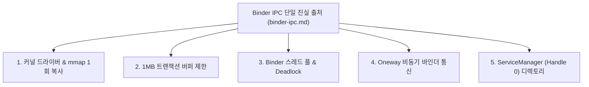

## Binder 및 IPC 토픽 학습 지도

### 1. 토픽 개요

안드로이드 플랫폼의 모든 프로세스 분리(앱 ↔ `system_server` ↔ HAL) 구조는 **Binder IPC** 라는 공통 통신 백본 위에서 작동합니다.

이 토픽 노드는 Binder 통신 구조, 1MB 트랜잭션 제한, 스레드 풀 및 커널 드라이버 원리를 체계적으로 학습하기 위한 **상위 아키텍처 토픽 지도**입니다.

---

### 2. Binder IPC 학습 구조 다이어그램

---

### 3. 핵심 원자 레퍼런스 노드 연결

- **[Binder IPC 표준 레퍼런스](../../01_system_internals/binder-ipc.md)** - Binder IPC 메인 SSOT 종합 레퍼런스
- **[ServiceManager](../../04_system_services/service-manager.md)** - 바인더 Handle 0 중앙 서비스 디렉토리
- **[Binder IPC](../../01_system_internals/binder-ipc.md)** - 1 회 메모리 복사 커널 원리
- **[Binder 트랜잭션 1MB 제한](../../01_system_internals/ipc-and-process/ipc-process/binder-transaction-lifetime-is-call-copy-dispatch-and-reply.md)** - 1MB 버퍼 및 TransactionTooLargeException
- **[Binder 스레드 풀 및 교착상태](../../01_system_internals/ipc-and-process/ipc-process/binder-thread-pool-is-service-concurrency-and-deadlock-boundary.md)** - 16 개 스레드 풀 및 Deadlock 방지
- **[Oneway 비동기 바인더](../../01_system_internals/ipc-and-process/ipc-process/oneway-binder-removes-caller-waiting-not-server-backpressure.md)** - 비동기 바인더 및 백프레셔
