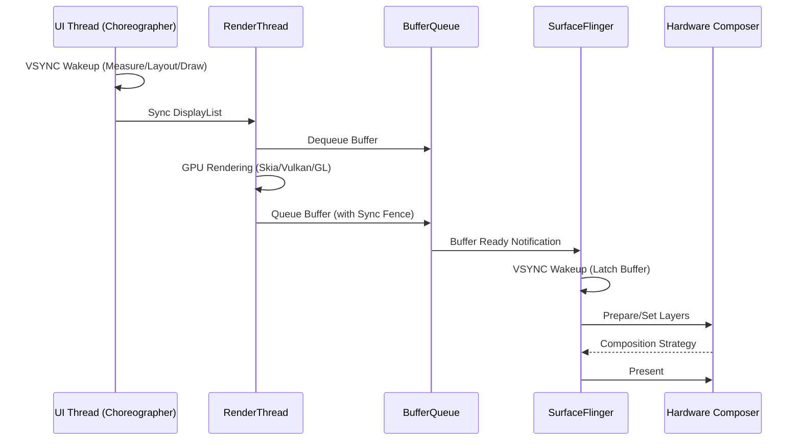

## A4. 렌더링 파이프라인 (Surface → SurfaceFlinger → 화면)

이 문서는 안드로이드에서 앱의 UI 상태가 어떻게 물리적인 화면의 픽셀로 변환되는지 그 전체 그래픽 파이프라인을 다루는 주제 합성 문서다. 애플리케이션의 렌더링 스레드부터 BufferQueue, SurfaceFlinger, 그리고 Hardware Composer(HWC)에 이르는 버퍼 흐름과 타이밍(VSYNC) 제어를 설명한다.

### 이 주제를 읽기 전에

안드로이드의 메인 스레드(UI 스레드) 역할과 뷰 시스템(또는 Compose)이 어떻게 화면을 그리는지에 대한 기초적인 이해가 필요하다. 또한 앱이 어떻게 프로세스로 실행되어 화면을 소유하게 되는지에 대한 맥락을 알아야 한다.

### 전체 조망도

### 버퍼 큐, 렌더 타이밍, 화면 합성

안드로이드 그래픽 파이프라인은 철저히 생산자 - 소비자(Producer-Consumer) 모델과 버퍼 소유권(Buffer Ownership)을 기반으로 동작한다. VSYNC 에 맞춰 각 단계가 정해진 마감 시간(Deadline) 내에 작업을 완수해야만 부드러운 화면(60Hz 이상)을 유지할 수 있다.

- **버퍼 큐와 Surface (BufferQueue & Surface)**
    앱과 시스템 간 그래픽 데이터의 교환은 BufferQueue 를 통해 이루어진다. 앱(Producer)은 Surface 를 통해 버퍼를 획득(Dequeue)하여 그리고 반환(Queue)하며, SurfaceFlinger(Consumer)가 이를 가져와(Acquire) 소비한다.
    - [Android 렌더링 파이프라인은 Surface → BufferQueue → Compositor 흐름이다](../../01_system_internals/graphics-and-media/android-rendering-pipeline.md): 안드로이드 렌더링 파이프라인은 Surface 에서 BufferQueue, 그리고 합성기(Compositor)로 이어진다.
    - [Surface 는 그래픽 버퍼 producer 측 계약이다](../../01_system_internals/graphics-and-media/surface-graphic-buffers.md): Surface 는 그래픽 버퍼를 위한 생산자 측의 계약이다.
    - [BufferQueue는 producer와 consumer를 버퍼 소유권으로 분리한다](../../01_system_internals/graphics-and-media/bufferqueue-ownership.md): BufferQueue 는 버퍼 소유권을 통해 생산자와 소비자를 명확히 분리한다.
- **앱 렌더링과 타이밍 (Choreographer & RenderThread)**
    프레임 렌더링은 VSYNC 신호에 맞춰 Choreographer 가 구동한다. UI 스레드가 렌더링 명령어(DisplayList)를 준비하면, 별도의 RenderThread 가 GPU 를 사용해 버퍼에 그림을 그린다.
    - [VSync 와 Choreographer 는 frame deadline 을 정의한다](../../01_system_internals/graphics-and-media/vsync-and-choreographer.md): VSYNC 와 Choreographer 는 프레임의 마감 시간(Deadline)을 정의한다.
    - [RenderThread 는 렌더 작업을 나누지만 UI 스레드 비용을 없애지 않는다](../../01_system_internals/graphics-and-media/renderthread-pipeline.md): RenderThread 는 렌더링 작업을 제출하지만 UI 스레드의 모든 부하를 완전히 없애주지는 않는다.
- **시스템 화면 합성 (SurfaceFlinger & HWC)**
    화면에 여러 창(StatusBar, NavigationBar, App Window)이 겹칠 때, SurfaceFlinger 가 이를 모아 하나의 화면으로 합성한다. 이때 전력 소모를 줄이기 위해 Hardware Composer(HWC)를 활용하여 레이어 합성을 오프로드한다.
    - [SurfaceFlinger 는 보이는 레이어를 HWC 와 함께 합성한다](../../01_system_internals/graphics-and-media/surfaceflinger-composition.md): SurfaceFlinger 는 가시적인 레이어들을 HWC 를 사용하여 합성한다.
    - [Hardware Composer는 기기 제약 안에서 합성을 offload한다](../../01_system_internals/graphics-and-media/hardware-composer.md): HWC 는 기기의 제약 조건 하에서 디스플레이 합성을 하드웨어로 오프로드한다.
    - [Jank 는 UI, RenderThread, SurfaceFlinger 전 구간의 frame deadline 실패다](../../01_system_internals/graphics-and-media/jank-frame-deadlines.md): Jank(버벅임)는 UI, RenderThread, SF 사이에서 프레임 마감 시간을 지키지 못해 발생한다.

### 이 주제와 연결된 Worked Example

앱 론칭부터 화면이 그려질 때까지, 그리고 버벅임이 발생할 때 파이프라인에서 어떤 일이 일어나는지 구체적으로 살펴본다.

- [앱 아이콘 탭에서 첫 프레임까지 (Cold Start to First Frame)](../worked-examples/01-app-icon-tap-to-first-frame.md): 앱 아이콘 탭 후 첫 화면이 SurfaceFlinger 를 거쳐 렌더링 되기까지의 전체 과정이다.
- [Compose jank 를 UI state 에서 SurfaceFlinger 까지 좁히는 사례](../worked-examples/07-compose-jank-from-ui-state-to-surfaceflinger.md): Compose UI 렌더링 지연이 SurfaceFlinger 합성 실패(Jank)로 이어지는 흐름을 분석한다.

### 이 주제와 연결된 Diagnostic Runbook

프레임 누락이나 화면 응답성 저하 등의 그래픽 성능 문제를 프로파일링하고 해결하는 방법을 알아본다.

- [화면이 끊긴다(jank, dropped frames)](../diagnostic-runbooks/07-jank-dropped-frames.md): 프레임 누락과 UI 버벅임(Jank)을 진단하고 최적화하는 런북이다.

### 더 깊이 들어갈 때 (Learning Spine)

디스플레이 프레임이 생성되기 전 입력(Input)이 어떻게 처리되고 리소스가 선택되는지 더 깊게 이해하려면 다음 챕터를 참고한다.

- [입력, 리소스 선택과 화면 프레임](../learning-spine/07-input-resource-selection-and-display-frame.md)
