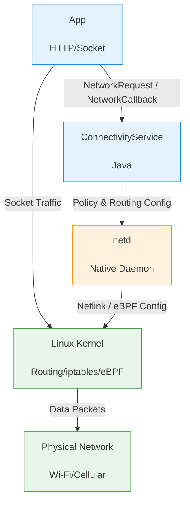

## A5. 네트워크 스택 (ConnectivityService → netd → 커널)

이 문서는 앱이 네트워크를 요청하고 데이터를 전송할 때 거치는 안드로이드 시스템의 네트워크 스택을 설명하는 주제 합성 문서다. 안드로이드 프레임워크의 ConnectivityService 부터 네이티브 데몬인 netd, 그리고 리눅스 커널의 네트워크 라우팅까지 이어지는 정책 및 연결 상태 관리를 다룬다.

### 이 주제를 읽기 전에

앱에서 HTTP 클라이언트나 소켓을 사용해 데이터를 주고받는 기초적인 네트워킹 지식과, 백그라운드 작업 시 기기의 전력 관리 정책이 어떻게 작용하는지에 대한 이해가 필요하다.

### 전체 조망도

### 정책, 네트워크 객체, 커널 라우팅

안드로이드 네트워킹의 핵심은 다중 네트워크(Wi-Fi, Cellular, VPN 등) 환경에서 시스템이 "어떤 네트워크를 사용할지" 정책을 결정하고, 이를 라우팅 규칙으로 강제하는 데 있다. 앱은 단순히 데이터를 보내는 것이 아니라, 시스템의 네트워크 상태와 비용 정책을 준수해야 한다.

- **ConnectivityService 와 정책 (Policy & Selection)**
    ConnectivityService 는 기기의 모든 네트워크 연결 상태를 관리하고, 사용 가능한 네트워크 중 최적의 기본 네트워크(Default Network)를 선택한다. 또한 데이터 절약 모드(Data Saver)나 종량제(Metered) 정책을 적용한다.
    - [ConnectivityService 는 네트워크를 선택하고 정책을 적용한다](../../01_system_internals/connectivity/connectivity/connectivityservice-selects-networks-and-applies-policy.md): ConnectivityService 는 최적의 네트워크를 선택하고 정책을 적용하는 두뇌 역할을 한다.
    - [Metered와 Data Saver는 백그라운드 네트워크 비용 정책이다](../../01_system_internals/connectivity/connectivity/metered-and-data-saver-are-background-network-cost-policy.md): 종량제 네트워크와 데이터 절약 모드는 백그라운드 네트워크 비용 정책으로 작용한다.
- **네트워크 객체와 생명주기 (Network Object & Lifecycle)**
    안드로이드에서 네트워크는 단순한 전송 방식(Transport)이 아니라 구체적인 연결 인스턴스(Network)다. 기본 네트워크와 특정 앱이 요청한 네트워크는 생명주기가 다르며, 앱은 콜백을 통해 이 상태를 추적해야 한다.
    - [Network는 연결 인스턴스이고 transport는 하나의 capability일 뿐이다](../../01_system_internals/connectivity/connectivity/network-is-connection-instance-and-transport-is-only-one-capability.md): 네트워크는 단순한 전송 타입(Wi-Fi 등)이 아닌 독립된 연결 인스턴스다.
    - [Default Network와 Requested Network는 수명이 다르다](../../01_system_internals/connectivity/connectivity/default-network-and-requested-network-have-different-lifetimes.md): 기본 네트워크와 명시적으로 요청된 네트워크는 서로 다른 생명주기를 갖는다.
    - [NetworkCallback 수명과 콜백 데이터 일관성은 관리되어야 한다](../../01_system_internals/connectivity/connectivity/networkcallback-lifetime-and-callback-data-consistency-must-be-managed.md): NetworkCallback 의 생명주기와 반환된 데이터의 일관성은 신중하게 관리되어야 한다.
    - [Validated와 Captive Portal은 관찰된 인터넷 상태다](../../01_system_internals/connectivity/connectivity/validated-and-captive-portal-are-observed-internet-states.md): 시스템은 네트워크가 실제로 인터넷에 연결되어 있는지(Validated/Captive Portal) 검증한다.
- **netd 데몬과 커널 라우팅 (Native Daemon & Kernel)**
    ConnectivityService 의 정책은 네이티브 데몬인 netd 로 전달되어 커널 수준의 라우팅 테이블(iptables/eBPF) 설정으로 변환된다. 모든 앱의 소켓 트래픽은 이 라우팅 규칙에 따라 특정 네트워크 인터페이스로 강제(bind)된다.
    - [netd는 라우팅, DNS, 방화벽, tethering 명령을 실행한다](../../01_system_internals/connectivity/connectivity/netd-enforces-routing-dns-firewall-and-tethering-operations.md): netd 는 라우팅, DNS, 방화벽 및 테더링 정책을 커널 수준에서 강제한다.

### 이 주제와 연결된 Worked Example

네트워크 연결이 필수적인 백그라운드 데이터 수신 시퀀스에서 네트워크 스택이 어떻게 동작하는지 확인한다.

- [FCM 전송에서 Notification 표시와 탭 복구까지 (FCM Delivery to Notification Display & Tap Recovery)](../worked-examples/04-fcm-to-notification-display-and-tap-recovery.md): 네트워크 소켓(FCM)을 유지하고 메시지 수신 시 어떻게 앱을 깨워 알림을 띄우는지 그 과정을 살펴볼 수 있다.

### 이 주제와 연결된 Diagnostic Runbook

네트워크 정책이나 기기 제약으로 인해 앱의 통신이 막히거나 지연되는 상황을 진단한다.

- [백그라운드 작업이 지연되거나 실행되지 않는다](../diagnostic-runbooks/05-background-work-delayed-or-not-running.md): 데이터 절약 모드(Data Saver)나 Doze 모드 등 네트워크 제약으로 인해 백그라운드 동기화가 실패하는 원인을 진단한다.

### 더 깊이 들어갈 때 (Learning Spine)

네트워크 상태 관리를 넘어 데이터를 기기에 캐싱하고 오프라인 상태에 대비하는 방법에 대해 학습하려면 다음 챕터를 확인한다.

- [데이터, 저장소, 네트워크와 offline recovery](../learning-spine/08-data-storage-network-and-offline-recovery.md)
