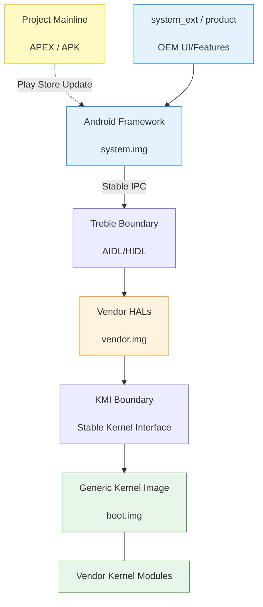

## A6. 플랫폼 모듈화 (APEX, Mainline, Treble, GKI)

이 문서는 파편화를 막고 시스템 업데이트를 원활하게 하기 위한 안드로이드의 플랫폼 모듈화 전략(Project Treble, Mainline, GKI 등)을 다루는 주제 합성 문서입니다. 운영체제가 어떻게 계층별로 분리되어 제조사(OEM)와 구글이 각각 독립적으로 시스템을 커스터마이징하고 업데이트할 수 있는지 설명합니다.

### 1. 이 주제를 읽기 전에

안드로이드의 빌드 시스템과 APK 패키지 구조에 대한 기본적인 이해가 필요합니다. 또한 펌웨어 업데이트 방식(OTA)과 기기 부팅 과정(Bootloader, Init)에 대한 배경지식이 있으면 모듈화가 왜 필요한지 이해하기 쉽습니다.

### 2. 전체 조망도

### 3. 하위 개념 및 원자 노트 합성

과거의 안드로이드는 전체 시스템(OS, 드라이버, 커널)이 묶여 있어 업데이트가 매우 느렸습니다. 이를 해결하기 위해 계층별 책임을 분리하고 독립 업데이트가 가능한 구조(모듈화)를 점진적으로 도입했습니다.

- **플랫폼 모듈화와 Mainline (APEX)**
    Project Mainline 은 안드로이드 프레임워크의 핵심 구성 요소(예: 미디어 코덱, 네트워킹 구성 요소 등)를 구글 플레이 시스템 업데이트를 통해 직접 업데이트할 수 있게 합니다. 일반 APK 로는 시스템 하위 레벨(네이티브 라이브러리 등)을 교체할 수 없어 APEX 라는 새로운 패키징 포맷이 사용됩니다.
    - [Android 플랫폼 모듈화는 system, vendor, kernel 업데이트 경계를 층위별로 나눈다](../../01_system_internals/platform-modularity/platform-modularity-contracts/android-platform-modularity-splits-update-boundaries-by-system-layer.md): 플랫폼 모듈화는 시스템 계층별로 업데이트 경계를 분리합니다.
    - [Mainline은 선택된 system component를 정규 플랫폼 release 밖에서 업데이트한다](../../01_system_internals/platform-modularity/platform-modularity-contracts/mainline-updates-selected-system-components-outside-normal-platform-releases.md): Mainline 은 전체 OS 업데이트 없이 특정 시스템 컴포넌트만을 업데이트합니다.
    - [APEX 는 APK 모델로 다루기 어려운 lower-level system module 을 담는다](../../01_system_internals/platform-modularity/platform-modularity-contracts/apex-packages-lower-level-system-modules-that-apk-cannot-model-well.md): APEX 는 기존 APK 가 감당할 수 없는 하위 레벨 시스템 모듈을 패키징합니다.
    - [APEX activation 은 boot-time mount, version selection, rollback 경계다](../../01_system_internals/platform-modularity/platform-modularity-contracts/apex-activation-uses-boot-time-mounting-version-selection-and-rollback.md): APEX 는 초기 부팅 시에 마운트되며 안전한 롤백 매커니즘을 지원합니다.
- **파트너 커스터마이징과 이미지 분리 (Vendor & Product)**
    기기 제조사(OEM)는 AOSP 코드베이스를 바탕으로 자사 기기만의 고유 기능(Product)과 하드웨어 제어(Vendor)를 추가합니다. 이들의 소유권을 분리하기 위해 파티션(system, vendor, product, system_ext 등)이 나뉘어져 있습니다.
    - [AOSP build는 source, device, vendor configuration으로 product image를 조립한다](../../01_system_internals/platform-customization/platform-customization-contracts/aosp-build-assembles-product-images-from-source-device-and-vendor-configuration.md): AOSP 빌드는 소스와 벤더 설정을 조합하여 여러 파티션 이미지를 조립합니다.
    - [product, vendor, odm, system_ext 는 customization ownership 을 나눈다](../../01_system_internals/platform-customization/platform-customization-contracts/product-vendor-odm-and-system-ext-split-customization-ownership.md): 다양한 파티션 분리를 통해 구글, 칩셋 벤더, 기기 제조사의 커스터마이징 소유권을 명확히 나눕니다.

### 4. 이 주제와 연결된 Worked Example

실제 시스템 업데이트나 앱의 배포 과정에서 이러한 모듈화가 어떻게 작동하는지 사례를 통해 살펴봅니다.

- [signed artifact 가 Play delivery 를 거쳐 update 되는 과정](../worked-examples/08-signed-artifact-through-play-delivery-to-update.md): Play 스토어를 통해 서명된 아티팩트(APK/APEX)가 다운로드되고 검증을 거쳐 시스템 업데이트로 이어지는 흐름을 보여줍니다.

### 5. 이 주제와 연결된 Diagnostic Runbook

시스템 업데이트, APEX 설치 또는 파티션 마운트 등 모듈화로 인해 발생할 수 있는 문제를 진단합니다.

- [설치 또는 업데이트가 실패한다](../diagnostic-runbooks/08-install-update-failure.md): 패키지 설치 실패나 APEX 롤백 등 업데이트 과정에서 발생하는 다양한 실패 사례를 진단합니다.

### 6. 더 깊이 들어갈 때 (Learning Spine)

디바이스의 호환성을 검증하고(CTS) 플랫폼 파편화를 어떻게 관리하는지 전체적인 생태계 관점에서 확장 학습하려면 다음 챕터를 참고하세요.

- [호환성, update 와 form factor](../learning-spine/12-compatibility-update-and-form-factor.md)
- [소스에서 설치된 패키지까지](../learning-spine/03-source-to-installed-package.md)
