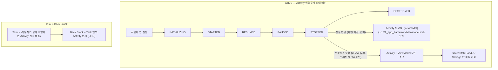

## B1 · 컴포넌트 생명주기와 Task / Back Stack

>**이 문서의 목적**: Android 앱 개발의 가장 기초적인 질문인 "Activity/Fragment 는 언제 살고 언제 죽는가", "화면 회전이나 앱 전환 시 어떤 일이 일어나는가", "Task 와 Back Stack 은 어떻게 관리되는가"를 체계적으로 이해한다.

---

### 이 주제를 읽기 전에

| 선행 개념 | 필요한 이유 |
|---|---|
| Android 앱 프로세스 생성 (A1) | Activity 재생성과 프로세스 종료의 차이 이해 |
| Kotlin Coroutines | viewModelScope, lifecycleScope 이해 |
| Compose 기초 (B2 § 1~2) | State 소유권 결정 시 생명주기 고려 |

관련 토픽: [A1 · 부팅과 프로세스 생성](./A1-boot-and-process.md) · [B2 · Jetpack Compose](./B2-jetpack-compose.md) · [B3 · 데이터 레이어](./B3-data-layer.md)

---

### 전체 조망도

---

### 1. Activity 생명주기: 가시성과 상호작용 경계

Activity 생명주기 콜백은 두 가지 축으로 이해한다:

- **가시성**: `onStart()` → 화면에 보임, `onStop()` → 화면에서 사라짐
- **상호작용**: `onResume()` → 사용자 입력 수신, `onPause()` → 입력 중단

`onDestroy()` 는 Activity 가 완전히 종료될 때 호출되지만, **프로세스 자체가 종료될 때는 호출되지 않을 수 있다**. 따라서 중요한 데이터 저장은 `onDestroy()` 에 의존하지 않는다.

Android 의 모든 앱 컴포넌트(Activity, Service, BroadcastReceiver, ContentProvider)는 시스템의 진입점이지 앱 내부 객체가 아니다. 시스템이 이 진입점을 통해 앱을 시작하고 수명주기를 제어한다.

| 원자 노트 | 핵심 명제 |
|---|---|
| [Activity 생명주기 콜백은 가시성과 상호작용 경계를 설명한다](../../02_app_framework/architecture/app-components/app-component-contracts/activity-lifecycle-callbacks-describe-visibility-and-interaction-boundaries.md) | 각 콜백의 의미와 올바른 작업 배치 |
| [Activity 는 사용자 가시 진입점이자 프로세스 우선순위 신호다](../../02_app_framework/architecture/app-components/app-component-contracts/activity-is-user-visible-entry-point-and-process-priority-signal.md) | Activity 상태가 OOM adj 에 미치는 영향 |
| [Android 앱 컴포넌트는 프로세스 내 객체가 아니라 시스템 진입점이다](../../02_app_framework/architecture/app-components/app-component-contracts/android-app-components-are-system-entry-points-not-in-process-objects.md) | 컴포넌트 = 시스템 진입점 관점 |

---

### 2. 설정 변경 vs 프로세스 종료

이 두 가지는 결과가 비슷해 보이지만 **완전히 다른 메커니즘**이다:

| 구분 | 설정 변경 | 프로세스 종료 |
|---|---|---|
| 원인 | 화면 회전, 언어 변경, 다크 모드 등 | 메모리 부족, 오래된 백그라운드 앱 |
| Activity | 재생성 (파괴 → 새 인스턴스) | 소멸 (복귀 시 새 인스턴스) |
| ViewModel | **유지됨** | **소멸** (복원 불가) |
| 복원 수단 | ViewModel 으로 충분 | SavedStateHandle + Storage |

설정 변경 시 ViewModel 이 유지되는 것은 Android 프레임워크가 Activity 재생성 시 같은 ViewModelStore 를 재사용하기 때문이다. 프로세스가 완전히 종료되면 이 store 도 사라진다.

| 원자 노트 | 핵심 명제 |
|---|---|
| [설정 변경은 Activity 를 재생성하지만 모든 화면 상태를 재생성하지는 않는다](../../02_app_framework/architecture/app-components/app-component-contracts/configuration-change-recreates-activity-but-not-all-screen-state.md) | 설정 변경 시 상태 생존 여부 분류 |
| [프로세스 종료 복구에는 saved state 와 영속 source of truth 가 필요하다](../../02_app_framework/architecture/app-components/app-component-contracts/process-death-recovery-needs-saved-state-and-persistent-source-of-truth.md) | 복구 전략 결정 기준 |

---

### 3. ViewModel: 설정 변경을 살아남는 상태 홀더

ViewModel 은 화면(Activity/Fragment/Composable) 의 생명주기보다 오래 살아남아 **설정 변경 동안 화면 상태를 유지**한다. 또한 repository 호출, UseCase 실행 같은 외부 작업을 조율한다.

**ViewModel 의 두 가지 핵심 규칙**:

1. **Mutable 상태는 내부에 숨긴다**: `_uiState: MutableStateFlow` 는 private, `uiState: [stateflow](../../02_app_framework/stateflow-and-sharedflow.md)` 만 공개
2. **UI Context 를 보유하지 않는다**: Activity, Fragment, View, Context 참조를 field 에 저장하면 메모리 누수가 발생한다

`viewModelScope` 는 ViewModel 이 소멸될 때 자동으로 취소되는 CoroutineScope 다. `SavedStateHandle` 은 프로세스 종료 후에도 작은 직렬화 가능한 값을 복원하고, Navigation argument 접근에도 쓰인다.

| 원자 노트 | 핵심 명제 |
|---|---|
| [ViewModel 은 설정 변경 동안 유지되지만 프로세스 사망 복원은 보장하지 않는다](../../02_app_framework/architecture/state-management/viewmodel/viewmodel-survives-configuration-change-not-process-death.md) | ViewModel 생존 범위의 정확한 경계 |
| [Mutable 상태 홀더는 ViewModel 내부에 숨기고 외부에는 읽기 전용 상태만 노출한다](../../02_app_framework/architecture/state-management/viewmodel/viewmodel-exposes-read-only-state.md) | StateFlow private/public 패턴 |
| [ViewModel 은 화면 상태와 외부 작업을 조율한다](../../02_app_framework/architecture/state-management/viewmodel/viewmodel-orchestrates-screen-state-and-external-work.md) | ViewModel 의 역할과 책임 범위 |
| [viewModelScope 는 외부 작업을 ViewModel 수명에 바인딩한다](../../02_app_framework/architecture/state-management/viewmodel/viewmodelscope-binds-external-work-to-viewmodel-lifetime.md) | viewModelScope 취소 타이밍 |
| [SavedStateHandle 은 프로세스 사망 후 복원해야 하는 작은 상태에 사용한다](../../02_app_framework/architecture/state-management/viewmodel/savedstatehandle-restores-small-process-death-state.md) | 적합한 값과 Navigation arg 접근 |
| [ViewModel 은 UI controller 나 Context 를 보유하지 않는다](../../02_app_framework/architecture/state-management/viewmodel/viewmodel-does-not-retain-ui-controller-or-context.md) | 메모리 누수 방지 규칙 |

---

### 4. Task 와 Back Stack

Android 의 Task 는 "사용자가 함께 수행하는 Activity 들의 묶음"이고, Back Stack 은 그 Task 안에 Activity 가 쌓인 순서(LIFO)다. 이것은 시스템(ATMS) 이 관리하는 OS 수준의 상태이고, Compose Navigation 이나 Navigation 3 의 route 스택과는 **다른 층위**다.

**핵심 규칙**: 일반 앱 내부 화면 전환은 app-owned navigation state(Compose NavController 등) 로 관리하고, 외부 진입점(딥링크, 알림), Task affinity, 알림 복귀 정책처럼 OS 와 맞닿는 부분만 Activity/Task 정책으로 결정한다.

`launchMode`, Intent flags, `taskAffinity` 는 강력하지만 잘못 쓰면 Back Stack 이 예측 불가능해지고 테스트가 어려워진다.

| 원자 노트 | 핵심 명제 |
|---|---|
| [Task 와 Back Stack 은 앱 내비게이션 상태가 아닌 OS 의 Activity 내비게이션이다](../../02_app_framework/architecture/app-components/app-component-contracts/task-and-back-stack-are-os-activity-navigation-not-app-navigation-state.md) | OS Task vs app navigation 층위 구분 |

---

### 5. 단방향 데이터 흐름 (UDF) 패턴

Android 권장 아키텍처의 핵심은 **State Down, Action Up** 이다:

- **UI(Composable/View)** 는 상태를 받아 그리고, 사용자 action 을 위로 올린다
- **ViewModel** 은 action 을 처리하고 새 UiState 를 계산해 StateFlow 로 노출한다
- **Repository/Data layer** 는 source of truth 를 유지한다

화면 상태(`UiState`)는 **불변 data class** 로 만들고, 변경은 명시적인 action 이나 전이 함수를 통해서만 일어난다.

| 원자 노트 | 핵심 명제 |
|---|---|
| [UI 는 상태를 아래로 받고 사용자 행동을 위로 전달한다](../../02_app_framework/architecture/state-management/ui-state/ui-receives-state-and-sends-actions-up.md) | State down / Action up 패턴 |
| [화면 상태는 불변 모델로 만들고 변경은 명시적인 상태 전이로 제한한다](../../02_app_framework/architecture/state-management/ui-state/screen-state-is-immutable-and-changes-by-explicit-transitions.md) | immutable UiState 설계 원칙 |
| [UI, domain, data layer 는 rendering, policy, source of truth 를 분리한다](../../02_app_framework/architecture/jetpack-architecture/architecture-contracts/ui-domain-data-layers-separate-rendering-policy-and-source-of-truth.md) | 3 개 레이어의 책임 분리 |
| [소비 가능한 신호는 event stream 에 둔다](../../02_app_framework/architecture/state-management/ui-state/consumable-signals-belong-in-event-stream.md) | Toast/Navigation 같은 일회성 이벤트 처리 |

---

### 6. Context: Android 환경 접근 능력

`Context` 는 Android 플랫폼 기능(리소스, 시스템 서비스, 파일 등) 에 접근하는 능력이지, 의존성 컨테이너가 아니다. Context 의 수명을 잘못 다루면 메모리 누수가 발생한다.

| Context 종류 | 수명 | 적합한 용도 |
|---|---|---|
| Activity Context | Activity 수명 | UI 테마, Window 접근, Dialog |
| Application Context | 앱 프로세스 수명 | 파일, DB, System Service |
| Service Context | Service 수명 | 알림, 백그라운드 작업 |

| 원자 노트 | 핵심 명제 |
|---|---|
| [Context 는 Android 환경 접근 능력이지 의존성 컨테이너가 아니다](../../02_app_framework/architecture/context-and-modularity/context-contracts/context-is-android-environment-capability-not-dependency-container.md) | Context 의 올바른 이해 |
| [Activity Context 는 Window, Theme, 짧은 수명을 갖는다](../../02_app_framework/architecture/context-and-modularity/context-contracts/activity-context-carries-window-theme-and-short-lifetime.md) | Activity Context 적합 범위 |
| [Context 누수는 참조가 컴포넌트 수명보다 오래 살 때 발생한다](../../02_app_framework/architecture/context-and-modularity/context-contracts/context-leaks-happen-when-reference-outlives-component-lifetime.md) | 누수 패턴과 방지 원칙 |
| [ViewModel 과 Repository 는 UI Context 를 보유하지 않아야 한다](../../02_app_framework/architecture/context-and-modularity/context-contracts/viewmodel-and-repository-should-not-retain-ui-context.md) | 메모리 누수 방지 실천 |

---

### 이 주제와 연결된 Worked Example

| Worked Example | 연결 포인트 |
|---|---|
| [WE 01 · App Icon Tap to First Frame](../worked-examples/01-app-icon-tap-to-first-frame.md) | Activity 시작, ATMS, 첫 프레임 렌더링 |
| [WE 03 · Deep Link to Correct Task](../worked-examples/03-deep-link-to-correct-task-and-screen-state.md) | Task affinity, launchMode, Back Stack 관리 |
| [WE 05 · Process Death Recovery](../worked-examples/05-process-death-recovery-of-edit-state-and-background-work.md) | SavedStateHandle + Storage 복원 전략 |

---

### 이 주제와 연결된 Diagnostic Runbook

| Runbook | 연결 포인트 |
|---|---|
| [RB 01 · 앱 실행 느리거나 실패](../diagnostic-runbooks/01-app-launch-slow-or-fails.md) | Activity 시작 지연, ATMS 병목 |
| [RB 03 · 프로세스 종료 후 상태 손실](../diagnostic-runbooks/03-process-death-state-loss.md) | SavedStateHandle 누락, storage 미저장 |

---

### 더 깊이 들어갈 때 (Learning Spine)

- [4장 매니페스트에서 컴포넌트 실행까지](../learning-spine/04-manifest-to-component-execution.md) — 4 대 컴포넌트가 매니페스트 선언에서 실행 요청으로 이어지는 전체 서사
- [5장 화면, 프로세스, task와 사용자 상태는 독립적인 lifetime을 가진다](../learning-spine/05-independent-lifetimes-of-screen-process-task-and-state.md) — configuration change/process death 에서 ViewModel·SavedStateHandle·task back stack 이 각각 어떻게 다르게 반응하는지
