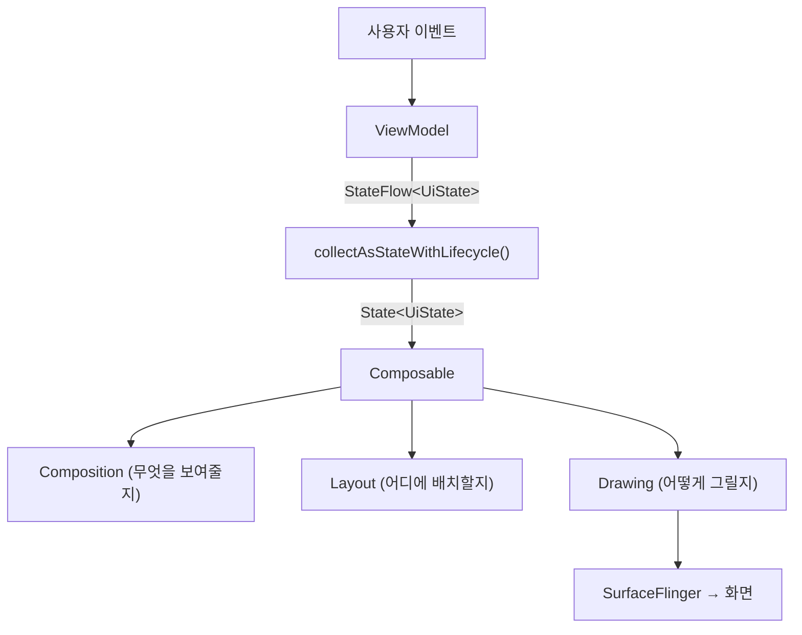

## B2 · Jetpack Compose 완전 이해

>**이 문서의 목적**: Jetpack Compose 를 처음 접하거나 체계적으로 정리하고 싶을 때 시작하는 단일 진입점. 각 섹션에서 핵심 개념을 3~5 줄로 설명하고, 더 깊은 내용은 원자 노트 링크로 연결한다. 이 문서 하나로 Compose 의 80% 를 이해할 수 있어야 한다.

---

### 이 주제를 읽기 전에

| 선행 개념 | 필요한 이유 |
|---|---|
| Kotlin Coroutines (suspend, Flow) | Effect API 와 [stateflow](../../02_app_framework/stateflow-and-sharedflow.md) 수집에 직접 등장 |
| Android Activity/Fragment 생명주기 | Composable 수명과 [viewmodel](../../02_app_framework/viewmodel.md) 연결 이해 |
| ViewModel + UiState 패턴 | 화면 상태 소유권 결정 기준 이해 |

관련 토픽: [B1 · 컴포넌트 생명주기와 Task](./B1-component-lifecycle-and-task.md) · [B3 · 데이터 레이어](./B3-data-layer.md)

---

### 전체 조망도

Compose 의 실행 모델은 크게 세 단계다.

**State 가 바뀌면** → **영향받는 Composable scope 만 재실행([recomposition](../../02_app_framework/jetpack-compose/runtime/recomposition.md))** → **Layout/Draw 단계를 거쳐 화면에 반영**.

---

### 1. Compose 핵심 원리

Compose 는 UI 를 "현재 상태에 대한 함수"로 선언한다. `Text("Count: $count")` 는 count 값에 대한 **UI 설명**이지, 화면을 바꾸는 **명령**이 아니다. state 가 바뀌면 Compose 가 이 설명을 다시 계산해 필요한 부분만 반영한다. 이것이 View 시스템의 `textView.text = …`(명령형)과의 핵심 차이다.

**Composable 함수의 세 가지 실행 계약**:

1. **빠르게**: composition 은 매 프레임마다 호출될 수 있다
2. **멱등하게**: 같은 입력으로 항상 같은 UI 설명을 만들어야 한다
3. **Side-effect 없이**: DB write, analytics 전송, mutation 은 composition 본문에 두지 않는다

**컴파일러의 역할**: `@Composable` 은 단순 마커가 아니다. Compose 컴파일러가 각 함수의 재시작 가능성(restartable)과 스킵 가능성(skippable) 정보를 Runtime 에 전달한다. `composeCompiler { reportsDestination.set(…) }` 로 각 Composable 의 stable/unstable 태그를 담은 리포트를 빌드마다 확인할 수 있다.

| 원자 노트 | 핵심 명제 |
|---|---|
| [Compose UI는 State의 선언적 함수다](../../02_app_framework/jetpack-compose/runtime/compose-runtime-contracts/compose-ui-is-declarative-function-of-state.md) | UI = f(State). 명령형 View 와의 근본적 차이 |
| [Composable body는 빠르고 멱등하며 side effect가 없어야 한다](../../02_app_framework/jetpack-compose/runtime/compose-runtime-contracts/composable-body-must-be-fast-idempotent-and-side-effect-free.md) | Composition 의 세 가지 실행 계약 |
| [자동 상태 관찰은 Compose와 Flutter Rebuild의 차이점이다](../../02_app_framework/jetpack-compose/runtime/compose-runtime-contracts/automatic-state-observation-is-the-compose-flutter-rebuild-difference.md) | Runtime 이 State read 를 추적한다는 의미 |
| [Composable compiler 출력은 재시작과 skip 제어를 가능하게 한다](../../02_app_framework/jetpack-compose/runtime/compose-runtime-contracts/composable-compiler-output-enables-restart-and-skip-control.md) | @Composable 이 실제로 하는 일 |

---

### 2. 상태(State) 관리

State 는 Compose 가 UI 를 다시 그려야 할지 결정하는 기준이다. Compose Runtime 은 Composable 실행 중 **어떤 State 를 읽었는지 자동으로 추적**한다. 그 State 가 바뀌면, 그 State 를 읽은 scope 만 재실행(invalidate)된다.

**State 소유권 원칙**: State 는 **읽거나 쓰는 Composable 들의 가장 낮은 공통 부모**에 둔다. 한 Composable 내부에서만 쓰이면 `remember`, 여러 자식이 함께 쓰면 공통 부모로 hoist, 화면 수준의 비즈니스 로직이 있으면 ViewModel 이 소유한다.

**State API 선택 기준** (수명 기준으로 결정):

| 필요 수명 | API |
|---|---|
| Recomposition 사이 | `remember { mutableStateOf(…) }` |
| Activity 재생성 후에도 복원 필요 | `rememberSaveable { … }` |
| 화면(Navigation destination) 수명 | `ViewModel.uiState: StateFlow<UiState>` |
| 앱 재시작 후에도 영속 | Room / DataStore |

**고빈도 입력에서 저빈도 결과**: 스크롤 인덱스처럼 자주 바뀌는 값에서 버튼 노출 여부처럼 드물게 바뀌는 값을 만들 때는 `derivedStateOf` 를 쓴다. 단순 값 복사나 문자열 결합에는 오히려 overhead 만 생긴다.

**ViewModel → Compose 연결**: ViewModel 의 `StateFlow<UiState>` 는 `collectAsStateWithLifecycle()` 로 Compose `State` 로 변환한다. `collectAsState()` 는 lifecycle 을 인식하지 못해 백그라운드에서도 수집이 계속된다.

| 원자 노트 | 핵심 명제 |
|---|---|
| [Snapshot State 관찰은 State를 읽은 scope를 invalidation 대상으로 만든다](../../02_app_framework/jetpack-compose/runtime/compose-runtime-contracts/snapshot-state-observation-invalidates-state-read-scopes.md) | Runtime 의 State 추적 메커니즘 |
| [Recomposition은 전체 UI redraw가 아니라 필요한 Composable scope 재실행이다](../../02_app_framework/jetpack-compose/runtime/compose-runtime-contracts/recomposition-reruns-needed-composable-scopes-not-the-whole-ui.md) | State read 위치가 recomposition 범위를 결정 |
| [Compose State Owner는 읽거나 쓰는 최하위 공통 소유자다](../../02_app_framework/jetpack-compose/runtime/compose-runtime-contracts/compose-state-owner-is-the-lowest-common-owner-that-needs-read-or-write.md) | State hoisting 판단 기준 |
| [Compose 상태 API는 필요한 수명에 맞춰 선택한다](../../02_app_framework/jetpack-compose/state-and-lifecycle/compose-state-and-effect-contracts/compose-state-api-selection-by-lifetime.md) | API 선택표 (remember → rememberSaveable → ViewModel → 영속) |
| [remember는 composition-scoped 저장소이지 일반 캐시가 아니다](../../02_app_framework/jetpack-compose/runtime/compose-runtime-contracts/remember-is-composition-scoped-storage-not-general-cache.md) | remember 의 수명 경계 |
| [Composable보다 오래 필요한 작은 복원 상태에만 rememberSaveable을 사용한다](../../02_app_framework/jetpack-compose/state-and-lifecycle/compose-state-and-effect-contracts/remember-saveable-is-for-small-restorable-ui-state.md) | 적합한 값과 anti-pattern |
| [derivedStateOf는 고빈도 입력에서 저빈도 결과를 만들 때 쓴다](../../02_app_framework/jetpack-compose/performance/compose-performance-contracts/derivedstateof-is-for-high-frequency-derived-values.md) | 스크롤 → 버튼 노출 패턴 |
| [snapshotFlow는 Compose 상태를 Cold Flow로 변환한다](../../02_app_framework/jetpack-compose/state-and-lifecycle/compose-state-and-effect-contracts/snapshot-flow-converts-compose-state-to-cold-flow.md) | State → Flow bridge (analytics, debounce 연결) |
| [ViewModel의 StateFlow는 collectAsStateWithLifecycle로 화면 상태로 변환한다](../../02_app_framework/jetpack-compose/state-and-lifecycle/compose-state-and-effect-contracts/viewmodel-stateflow-becomes-screen-state-with-lifecycle-collection.md) | ViewModel ↔ Compose 연결 패턴 |

---

### 3. 사이드이펙트(Effects)

Composable 본문은 side effect 가 없어야 한다. 그래서 Compose 는 "언제 시작하고, 언제 취소하고, 언제 정리할지"를 선언하는 **Effect API**를 제공한다. 핵심은 **Effect 의 수명을 선언**하는 것이다.

**Effect API 선택 기준**:

| 상황 | API |
|---|---|
| Composable 이 사라지면 취소되어야 하는 suspend 작업 | `LaunchedEffect(key)` |
| 등록/해제가 쌍인 non-suspend 작업 (listener, observer) | `DisposableEffect(key)` |
| 사용자 이벤트(클릭)에서 시작하는 일회성 코루틴 | `rememberCoroutineScope()` |
| Effect 를 재시작하지 않고 최신 람다값만 유지 | `rememberUpdatedState(value)` |
| 외부 비동기 source 를 Compose State 로 변환 | `produceState(initialValue, key)` |

**`LaunchedEffect` 의 key 규칙**: key 가 바뀌면 이전 coroutine 을 취소하고 새 coroutine 을 시작한다. `LaunchedEffect(Unit)` 은 "Composable 이 처음 composition 에 진입할 때 한 번만 실행"을 의미한다.

**UI 수명에 두어야 하는 객체**: `SnackbarHostState`, `DrawerState`, `SheetState` 처럼 UI tree 와 직접 상호작용하는 controller 는 ViewModel 이 아니라 UI(Composable) 수명에 소유권을 둔다.

**무거운 작업은 composition 에 두지 않는다**: 파일 읽기, 네트워크 요청, 큰 정렬은 Composable body 에 두면 jank 가 생긴다. `remember` 는 값 보존 도구이지 무거운 작업 허가가 아니다.

| 원자 노트 | 핵심 명제 |
|---|---|
| [Composable과 함께 취소되어야 하는 작업은 LaunchedEffect로 시작한다](../../02_app_framework/jetpack-compose/state-and-lifecycle/compose-state-and-effect-contracts/launched-effect-owns-composable-cancellable-work.md) | LaunchedEffect 사용 기준과 key 규칙 |
| [등록과 해제가 쌍인 작업은 DisposableEffect로 관리한다](../../02_app_framework/jetpack-compose/state-and-lifecycle/compose-state-and-effect-contracts/disposable-effect-pairs-registration-and-cleanup.md) | listener/observer 의 안전한 생명주기 관리 |
| [rememberCoroutineScope는 수동 제어 UI Coroutine을 소유한다](../../02_app_framework/jetpack-compose/state-and-lifecycle/compose-state-and-effect-contracts/remember-coroutine-scope-owns-manually-controlled-ui-coroutines.md) | 클릭 이벤트에서 시작하는 coroutine |
| [rememberUpdatedState는 effect를 최신 값으로 유지한다](../../02_app_framework/jetpack-compose/state-and-lifecycle/compose-state-and-effect-contracts/remember-updated-state-keeps-effect-on-latest-value.md) | 재시작 없이 최신 람다 유지 |
| [produceState는 외부 상태를 Compose 상태로 변환한다](../../02_app_framework/jetpack-compose/state-and-lifecycle/compose-state-and-effect-contracts/produce-state-converts-external-state-to-compose-state.md) | 외부 비동기 source → State 변환 |
| [UI controller와 effect runner는 UI 수명에 둔다](../../02_app_framework/jetpack-compose/state-and-lifecycle/compose-state-and-effect-contracts/ui-controllers-and-effect-runners-live-with-ui-lifetime.md) | SnackbarHostState 등의 소유권 |
| [무거운 작업은 composition 안에 두지 않는다](../../02_app_framework/jetpack-compose/performance/compose-performance-contracts/heavy-work-does-not-belong-in-composition.md) | composition 에서 금지된 작업 유형 |

---

### 4. 레이아웃(Layout)

Compose 레이아웃의 핵심 규칙은 **단방향 제약 전달**이다. 부모가 constraints(최소/최대 너비·높이)를 자식에 전달하고, 자식은 측정 결과를 부모에 보고한다. **자식은 일반적으로 한 번만 측정**된다.

**Compose 프레임의 3 단계**:

1. **Composition**: 무엇을 보여줄지 결정 (Composable 실행)
2. **Layout**: 각 node 의 측정과 배치
3. **Drawing**: 실제 픽셀 렌더링

**Modifier 순서는 UI 계약이다**: `padding().clickable()` 과 `clickable().padding()` 은 같은 결과가 아니다. Modifier chain 은 바깥에서 안으로 constraints 를 전달하고 안에서 바깥으로 측정 결과를 보고한다. 터치 영역, clipping, 시각 결과 모두 순서에 의존한다.

**커스텀 레이아웃**: `Layout` 과 `MeasurePolicy` 로 child `Measurable` 을 직접 측정하고 `Placeable` 을 배치한다. 표준 layout 으로 해결 안 되는 사전 크기 질의는 `intrinsicWidth/Height` 로, composition 과 measurement 순서를 엮어야 하는 특수 문제는 `SubcomposeLayout` 으로 해결한다.

| 원자 노트 | 핵심 명제 |
|---|---|
| [Compose 프레임 파이프라인은 Composition, Layout, Drawing 단계로 분리된다](../../02_app_framework/jetpack-compose/runtime/compose-runtime-contracts/compose-frame-pipeline-is-split-into-composition-layout-and-drawing.md) | 3 단계와 State read 가 각 단계에 미치는 영향 |
| [Compose layout은 부모 제약 안에서 자식을 측정하고 배치한다](../../02_app_framework/jetpack-compose/layout-and-ui/compose-ui-contracts/compose-layout-measures-children-under-parent-constraints.md) | 단방향 제약 전달 모델 |
| [Modifier 순서는 layout, draw, input wrapper의 적용 순서를 바꾼다](../../02_app_framework/jetpack-compose/layout-and-ui/compose-ui-contracts/modifier-order-changes-layout-draw-and-input-wrappers.md) | padding.clickable ≠ clickable.padding |
| [Size modifier는 incoming constraint 안에서 요청 크기를 해석한다](../../02_app_framework/jetpack-compose/layout-and-ui/compose-ui-contracts/size-modifiers-interpret-requested-size-inside-incoming-constraints.md) | size/fillMax*/wrapContent 동작 차이 |
| [Custom Layout은 자식 측정과 배치를 직접 책임진다](../../02_app_framework/jetpack-compose/layout-and-ui/compose-ui-contracts/custom-layout-measures-and-places-children-explicitly.md) | MeasurePolicy, placeRelative, alignment line |
| [Intrinsic measurement와 SubcomposeLayout은 특수한 측정 문제를 해결한다](../../02_app_framework/jetpack-compose/layout-and-ui/compose-ui-contracts/intrinsic-measurement-and-subcompose-layout-solve-special-measurement-problems.md) | 일반 레이아웃으로 해결 안 되는 특수 케이스 |
| [Compose layout과 image 비용은 프레임 예산 안에서 관리한다](../../02_app_framework/jetpack-compose/performance/compose-performance-contracts/compose-layout-and-image-cost-must-be-budgeted.md) | 레이아웃 비용을 프레임 예산 관점으로 |

---

### 5. 성능(Performance)

Compose 성능의 핵심 질문은 "Composable 이 skip 되는가, 되지 않는가"다. 컴파일러는 파라미터가 안정적(stable)인 Composable 에만 `skippable` 태그를 부여한다. `List<T>` 처럼 변경 가능한 타입은 unstable 로 분류되어 같은 값을 받아도 skip 되지 않는다.

**성능 개선 루프**: 측정(Systrace/Macrobenchmark) → 분석(Layout Inspector recomposition count) → 개선(State read 위치 조정, stable 마킹, 컴파일러 리포트 확인) → 재측정.

**State read 위치가 성능을 결정한다**: State 를 Composition phase 에서 읽으면 Composable 재실행이 필요하다. Layout 이나 Draw phase 로 State read 를 늦출 수 있다면 그 phase 의 작업만 다시 하면 된다. 예: `Modifier.offset { IntOffset(x, 0) }` 내부에서 scroll state 를 읽으면 scroll 시 Composition 을 건너뛰고 Layout 만 다시 할 수 있다.

| 원자 노트 | 핵심 명제 |
|---|---|
| [Compose 안정성과 strong skipping은 skippability에 영향을 준다](../../02_app_framework/jetpack-compose/performance/compose-performance-contracts/compose-stability-and-strong-skipping-affect-skippability.md) | stable/unstable 분류 기준과 해결 방법 |
| [Compose 성능은 측정-디버그-개선 루프로 시작한다](../../02_app_framework/jetpack-compose/performance/compose-performance-contracts/compose-performance-starts-with-measure-debug-improve-loop.md) | 성능 도구 사용 순서 |
| [Compose 모듈 경계는 dependency 범위와 교체 비용을 드러낸다](../../02_app_framework/jetpack-compose/design-system-and-architecture/compose-design-system-contracts/compose-module-boundaries-expose-dependency-scope-and-replacement-cost.md) | 모듈화가 Compose 성능에 미치는 영향 |
| [Compose 레이어는 상위 컴포넌트가 맞지 않을 때 내려갈 수 있다](../../02_app_framework/jetpack-compose/design-system-and-architecture/compose-design-system-contracts/compose-layers-let-you-drop-down-when-higher-level-components-do-not-fit.md) | Foundation → 직접 측정/배치 레이어 하강 기준 |

---

### 6. 애니메이션(Animation)

Compose animation API 선택의 핵심은 **"무엇이 바뀌는가"** 다. Visibility 변화는 `AnimatedVisibility`, content 교체는 `AnimatedContent`/`Crossfade`, 크기 변화는 `animateContentSize` 가 후보다. 여러 property 를 하나의 state transition 에 묶으면 `updateTransition`, 코루틴에서 직접 제어해야 하면 `Animatable` 을 쓴다.

`AnimationSpec` 은 애니메이션이 target 에 도달하는 방식을 정의한다. `spring`(물리 기반), `tween`(duration/easing), `keyframes`(시점별 값), `snap`(즉시). API 마다 기본 spec 이 다르므로 동일하게 가정하지 않는다. 반복 애니메이션과 큰 layout 변화는 실제 디바이스에서 프레임 예산을 측정해야 한다.

| 원자 노트 | 핵심 명제 |
|---|---|
| [Compose animation API는 변경 단위와 제어 수준으로 선택한다](../../02_app_framework/jetpack-compose/layout-and-ui/compose-ui-contracts/compose-animation-api-is-selected-by-change-unit-and-control-level.md) | API 선택 기준 (무엇이 바뀌는가, 얼마나 제어할 것인가) |
| [AnimationSpec은 시간, 물리, 반복 정책을 정의한다](../../02_app_framework/jetpack-compose/layout-and-ui/compose-ui-contracts/animation-spec-defines-time-physics-and-repeat-policy.md) | spring/tween/keyframes/snap 선택 기준 |
| [Value animation API는 단일 target, transition, infinite, coroutine 제어를 분리한다](../../02_app_framework/jetpack-compose/layout-and-ui/compose-ui-contracts/value-animation-apis-separate-single-target-transition-infinite-and-coroutine-control.md) | animate*AsState, updateTransition, Animatable 분류 |

---

### 7. 디자인 시스템(Design System)

Compose 의 Material 3 테마 시스템은 `MaterialTheme` provider 를 통해 `colorScheme`, `typography`, `shapes` 를 Composition tree 전체에 공급한다. 컴포넌트는 `#FF0000` 같은 raw color 대신 `MaterialTheme.colorScheme.primary` 처럼 **semantic role**을 읽어야 light/dark theme, dynamic color 변경에도 의도가 유지된다.

`CompositionLocal` 은 하위 UI tree 전체에 적용되는 **UI 환경 값**을 전달하는 메커니즘이다. Theme, density, layout policy 처럼 많은 node 가 읽지만 중간 layer 가 알 필요 없는 값에 적합하다. Repository, use case 같은 **비즈니스 의존성을 CompositionLocal 에 숨기면 안 된다** — DI(Hilt)가 해결할 문제다.

**Dynamic Color**: Android 12+ 에서 시스템 wallpaper 색상을 `MaterialTheme` 의 `ColorScheme` 으로 연결한다. `Build.VERSION.SDK_INT >= S` 조건에서 `dynamicLightColorScheme(context)` 를 쓰고, 하위 버전은 브랜드 고정 scheme 으로 fallback 한다.

| 원자 노트 | 핵심 명제 |
|---|---|
| [Design System Provider는 Material Theme과 project Local을 조합한다](../../02_app_framework/jetpack-compose/design-system-and-architecture/compose-design-system-contracts/design-system-provider-composes-material-theme-and-project-locals.md) | AppTheme = MaterialTheme + project CompositionLocals 구조 |
| [Material 3 색상 역할은 고정된 색상이 아닌 의미적 의도를 표현한다](../../02_app_framework/jetpack-compose/design-system-and-architecture/compose-design-system-contracts/material3-color-roles-express-semantic-intent-not-fixed-colors.md) | primary/surface/error 의 semantic 의미 |
| [Material 3 on-color와 surface는 대비와 위계를 짝지어 표현한다](../../02_app_framework/jetpack-compose/design-system-and-architecture/compose-design-system-contracts/material3-on-colors-and-surfaces-pair-contrast-with-hierarchy.md) | onPrimary/onSurface 사용 패턴 |
| [Dynamic Color는 Material Color Scheme에 대한 플랫폼 입력이다](../../02_app_framework/jetpack-compose/design-system-and-architecture/compose-design-system-contracts/dynamic-color-is-platform-input-to-a-material-color-scheme.md) | Material You + API level 분기 패턴 |
| [CompositionLocal은 tree-scoped UI 환경을 암묵적으로 전달한다](../../02_app_framework/jetpack-compose/design-system-and-architecture/compose-design-system-contracts/compositionlocal-passes-tree-scoped-ui-environment-implicitly.md) | CompositionLocal 적합한 값과 주의사항 |
| [CompositionLocal 매개변수와 DI는 다른 문제를 해결한다](../../02_app_framework/jetpack-compose/design-system-and-architecture/compose-design-system-contracts/compositionlocal-parameters-and-di-solve-different-problems.md) | UI 환경 값 vs 비즈니스 의존성 분리 |

---

### 8. 접근성(Accessibility)

Compose 는 화면의 픽셀 구조와 별도로 **Semantics Tree**를 유지한다. TalkBack, Switch Access 같은 접근성 서비스와 Compose test 는 이 tree 를 통해 UI 의미를 읽는다. `Text`, `Button` 같은 Material 컴포넌트는 대부분의 semantics 를 자동으로 제공하지만, 커스텀 컴포넌트는 역할(role), 상태(state), 설명(contentDescription), action 을 명시해야 할 수 있다.

**접근성 검증 루프**: TalkBack 으로 포커스 순서·읽히는 문장·action 가능 여부 확인 → Accessibility Scanner 로 touch target 크기·contrast·description 누락 점검 → Layout Inspector 로 Semantics tree 확인 → Compose test 에서 semantics 기반 assertion.

`testTag` 는 테스트 편의를 위한 것이고, `contentDescription` 은 접근성 서비스를 위한 것이다. 두 목적이 혼재되면 label 이 오염된다.

| 원자 노트 | 핵심 명제 |
|---|---|
| [Semantics Tree는 UI 의미를 접근성 서비스와 테스트에 드러낸다](../../02_app_framework/jetpack-compose/layout-and-ui/compose-ui-contracts/semantics-tree-makes-ui-meaning-visible-to-accessibility-and-tests.md) | Semantics Tree 구조와 merged/unmerged 차이 |
| [Semantics merging, clearing, traversal이 의미 단위를 제어한다](../../02_app_framework/jetpack-compose/layout-and-ui/compose-ui-contracts/semantics-merging-clearing-and-traversal-control-the-unit-of-meaning.md) | mergeDescendants, clearAndSetSemantics 사용 기준 |
| [시각 정보와 제스처는 읽을 수 있는 의미와 대체 행동이 필요하다](../../02_app_framework/jetpack-compose/layout-and-ui/compose-ui-contracts/visual-information-and-gestures-need-readable-meaning-and-alternate-actions.md) | 장식 이미지 vs 의미 있는 이미지 분류 |
| [접근성 품질은 서비스, 스캐너, Semantics 검증이 필요하다](../../02_app_framework/jetpack-compose/layout-and-ui/compose-ui-contracts/accessibility-quality-requires-service-scanner-and-semantics-verification.md) | TalkBack + Scanner + test 검증 루프 |

---

### 9. 컴포지션 내부 원리 (고급)

Compose Runtime 은 Composable 실행 결과를 **Slot Table(Gap Buffer 구조)** 에 저장한다. 각 Composable 호출은 호출 위치(call site)의 identity 로 식별되어, 같은 함수라도 위치가 다르면 다른 저장 슬롯을 갖는다. 이것이 `remember` 가 올바른 값을 보존하는 원리이고, key 를 달리하면 다른 인스턴스를 강제하는 이유다.

**성능 판단의 전환**: Flutter 개발자가 Compose 를 볼 때 "Widget 객체를 rebuild 한다"가 아니라 "어떤 Snapshot State 를 읽었는지 Runtime 이 추적한다"로 관점을 바꿔야 한다. Composable 이 호출됐다는 것 자체는 성능 문제의 지표가 아니다. 핵심은 어디에서 State 를 읽었는가, 어떤 파라미터가 skip 을 막는가, 어떤 작업이 composition 에 들어갔는가다.

| 원자 노트 | 핵심 명제 |
|---|---|
| [Composition은 호출 위치 identity로 remember 값을 보존한다](../../02_app_framework/jetpack-compose/runtime/compose-runtime-contracts/composition-uses-callsite-identity-to-preserve-remembered-values.md) | Slot Table 과 call site identity 원리 |
| [Compose Runtime은 상태, 효과, 성능, 도구를 연결한다](../../02_app_framework/jetpack-compose/runtime/compose-runtime-contracts/compose-runtime-links-state-effects-performance-and-tooling.md) | Runtime 전체 조망 (hub note) |

---

### 이 주제와 연결된 Worked Example

| Worked Example | 연결 포인트 |
|---|---|
| [WE 01 · App Icon Tap to First Frame](../worked-examples/01-app-icon-tap-to-first-frame.md) | Compose SplashScreen API, 첫 프레임 렌더링 파이프라인 |
| [WE 07 · Compose Jank from UI State to SurfaceFlinger](../worked-examples/07-compose-jank-from-ui-state-to-surfaceflinger.md) | Composition→Layout→Draw 단계별 jank 원인 추적 |

---

### 이 주제와 연결된 Diagnostic Runbook

| Runbook | 연결 포인트 |
|---|---|
| [RB 07 · Jank / Dropped Frames](../diagnostic-runbooks/07-jank-dropped-frames.md) | Compose recomposition count, frameOverrunMs 진단 |

---

### 더 깊이 들어갈 때 (Learning Spine)

- [7장 입력, 리소스 선택과 화면 프레임](../learning-spine/07-input-resource-selection-and-display-frame.md) — Compose 가 그린 결과가 Surface→BufferQueue→SurfaceFlinger 합성을 거쳐 화면이 되는 과정
- [11장 관찰, 테스트와 품질 feedback](../learning-spine/11-observation-testing-and-quality-feedback.md) — Macrobenchmark/Perfetto 로 Compose 성능을 측정하고 회귀를 잡는 순환
