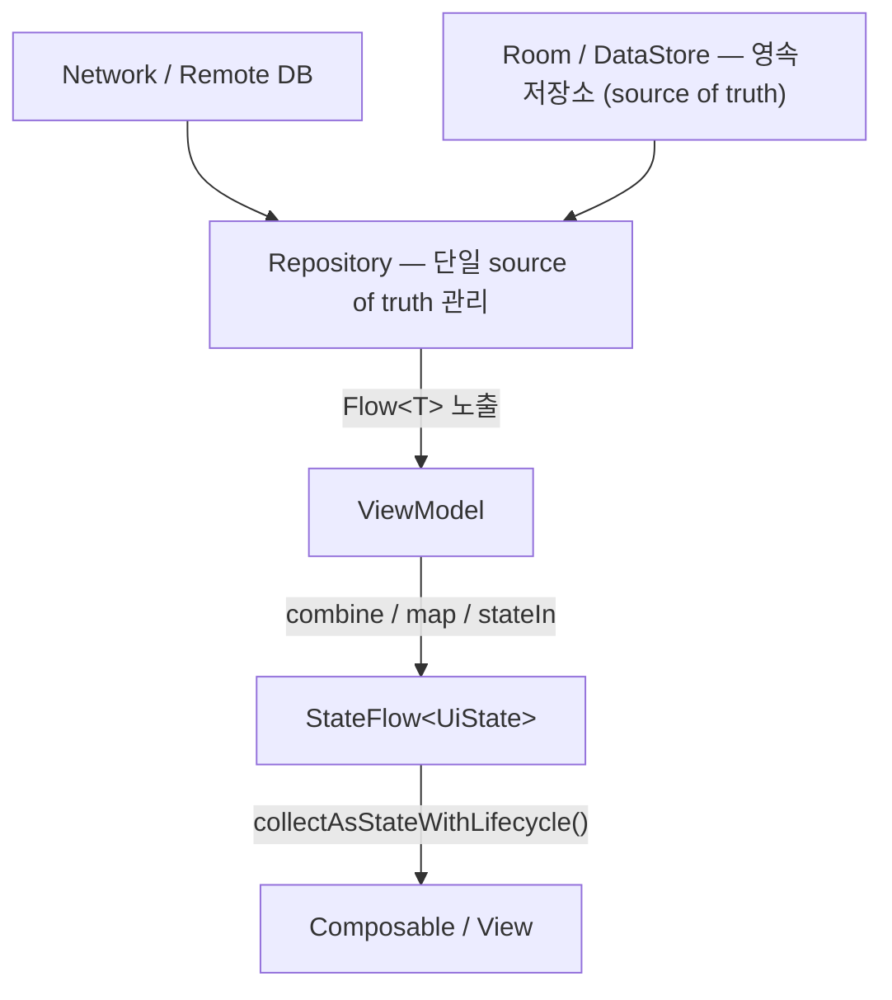

## B3 · 데이터 레이어: Flow · Room · DataStore · Paging

>**이 문서의 목적**: Android 앱의 데이터 레이어 전체 구조를 이해한다. Kotlin Coroutines 와 Flow 가 어떻게 비동기 데이터 흐름을 만드는지, Repository 가 어떻게 data source 를 추상화하는지, 그리고 각 저장소(Room, DataStore)가 언제 선택되는지를 체계적으로 정리한다.

---

### 이 주제를 읽기 전에

| 선행 개념 | 필요한 이유 |
|---|---|
| Kotlin suspend 함수 기초 | Coroutine 이 왜 필요한지 이해 |
| [viewmodel](../../02_app_framework/viewmodel.md) + UiState 패턴 (B1) | Repository → ViewModel → UI 연결 이해 |
| Compose State 수집 (B2 § 2) | collectAsStateWithLifecycle 이해 |

관련 토픽: [B1 · 컴포넌트 생명주기](./B1-component-lifecycle-and-task.md) · [B2 · Jetpack Compose](./B2-jetpack-compose.md)

---

### 전체 조망도

**핵심 원칙**: Repository 는 데이터 출처를 감추고 `Flow` 로 노출한다. ViewModel 은 이 Flow 를 조합해 화면 상태(`StateFlow<UiState>`)를 만든다.

---

### 1. Kotlin Coroutines: 가볍고 취소 가능한 비동기 작업

Coroutine 은 스레드가 아니다. 하나의 스레드 위에서 여러 coroutine 이 `suspend` 함수 호출을 만날 때마다 다른 coroutine 에 실행을 양보한다. 스레드를 블로킹하지 않으므로 메인 스레드에서도 네트워크 대기가 가능하다.

**[structured concurrency](../../../../computer-science/structured-concurrency.md)**: 모든 coroutine 은 부모 scope 안에서 시작한다. 부모가 취소되면 자식 coroutine 이 모두 취소된다. `viewModelScope`, `lifecycleScope` 는 각 컴포넌트 수명에 맞춰 자동으로 취소되는 scope 다.

**Dispatcher**: 어느 스레드에서 실행할지 결정한다. `Dispatchers.Main` 은 UI 스레드, `Dispatchers.IO` 는 블로킹 I/O, `Dispatchers.Default` 는 CPU 집약 작업. Dispatcher 는 실행 위치, Scope 는 취소 정책 — 이 둘을 혼동하지 않는다.

| 원자 노트 | 핵심 명제 |
|---|---|
| [Coroutine 은 가볍고 취소 가능한 작업이지 스레드가 아니다](../../../../computer-science/thread.md) | suspension vs blocking 차이 |
| [Structured concurrency 에서 부모는 자식 수명을 소유한다](../../02_app_framework/data/async-flow/coroutines/structured-concurrency-parent-owns-child-lifetime.md) | scope 취소 전파 원리 |
| [suspend 함수는 스레드를 블로킹하지 않고 coroutine 을 일시 중단한다](../../../../computer-science/thread.md) | suspend 의 정확한 의미 |
| [Dispatcher 는 실행 컨텍스트를 선택하지 작업 수명을 선택하지 않는다](../../02_app_framework/data/async-flow/coroutines/dispatcher-selects-execution-context-not-work-lifetime.md) | Dispatcher vs Scope 구분 |
| [병렬 coroutine 은 명시적 부모와 실패 정책이 필요하다](../../02_app_framework/data/async-flow/coroutines/parallel-coroutines-need-explicit-parent-and-failure-policy.md) | async/await 와 SupervisorJob |
| [예외 전파는 supervision 경계가 필요하다](../../02_app_framework/data/async-flow/coroutines/exception-propagation-needs-supervision-boundary.md) | CoroutineExceptionHandler, SupervisorScope |

---

### 2. Kotlin Flow: 비동기 데이터 스트림

`Flow` 는 Cold Stream 이다. 수집(collect)이 시작될 때만 실행된다. 데이터를 시간에 따라 방출하는 파이프라인으로, `map`, `filter`, `combine`, `flatMapLatest` 등의 연산자로 변환한다.

**Cold vs Hot**:

- `Flow` (Cold): 수집할 때마다 새로 실행
- `StateFlow` (Hot): 항상 최신값을 보유, 새 구독자가 즉시 현재값을 받음
- `SharedFlow` (Hot): 재생 정책 설정 가능

`callbackFlow` 는 콜백 기반 API(BroadcastReceiver, LocationManager 등)를 Flow 로 래핑할 때 쓴다. `awaitClose` 에서 등록 해제를 해야 한다.

| 원자 노트 | 핵심 명제 |
|---|---|
| [Cold Flow 는 수집될 때 실행된다](../../02_app_framework/data/async-flow/flow/cold-flow-runs-when-collected.md) | Cold/Hot 구분과 실행 시점 |
| [Flow 연산자는 선언된 취소와 조합으로 스트림을 변환한다](../../02_app_framework/data/async-flow/flow/flow-operators-transform-stream-with-declared-cancellation-and-combination.md) | map, filter, combine, flatMapLatest |
| [callbackFlow 는 등록 정리를 위해 awaitClose 가 필요하다](../../02_app_framework/data/async-flow/flow/callbackflow-requires-awaitclose-for-registration-cleanup.md) | 콜백 API → Flow 변환 패턴 |
| [shareIn 은 공유 스트림 수명과 재생 정책을 정의한다](../../02_app_framework/data/async-flow/flow/sharein-defines-shared-stream-lifetime-and-replay-policy.md) | SharingStarted 옵션 선택 기준 |

---

### 3. StateFlow vs Flow: 화면 상태와 원천 스트림 선택

| 기준 | StateFlow | Flow |
|---|---|---|
| 현재값 | 항상 보유 | 없음 |
| 새 구독자 | 즉시 현재값 수신 | 새 실행 |
| 용도 | 화면 상태(UiState) | 원천 데이터 스트림 |
| 위치 | ViewModel 이 노출 | Repository 가 노출 |

**`stateIn`**: Repository 의 `Flow` 를 ViewModel 에서 `StateFlow` 로 변환. `WhileSubscribed(5000)` 는 구독자가 없어진 뒤 5 초 후 upstream 취소 → 화면 회전 시 불필요한 network re-fetch 를 막는다.

**`flatMapLatest`**: 사용자 검색어처럼 입력이 바뀔 때마다 이전 요청을 취소하고 새 요청을 시작.

**`combine`**: 여러 Flow 의 최신값을 조합해 하나의 화면 상태를 만들 때 사용.

| 원자 노트 | 핵심 명제 |
|---|---|
| [StateFlow 는 현재값이 필요한 화면 상태에 사용하고 Flow 는 원천 데이터 흐름에 사용한다](../../02_app_framework/data/async-flow/flow-state-contracts/stateflow-is-for-current-screen-state-flow-is-for-source-stream.md) | 두 API 의 정확한 용도 구분 |
| [Repository 는 데이터 흐름을 Flow 로 제공하고 ViewModel 은 화면 상태로 조합한다](../../02_app_framework/data/async-flow/flow-state-contracts/repository-exposes-flow-and-viewmodel-composes-screen-state.md) | 레이어별 역할 분담 패턴 |
| [SharedFlow 와 Channel 은 상태 저장소가 아니라 일회성 신호 전달 수단이다](../../02_app_framework/data/async-flow/flow-state-contracts/sharedflow-and-channel-are-event-signals-not-state-stores.md) | 이벤트 vs 상태 구분 |
| [화면에 그릴 Flow 는 lifecycle-aware API 로 수집한다](../../02_app_framework/data/async-flow/flow-state-contracts/collect-flow-for-ui-with-lifecycle-aware-api.md) | collectAsStateWithLifecycle vs collectAsState |
| [stateIn 은 명시적 수명과 공유 정책이 필요하다](../../02_app_framework/data/async-flow/flow-state-contracts/statein-requires-explicit-lifetime-and-sharing-policy.md) | WhileSubscribed(5000) 이유 |
| [flatMapLatest 는 새 입력에 의한 구식 작업을 취소한다](../../02_app_framework/data/async-flow/flow-state-contracts/flatmaplatest-cancels-obsolete-work-for-new-input.md) | 검색 입력 취소 패턴 |
| [combine 은 최신 소스값으로 화면 상태를 만든다](../../02_app_framework/data/async-flow/flow-state-contracts/combine-builds-screen-state-from-latest-source-values.md) | 다중 flow 조합 패턴 |

---

### 4. Room: 로컬 관계형 데이터베이스

Room 은 SQLite 위에서 동작하는 Jetpack ORM 이다. `@Entity`, `@Dao`, `@Database` 세 가지 핵심 개념으로 이루어진다. DAO 의 쿼리 결과를 `Flow<T>` 로 선언하면 데이터가 바뀔 때마다 자동으로 새 값을 방출한다.

**언제 Room 을 선택하는가**: 누적되고 조회 가능한 로컬 데이터 — 사용자 목록, 캐시된 게시글, 오프라인에서도 필요한 데이터.

**Migration**: 스키마를 바꿀 때 `Migration` 객체를 명시해야 한다. `fallbackToDestructiveMigration()` 은 개발 중에만 허용.

| 원자 노트 | 핵심 명제 |
|---|---|
| [Room 은 누적되고 조회되는 로컬 데이터를 저장한다](../../02_app_framework/data/storage/persistence-contracts/room-stores-accumulated-queryable-local-data.md) | Entity/DAO/Database 구조와 Flow 통합 |
| [SQLite 는 저장 엔진이고 Room 은 앱 접근 레이어다](../../02_app_framework/data/storage/persistence-contracts/sqlite-is-storage-engine-room-is-app-access-layer.md) | Room 이 SQLite 위에서 하는 일 |
| [Repository 는 Room 과 DataStore 를 Flow 로 연결한다](../../02_app_framework/data/storage/persistence-contracts/repository-connects-room-and-datastore-as-flow.md) | Repository 패턴 구현 |
| [DataStore 와 Room migration 은 시간 경계다](../../02_app_framework/data/storage/persistence-contracts/datastore-and-room-migrations-are-time-boundaries.md) | Migration 설계 원칙 |

---

### 5. DataStore: 소규모 설정과 상태 영속

DataStore 는 `SharedPreferences` 를 대체하는 Jetpack 저장소다. 비동기(`Flow` 기반)이고 메인 스레드 안전하다.

**Preferences DataStore vs Proto DataStore**:

- `Preferences DataStore`: 타입 없는 key-value
- `Proto DataStore`: Protocol Buffers 기반 타입 안전

**언제 DataStore 를 선택하는가**: 테마 설정, 알림 on/off, 마지막 선택 탭처럼 작고 단순한 설정. 쿼리나 관계가 필요하면 Room 을 선택한다.

| 원자 노트 | 핵심 명제 |
|---|---|
| [DataStore 는 작은 설정과 현재 상태를 저장한다](../../02_app_framework/data/storage/persistence-contracts/datastore-stores-small-settings-and-current-state.md) | DataStore 적합 범위와 Flow 통합 |
| [저장소는 데이터 수명과 소유권으로 선택한다](../../02_app_framework/data/storage/persistence-contracts/choose-storage-by-data-lifetime-and-ownership.md) | Room vs DataStore vs File 선택 기준 |
| [앱 전용 디렉터리는 앱이 소유하는 파일에 사용한다](../../02_app_framework/data/storage/file-access-contracts/app-specific-directory-is-for-app-owned-files.md) | filesDir vs cacheDir 구분 |
| [Scoped Storage 는 공유 저장소 직접 접근을 제한한다](../../02_app_framework/data/storage/file-access-contracts/scoped-storage-limits-direct-shared-storage-access.md) | Android 10+ 파일 접근 정책 |

---

### 6. Paging 3: 대용량 목록 로딩

Paging 3 은 무한 스크롤처럼 데이터를 페이지 단위로 로드하는 라이브러리다.

**핵심 3 단 구조**:

1. `PagingSource`: 한 번에 한 페이지를 로드하고 다음/이전 키를 반환
2. `Pager`: `PagingSource` factory 와 `PagingConfig` 를 받아 `Flow<PagingData<T>>` 생성
3. `LazyPagingItems` (Compose) 또는 `PagingDataAdapter` (View): UI 에서 수집

**RemoteMediator**: 네트워크 + 로컬 DB 를 함께 쓸 때 사용. UI 는 항상 DB 에서 읽고, mediator 가 DB 를 network 데이터로 갱신. source of truth 가 DB 가 된다.

| 원자 노트 | 핵심 명제 |
|---|---|
| [Pager 는 PagingSource factory 로 PagingData Flow 를 만든다](../../02_app_framework/data/paging/paging-contracts/pager-exposes-pagingdata-flow-from-pagingsource-factory.md) | Pager 구조와 ViewModel 연결 |
| [PagingSource 는 한 페이지를 로드하고 키를 반환한다](../../02_app_framework/data/paging/paging-contracts/paging-source-loads-one-page-and-returns-keys.md) | LoadParams/LoadResult 구조 |
| [RemoteMediator 는 network page 와 local cache 를 연결한다](../../02_app_framework/data/paging/paging-contracts/remote-mediator-connects-network-pages-to-local-cache.md) | 오프라인 + 네트워크 레이어드 소스 |
| [LoadState 는 refresh, append, prepend UI 상태를 모델링한다](../../02_app_framework/data/paging/paging-contracts/loadstate-models-refresh-append-and-prepend-ui-states.md) | 로딩/에러/완료 UI 표현 |
| [cachedIn 은 PagingData Flow 를 ViewModel 수명에 묶는다](../../02_app_framework/data/paging/paging-contracts/cachedin-ties-pagingdata-flow-to-viewmodel-lifetime.md) | 설정 변경 시 페이지 캐시 유지 |

---

### 이 주제와 연결된 Worked Example

| Worked Example | 연결 포인트 |
|---|---|
| [WE 05 · Process Death Recovery](../worked-examples/05-process-death-recovery-of-edit-state-and-background-work.md) | Room/DataStore 가 source of truth 로서 복원 |
| [WE 04 · FCM to Notification](../worked-examples/04-fcm-to-notification-display-and-tap-recovery.md) | 백그라운드 데이터 동기화, WorkManager + Room |

---

### 이 주제와 연결된 Diagnostic Runbook

| Runbook | 연결 포인트 |
|---|---|
| [RB 03 · 프로세스 종료 후 상태 손실](../diagnostic-runbooks/03-process-death-state-loss.md) | Storage source of truth 미저장 패턴 |
| [RB 05 · 백그라운드 작업 지연](../diagnostic-runbooks/05-background-work-delayed-or-not-running.md) | WorkManager + Room 연동 문제 |

---

### 더 깊이 들어갈 때 (Learning Spine)

- [8장 데이터, 저장소, 네트워크와 offline recovery](../learning-spine/08-data-storage-network-and-offline-recovery.md) — 로컬 우선 쓰기, 지연된 동기화, idempotent 재시도가 이어지는 순환 서사
- [6장 메인 스레드, Binder, coroutine과 durable scheduler는 서로 다른 실행 책임을 진다](../learning-spine/06-main-thread-binder-coroutine-and-durable-work-lifetime.md) — WorkManager 가 프로세스 재시작을 넘는 지속성을 어떻게 책임지는지
