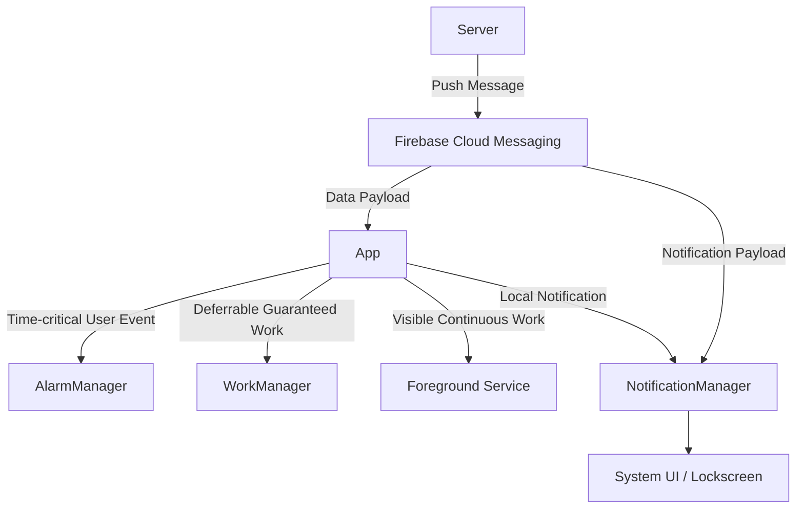

## 백그라운드 실행과 스케줄링 선택

이 문서는 안드로이드 시스템에서 백그라운드 작업을 실행하고, 이를 스케줄링하며, 시스템과 사용자에게 알림을 전달하는 과정을 종합적으로 설명합니다. 안드로이드의 백그라운드 실행은 시스템 자원(배터리, 메모리) 보존을 위해 매우 엄격하게 통제되며, 작업의 특성(지연 가능 여부, 정확한 시간 요구 여부, 사용자 인지 필요 여부)에 따라 적절한 API를 선택하는 것이 핵심입니다.

### 1. 이 주제를 읽기 전에
이 주제를 이해하기 위해 다음 선수 지식을 권장합니다.
- 안드로이드 4대 컴포넌트의 생명주기 및 프로세스 생명주기
- 시스템 서비스 조회 및 바인더 IPC 통신 구조

### 2. 전체 조망도

### 3. 하위 개념 및 원자 노트 합성

#### 3.1. 백그라운드 작업 API 선택 기준
작업의 지연 가능성과 실행 보장성, 그리고 사용자 가시성에 따라 백그라운드 실행 수단을 선택해야 합니다. 각 수단은 실패 비용과 시스템 제약(Doze 모드 등)을 고려해 설계되었습니다.
- [백그라운드 작업 계약](../../04_system_services/background-and-notifications/background-work-contracts/background-work-contracts.md)
- [Background Work API selection is a failure cost decision](../../04_system_services/background-and-notifications/background-work-contracts/background-api-selection.md)
- [Background execution is selected by guarantee, delay, and visibility](../../04_system_services/background-and-notifications/background-work-contracts/background-execution-selection.md)
- [WorkManager is default for deferrable guaranteed work](../../04_system_services/background-and-notifications/background-work-contracts/work-manager-contract.md)
- [AlarmManager is for time-based user events](../../04_system_services/background-and-notifications/background-work-contracts/alarm-manager-contract.md)
- [Foreground Service is for visible continuous work](../../04_system_services/background-and-notifications/background-work-contracts/foreground-service-contract.md)
- [Background restrictions require persistent work state](../../04_system_services/background-and-notifications/background-work-contracts/background-restrictions-state.md)

#### 3.2. 알림 및 메시징 처리 (FCM & Notification)
FCM(Firebase Cloud Messaging)과 알림은 사용자의 주의를 끌고 작업을 재개하는 진입점입니다. FCM 메시지는 페이로드 유형에 따라 처리 주체가 다르며, 메시지 전달 자체는 비즈니스 로직 실행을 보장하지 않습니다.
- [알림과 FCM 메시징 계약](../../04_system_services/background-and-notifications/notification-messaging-contracts/notification-messaging-contracts.md)
- [Android notification permission and channel control visibility](../../04_system_services/background-and-notifications/notification-messaging-contracts/notification-permission-channel.md)
- [FCM operations observe delivery, display, tap, and recovery separately](../../04_system_services/background-and-notifications/notification-messaging-contracts/fcm-delivery-lifecycle.md)
- [FCM registration identifier targets app instance, not user account](../../04_system_services/background-and-notifications/notification-messaging-contracts/fcm-registration-token.md)
- [FCM high priority is justified by user-visible notification](../../04_system_services/background-and-notifications/notification-messaging-contracts/fcm-high-priority.md)
- [FCM notification and data payloads have different handling points](../../04_system_services/background-and-notifications/notification-messaging-contracts/fcm-payload-handling.md)
- [FCM is message delivery, not business execution guarantee](../../04_system_services/background-and-notifications/notification-messaging-contracts/fcm-delivery-guarantee.md)

### 4. 이 주제와 연결된 Worked Example
- [04-fcm-to-notification-display-and-tap-recovery.md](../worked-examples/04-fcm-to-notification-display-and-tap-recovery.md)
- [05-process-death-recovery-of-edit-state-and-background-work.md](../worked-examples/05-process-death-recovery-of-edit-state-and-background-work.md)

### 5. 이 주제와 연결된 Diagnostic Runbook
- [05-background-work-delayed-or-not-running.md](../diagnostic-runbooks/05-background-work-delayed-or-not-running.md)
- [06-notification-missing.md](../diagnostic-runbooks/06-notification-missing.md)

### 6. 더 깊이 들어갈 때 (Learning Spine)
- [10-device-capability-discovery-and-background-execution.md](../learning-spine/10-device-capability-discovery-and-background-execution.md)
