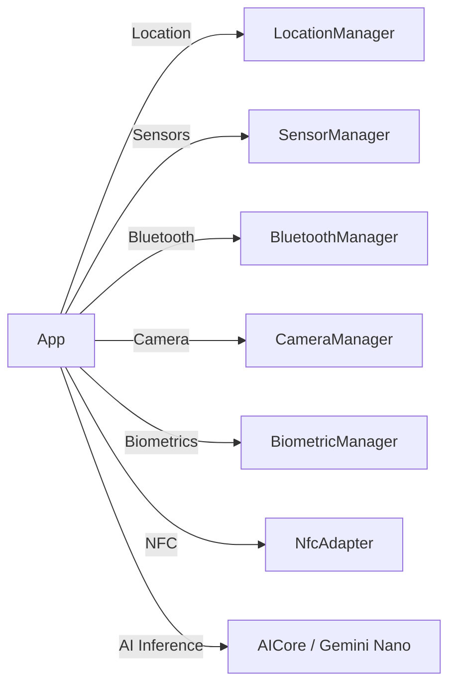

## 디바이스 기능 접근

이 문서는 카메라, 위치, 센서, 생체인증, NFC, Bluetooth, 그리고 온디바이스 AI와 같은 안드로이드 디바이스의 특수 하드웨어 및 소프트웨어 기능에 접근하는 패턴과 계약(Contract)을 다룬다.

### 이 주제를 읽기 전에
이 주제를 이해하기 위해 다음 선수 지식을 권장합니다.
- 권한(Permission) 요청 및 사용자 승인 흐름
- 안드로이드 시스템 서비스 조회(getSystemService) 메커니즘

### 전체 조망도

### 기기 하드웨어 및 소프트웨어 기능 접근

#### 위치 및 Health Connect
위치 정보는 대략적/정확한 권한이 분리되어 있으며, 건강 데이터는 Health Connect를 통해 앱 간에 안전하게 공유됩니다.
- [Precise and approximate location are separate permissions](../../04_system_services/device-capabilities/location/precise-vs-approximate-location.md)
- [Health Connect 접근 계약](../../04_system_services/device-capabilities/health-connect/health-connect.md)
- [Health connect permissions are granted per record type, not as a single grant](../../04_system_services/device-capabilities/health-connect/health-connect-record-permissions.md)
- [Health connect is a shared on-device store, not a cloud sync service](../../04_system_services/device-capabilities/health-connect/health-connect-on-device-storage.md)

#### 카메라, 오디오 및 미디어
오디오 재생은 오디오 포커스를 통해 조정되며, 카메라는 특성 확인 후 접근하는 패턴을 따릅니다.
- [미디어/오디오/카메라 시스템 서비스 접근 계약](../../04_system_services/device-capabilities/media-audio-camera/media-audio-camera.md)
- [AudioManager arbitrates concurrent playback through focus requests](../../04_system_services/device-capabilities/media-audio-camera/audio-manager-focus-arbitration.md)
- [CameraManager access starts with availability and characteristics](../../04_system_services/device-capabilities/media-audio-camera/camera-manager-characteristics.md)
- [MediaSession exposes playback state to system and external controllers](../../04_system_services/device-capabilities/media-audio-camera/media-session-controllers.md)

#### 블루투스 및 NFC
블루투스와 NFC는 연결 스택과 트랜잭션 관리가 중요하며, 각 프로토콜 모드(Classic, BLE, HCE, Reader)에 따라 사용 API가 다릅니다.
- [Bluetooth 접근 계약](../../04_system_services/device-capabilities/bluetooth/bluetooth.md)
- [Bluetooth Classic and BLE GATT are different connection models](../../04_system_services/device-capabilities/bluetooth/bluetooth-classic-vs-ble-gatt.md)
- [BLE background scanning is battery constrained and needs scan filters](../../04_system_services/device-capabilities/bluetooth/ble-background-scanning.md)
- [BluetoothGatt callback connection needs an explicit state machine](../../04_system_services/device-capabilities/bluetooth/bluetooth-gatt-state-machine.md)
- [Android 12 Bluetooth runtime permissions conditionally replace location permission](../../04_system_services/device-capabilities/bluetooth/bluetooth-runtime-permissions.md)
- [NFC와 비접촉 기능 계약](../../04_system_services/device-capabilities/nfc/nfc.md)
- [Android NFC splits reader, tag, and card emulation modes](../../04_system_services/device-capabilities/nfc/nfc-modes-reader-tag-hce.md)
- [HCE uses HostApduService to handle APDU transactions](../../04_system_services/device-capabilities/nfc/hce-host-apdu-service.md)
- [NDEF structures tag data as messages and records](../../04_system_services/device-capabilities/nfc/ndef-record-structures.md)

#### 센서 및 접근성/입력
물리적 센서 좌표계는 디바이스 기준이며, 배터리를 위해 일괄 처리(batching)를 적용합니다. 접근성 서비스는 다른 앱의 UI를 관찰합니다.
- [센서 접근 계약](../../04_system_services/device-capabilities/sensors/sensor.md)
- [Sensor coordinate system is device-fixed, not screen-relative](../../04_system_services/device-capabilities/sensors/sensor-coordinate-system.md)
- [SensorManager exposes raw and synthetic sensors through one API](../../04_system_services/device-capabilities/sensors/sensor-manager-synthetic-sensors.md)
- [Sensor batching trades latency for battery](../../04_system_services/device-capabilities/sensors/sensor-batching-latency.md)
- [입력 장치와 접근성 서비스 계약](../../04_system_services/device-capabilities/input-accessibility/input-accessibility.md)
- [AccessibilityService observes and acts on other apps UI](../../04_system_services/device-capabilities/input-accessibility/accessibility-service-ui-inspection.md)
- [InputManager abstracts physical input devices as event sources](../../04_system_services/device-capabilities/input-accessibility/input-manager-physical-devices.md)

#### 3.5. 생체인증, 자격증명 및 텔레포니
인증은 암호화 키 권한 부여와 결합되며, CredentialManager가 패스워드와 패스키를 통합합니다.
- [생체 인증/자격 증명 계약](../../04_system_services/device-capabilities/biometrics-credential/biometrics-credential.md)
- [CredentialManager unifies password, passkey, and federated sign-in](../../04_system_services/device-capabilities/biometrics-credential/credential-manager-unification.md)
- [BiometricManager canAuthenticate is a precondition check](../../04_system_services/device-capabilities/biometrics-credential/biometric-manager-preconditions.md)
- [BiometricPrompt couples authentication UI with key authorization](../../04_system_services/device-capabilities/biometrics-credential/biometric-prompt-key-auth.md)
- [텔레포니 접근 계약](../../04_system_services/device-capabilities/telephony/telephony.md)
- [TelephonyManager permissions split into phone state and phone numbers](../../04_system_services/device-capabilities/telephony/telephony-manager-permissions.md)

#### 3.6. 온디바이스 AI
AICore를 통해 시스템 번들 모델(Gemini Nano)을 호출하여 네트워크 요청 없이 로컬에서 추론을 수행합니다.
- [온디바이스 AI 접근 계약](../../04_system_services/device-capabilities/on-device-ai/on-device-ai.md)
- [On-device inference skips the network round trip cloud inference needs](../../04_system_services/device-capabilities/on-device-ai/on-device-inference-low-latency.md)
- [AICore manages Gemini Nano as a shared system model, not a bundled asset](../../04_system_services/device-capabilities/on-device-ai/aicore-gemini-nano.md)
- [On-device AI feature availability must be checked before use](../../04_system_services/device-capabilities/on-device-ai/on-device-ai-feature-availability.md)

### 4. 이 주제와 연결된 Worked Example
- [02-photo-capture-preview-save-upload.md](../worked-examples/02-photo-capture-preview-save-upload.md)

### 5. 이 주제와 연결된 Diagnostic Runbook
- [04-permission-denial.md](../diagnostic-runbooks/04-permission-denial.md)

### 6. 더 깊이 들어갈 때 (Learning Spine)
- [10-device-capability-discovery-and-background-execution.md](../learning-spine/10-device-capability-discovery-and-background-execution.md)
