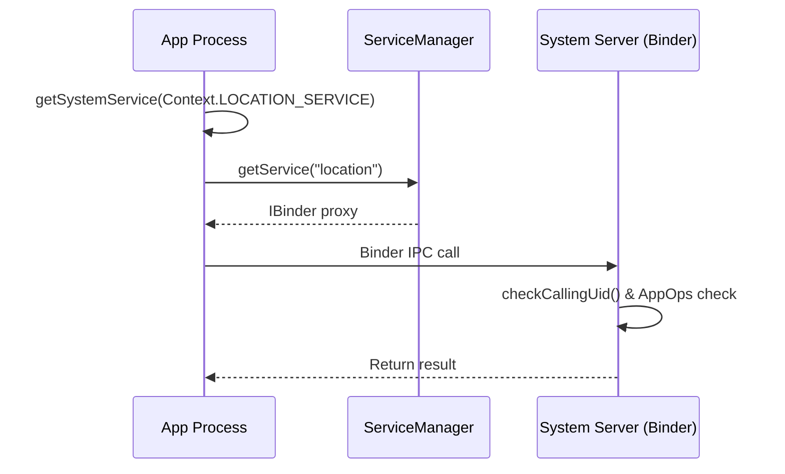

## 시스템 서비스 조회 패턴

안드로이드의 다양한 기능은 `system_server` 프로세스에서 서비스 형태로 호스팅됩니다. 앱은 `getSystemService()`를 통해 이러한 서비스에 접근하며, 이때 백그라운드에서는 Binder IPC 통신과 권한 확인 메커니즘이 동작합니다. 이 문서는 서비스 조회와 IPC 권한 검사 구조를 설명합니다.

### 1. 이 주제를 읽기 전에
이 주제를 이해하기 위해 다음 선수 지식을 권장합니다.
- Binder IPC 및 안드로이드 프로세스 간 통신
- 안드로이드 권한 모델과 AppOps

### 2. 전체 조망도

### 3. 하위 개념 및 원자 노트 합성

#### 3.1. getSystemService 메커니즘
`getSystemService`는 시스템 서비스의 로컬 프록시(매니저 객체)를 캐싱하여 반환합니다. 실제 핵심 로직은 Binder를 통해 System Server로 전달됩니다.
- [시스템 서비스 접근 공통 계약](../../04_system_services/service-lookup/service-lookup-contracts/service-lookup-contracts.md)
- [getSystemService returns a cached manager backed by Binder IPC](../../04_system_services/service-lookup/service-lookup-contracts/getsystemservice-returns-a-cached-manager-backed-by-binder-ipc.md)

#### 3.2. 권한(UID/PID) 및 AppOps 검사
모든 Binder 호출은 시스템 서버 측에서 호출자의 UID와 PID를 확인하여 권한을 검사합니다. 특히 AppOps는 사용자가 권한을 부여한 이후라도 세밀하게 접근을 거부할 수 있는 통제 수단입니다.
- [System server checks caller UID and PID for every call](../../04_system_services/service-lookup/service-lookup-contracts/system-server-checks-caller-uid-and-pid-for-every-call.md)
- [AppOps can deny after permission is already granted](../../04_system_services/service-lookup/service-lookup-contracts/appops-can-deny-after-permission-is-already-granted.md)

### 4. 이 주제와 연결된 Worked Example
- [06-permission-granted-but-api-fails.md](../worked-examples/06-permission-granted-but-api-fails.md)

### 5. 이 주제와 연결된 Diagnostic Runbook
- [04-permission-denial.md](../diagnostic-runbooks/04-permission-denial.md)

### 6. 더 깊이 들어갈 때 (Learning Spine)
- [01-android-ecosystem-and-contract-surfaces.md](../learning-spine/01-android-ecosystem-and-contract-surfaces.md)
- [02-android-platform-execution-layers-and-call-paths.md](../learning-spine/02-android-platform-execution-layers-and-call-paths.md)
