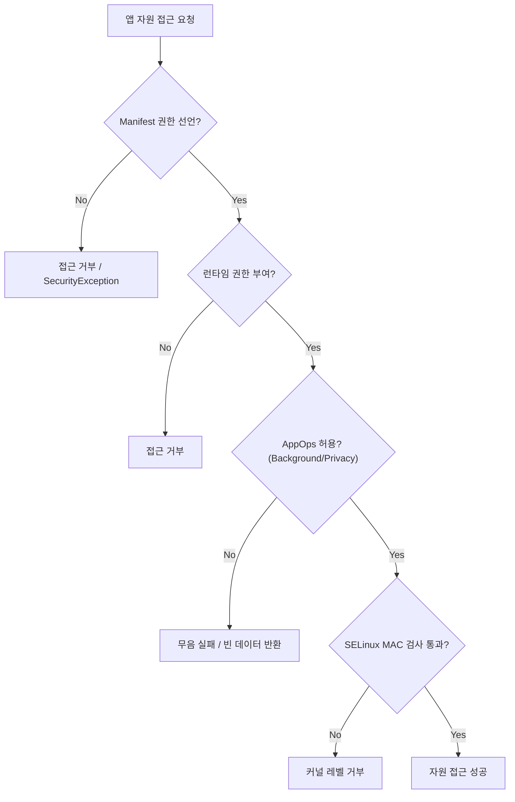

## D1: 권한 모델 완전 이해 (Permission → AppOps → SELinux)

안드로이드의 권한 시스템은 단순한 매니페스트 선언(Manifest Declaration)을 넘어, 런타임 권한, AppOps(백그라운드 제어/프라이버시 제어), 그리고 커널 수준의 SELinux 샌드박스로 이어지는 다층적 보안 구조를 가진다. 이 주제는 앱이 시스템 자원에 접근하기 위해 통과해야 하는 독립적인 보안 게이트(Security Gates)들을 조망한다.

### 이 주제를 읽기 전에 (Prerequisite & Related Topics)
- 안드로이드 컴포넌트 모델과 매니페스트: 앱의 기본 구조와 권한 선언 방식
- 프로세스 생명주기: 권한 부여 및 취소가 프로세스에 미치는 영향

### 전체 조망도 (Diagram)

### 권한 보호 수준과 보안 게이트

#### 보호 수준과 런타임 권한 (Protection Levels & Runtime Permissions)

안드로이드는 권한의 보호 수준(Normal, Signature, Dangerous 등)에 따라 권한 부여의 주체를 결정한다. 위험(Dangerous) 권한은 반드시 사용자의 명시적인 승인(Runtime Permission)을 거쳐야 한다.

- [Permission protection level defines who can grant access](../../05_security_privacy/permissions-and-sandbox/permission-contracts/permission-protection-level-defines-who-can-grant-access.md)
- [Runtime permission is user-mediated access contract](../../05_security_privacy/permissions-and-sandbox/permission-contracts/runtime-permission-is-user-mediated-access-contract.md)
- [Permission request UX uses minimal point-of-use explanation](../../05_security_privacy/permissions-and-sandbox/permission-contracts/permission-request-ux-uses-minimal-point-of-use-explanation.md)

#### AppOps 와 특별 접근 권한 (AppOps & Special App Access)

권한이 부여되었더라도, 백그라운드 상태나 프라이버시 설정(예: 마이크/카메라 사용 중 차단)에 의해 AppOps 레벨에서 접근이 차단될 수 있습니다. 또한, 다른 앱 위에 그리기와 같은 강력한 기능은 설정 앱을 통한 특별 권한(Special Access)을 요구합니다.

- [AppOps observes and gates sensitive operations after permission](../../05_security_privacy/permissions-and-sandbox/permission-contracts/appops-observes-and-gates-sensitive-operations-after-permission.md)
- [Special app access is settings-mediated capability](../../05_security_privacy/permissions-and-sandbox/permission-contracts/special-app-access-is-settings-mediated-capability.md)
- [Permission debugging separates manifest grant and AppOps state](../../05_security_privacy/permissions-and-sandbox/permission-contracts/permission-debugging-separates-manifest-grant-and-appops-state.md)

### 4. 이 주제와 연결된 Worked Example
- [Worked Example: Permission granted but API fails](../worked-examples/06-permission-granted-but-api-fails.md)

### 5. 이 주제와 연결된 Diagnostic Runbook
- [Runbook: Permission Denial](../diagnostic-runbooks/04-permission-denial.md)

### 6. 더 깊이 들어갈 때 (Learning Spine)

권한 검증과 샌드박스의 근본적인 동작 원리를 이해하려면 다음 챕터를 참고하세요.

- [Learning Spine: 09. Identity, Permission, and Independent Security Gates](../learning-spine/09-identity-permission-and-independent-security-gates.md)
- [Learning Spine: 04. Manifest to Component Execution](../learning-spine/04-manifest-to-component-execution.md)
