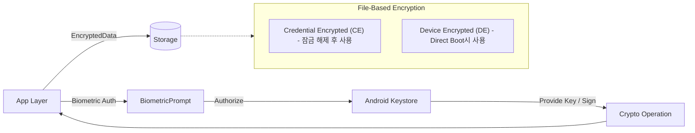

## D2: 안전한 저장소와 암호화

모바일 기기는 분실 위험이 높기 때문에, 안드로이드는 데이터의 생명주기와 보호 수준에 맞춰 다양한 암호화 및 저장소 정책을 제공합니다. 이 문서는 파일 기반 암호화(FBE), Keystore 시스템, 생체 인증, 그리고 데이터 백업 정책을 관통하는 암호화 및 안전한 저장소 활용 방안을 종합합니다.

### 1. 이 주제를 읽기 전에 (Prerequisite & Related Topics)
- 안드로이드 저장소 모델: 내부/외부 저장소 및 Scoped Storage
- 암호학 기초: 대칭키/비대칭키, AES-GCM 동작 원리

### 2. 전체 조망도 (Diagram)

### 3. 하위 개념 및 원자 노트 합성

#### 안드로이드 Keystore와 생체 인증 연동 (Keystore & Biometrics)
비밀키는 메모리에 노출되어서는 안 되며, Android Keystore(하드웨어 지원 환경) 내부에서 생성되고 관리되어야 합니다. 민감한 키 사용 시 사용자의 생체 인증을 필수 조건으로 결합할 수 있습니다.
- [Android Keystore protects keys by non-exportability](../../05_security_privacy/secure-storage/secure-storage-contracts/android-keystore-protects-keys-by-non-exportability.md)
- [BiometricPrompt authorizes Keystore key use](../../05_security_privacy/secure-storage/secure-storage-contracts/biometricprompt-authorizes-keystore-key-use.md)
- [Sensitive data requires encryption and key ownership](../../05_security_privacy/secure-storage/secure-storage-contracts/sensitive-data-requires-encryption-and-key-ownership.md)

#### 암호화 동작과 래퍼 API (Crypto Operations & Wrapper APIs)
암호화(특히 AES-GCM) 시 IV(초기화 벡터) 재사용 방지와 인증 태그 검증은 데이터 무결성을 보장하는 핵심입니다. EncryptedSharedPreferences와 같은 래퍼 API는 유용하지만 한계점도 명확히 이해해야 합니다.
- [AES-GCM requires unique IV and authentication tag](../../05_security_privacy/secure-storage/secure-storage-contracts/aes-gcm-requires-unique-iv-and-authentication-tag.md)
- [Encrypted storage APIs do not replace key and data boundary](../../05_security_privacy/secure-storage/secure-storage-contracts/encrypted-storage-apis-do-not-replace-key-and-data-boundary.md)

#### 데이터 생명주기와 백업 (Storage Lifecycle & FBE)
기기가 부팅되었으나 잠금 해제되지 않은 Direct Boot 상태(Device Encrypted, DE)와, 잠금 해제 후 사용자 데이터(Credential Encrypted, CE)의 접근 가능 시점은 구분됩니다. 또한 앱 백업 정책은 저장소 생명주기와 밀접하게 닿아 있습니다.
- [FBE CE and DE separate storage availability](../../05_security_privacy/secure-storage/storage-lifecycle-and-backup/fbe-ce-and-de-separate-storage-availability.md)
- [Direct Boot requires minimal device-protected data](../../05_security_privacy/secure-storage/storage-lifecycle-and-backup/direct-boot-requires-minimal-device-protected-data.md)
- [Backup/restore requires explicit data boundaries](../../05_security_privacy/secure-storage/storage-lifecycle-and-backup/backup-restore-requires-explicit-data-boundaries.md)
- [Cache is recreatable data, not source of truth](../../05_security_privacy/secure-storage/storage-lifecycle-and-backup/cache-is-recreatable-data-not-source-of-truth.md)
- [Scoped storage and encryption protect different boundaries](../../05_security_privacy/secure-storage/storage-lifecycle-and-backup/scoped-storage-and-encryption-protect-different-boundaries.md)

### 4. 이 주제와 연결된 Worked Example
- [Worked Example: Photo capture, preview, save, upload](../worked-examples/02-photo-capture-preview-save-upload.md)

### 5. 이 주제와 연결된 Diagnostic Runbook
- 특화된 Runbook은 아직 존재하지 않으나, 암호화 상태로 인한 시작 실패 시 관련 지식이 필요할 수 있습니다.

### 6. 더 깊이 들어갈 때 (Learning Spine)
- [Learning Spine: 08. Data Storage, Network, and Offline Recovery](../learning-spine/08-data-storage-network-and-offline-recovery.md)
- [Learning Spine: 09. Identity, Permission, and Independent Security Gates](../learning-spine/09-identity-permission-and-independent-security-gates.md)
