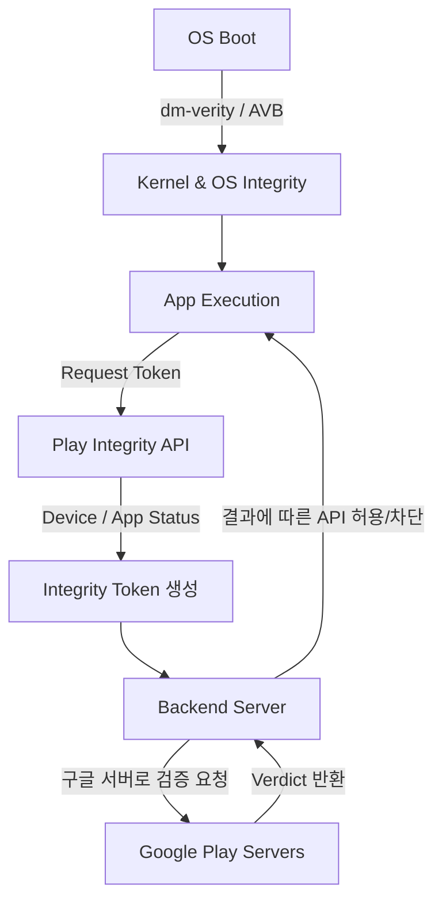

## D3: 앱 무결성 검증 (Play Integrity, AVB, dm-verity)

앱 및 실행 환경의 무결성은 신뢰할 수 없는 기기에서 서버와 통신할 때 매우 중요하다. 안드로이드는 OS 무결성을 위한 Android Verified Boot (AVB/dm-verity), 서명 및 패키지 무결성, 그리고 구글 서비스 기반의 Play Integrity API 등 다계층의 무결성 증명(Attestation) 메커니즘을 사용한다.

### 이 주제를 읽기 전에 (Prerequisite & Related Topics)
- 앱 서명(App Signing)과 패키지 관리: 인증서 및 APK 서명 스킴(v2/v3/v4)
- 백엔드 서버 인증 및 토큰 검증 메커니즘

### 전체 조망도 (Diagram)

### Play Integrity, AVB/dm-verity, 앱 서명

#### Play Integrity와 증명(Attestation) 메커니즘 (Play Integrity API)
기기가 루팅되었거나, 앱이 변조(Tampered)되었는지를 클라이언트 스스로 판단하는 것은 안전하지 않다. Play Integrity API가 생성한 토큰은 반드시 신뢰할 수 있는 백엔드 서버에서 검증(Server-verified)해야 하며, 이는 인가(Authorization)와는 분리된 위험 신호(Risk Signal)로 활용되어야 한다.
- [Play Integrity token is server-verified risk signal, not authorization](../../05_security_privacy/integrity/play-integrity-token-verification.md)

#### OS 무결성과 커널 보호 (AVB & dm-verity)
기기 자체의 펌웨어나 부트 파티션이 변조되지 않았음을 증명하기 위해, 기기 부팅 시점부터 Android Verified Boot (AVB)와 dm-verity 커널 기능이 동작하여 신뢰 체인(Chain of Trust)을 구축한다. 이는 이후 하드웨어 기반 Key Attestation과 Play Integrity의 신뢰 기반이 된다.

#### 앱 서명 및 전송 무결성 (App Signing & Delivery)
APK/AAB의 서명 구조는 로컬에 설치된 패키지가 원래 개발자에 의해 배포되었음을 보장한다. Google Play 앱 서명을 사용할 경우, 플레이 스토어 전송 계층에서도 인증서 교체 및 무결성 유지가 지원된다.

### 4. 이 주제와 연결된 Worked Example
- [Worked Example: Signed artifact through Play delivery to update](../worked-examples/08-signed-artifact-through-play-delivery-to-update.md)

### 5. 이 주제와 연결된 Diagnostic Runbook
- [Runbook: Install/Update Failure (서명 불일치 및 무결성 문제 포함)](../diagnostic-runbooks/08-install-update-failure.md)

### 6. 더 깊이 들어갈 때 (Learning Spine)
무결성 증명과 앱 배포, 업데이트 프로세스의 근본 원리를 이해하려면 다음을 참고하세요.
- [Learning Spine: 03. Source to Installed Package](../learning-spine/03-source-to-installed-package.md)
- [Learning Spine: 09. Identity, Permission, and Independent Security Gates](../learning-spine/09-identity-permission-and-independent-security-gates.md)
