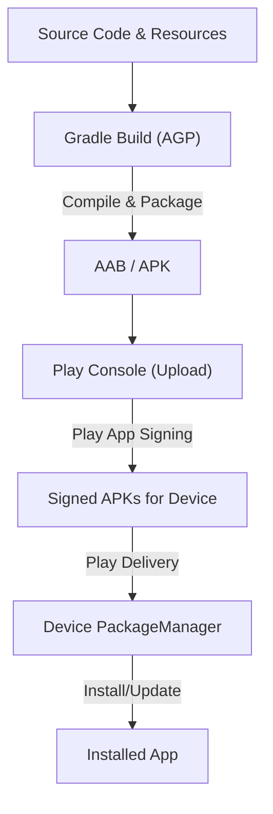

## E1: 빌드에서 설치까지 (Gradle → APK/AAB → PackageManager)

**목적:** 안드로이드 앱의 소스코드가 컴파일되고 패키징되어 스토어를 거쳐 사용자 기기에 설치, 업데이트되는 전체 흐름과 각 단계의 계약(Contract)을 이해한다.

### 이 주제를 읽기 전에
- **소스코드에서 패키지까지**: 소스코드가 어떻게 바이너리(DEX, 리소스)로 변환되는지 기본 개념
- **서명(Signing)의 중요성**: 안드로이드에서 앱의 신원을 증명하고 업데이트 연속성을 보장하는 서명 메커니즘
- **관련 주제**: [A1: 부팅과 프로세스](A1-boot-and-process.md)

### 전체 조망도

### 빌드, 패키징, 서명, 설치

#### 3.1. 빌드 도구와 플러그인 (Gradle & AGP)
안드로이드 빌드는 Gradle 위에 Android Gradle Plugin(AGP)을 올려 수행됩니다. AGP는 안드로이드 특유의 컴파일, 리소스 병합, 패키징 규칙을 Gradle 태스크로 제공합니다.
- [Android Gradle Plugin (AGP) 아키텍처 및 확장 모델](../../03_packaging_deployment/build/gradle/gradle-build/android-gradle-plugin.md)

#### 3.2. CI/CD 파이프라인
CI(Continuous Integration) 환경에서의 빌드는 로컬 개발 환경과 달리 빠른 검증(Fast Validation)과 릴리스 검증(Release Validation)으로 나뉩니다.
- [Android CI/CD 게이트는 빠른 검증과 릴리스 검증을 분리한다](../../03_packaging_deployment/build/dependency-versioning/dependency-ci/android-cicd-gates-separate-fast-validation-and-release-validation.md)

#### 3.3. 패키징 포맷과 스토어 배포 (AAB & APK)
AAB(Android App Bundle)는 스토어 제출용 아티팩트이며, 기기에 직접 설치할 수 없습니다. Play Store는 AAB를 바탕으로 사용자의 기기 사양에 맞춘 최적화된 분할 APK를 생성해 전달합니다.
- [Play app signing은 업로드 키와 앱 서명 키를 분리한다](../../03_packaging_deployment/distribution/release-distribution/play-app-signing-separates-upload-key-and-app-signing-key.md)

#### 3.4. 앱 서명과 아이덴티티
Play App Signing을 사용하면 개발자는 업로드 키로 AAB에 서명하고, 구글 플레이가 앱 서명 키로 최종 APK에 서명합니다. 이는 키 분실 시의 복구와 보안을 강화합니다.
- [Play App Signing은 업로드 키와 앱 서명 키를 분리한다](../../03_packaging_deployment/distribution/release-distribution/play-app-signing-separates-upload-key-and-app-signing-key.md)

#### 3.5. 인앱 업데이트
인앱 업데이트는 백그라운드에서 유연하게 다운로드되는 흐름(Flexible)과 사용자를 차단하고 즉시 강제 업데이트하는 흐름(Immediate)으로 나뉘며, 각각 다른 사용자 경험을 제공합니다.
- [인앱 업데이트의 유연한 흐름과 즉시 흐름은 차단 여부가 다르다](../../03_packaging_deployment/distribution/release-distribution/in-app-update-flexible-and-immediate-flows-differ-in-blocking.md)

### 4. 이 주제와 연결된 Worked Example
- [08. 서명된 아티팩트가 Play Delivery를 거쳐 업데이트되기까지](../worked-examples/08-signed-artifact-through-play-delivery-to-update.md)

### 5. 이 주제와 연결된 Diagnostic Runbook
- [08. 설치 및 업데이트 실패 (Install/Update Failure)](../diagnostic-runbooks/08-install-update-failure.md)

### 6. 더 깊이 들어갈 때 (Learning Spine)
- [03. Source to Installed Package](../learning-spine/03-source-to-installed-package.md)
- [12. Compatibility, Update, and Form Factor](../learning-spine/12-compatibility-update-and-form-factor.md)
