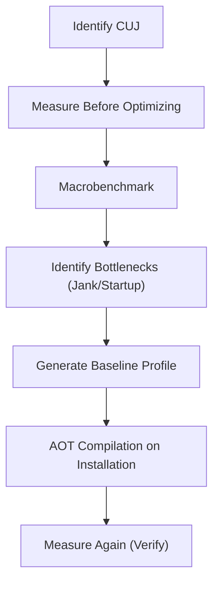

## E2: 성능 측정과 최적화 (Baseline Profile, Macrobenchmark)

**목적:** 안드로이드 환경에서 앱의 성능(시작 시간, 렌더링 등)을 측정하고, Baseline Profile과 Macrobenchmark를 통해 이를 안정적으로 최적화하는 전략과 계약을 이해한다.

### 이 주제를 읽기 전에
- **JIT/AOT 컴파일**: ART(Android Runtime)가 앱을 실행할 때 컴파일하는 방식의 차이
- **렌더링 파이프라인**: 프레임을 기기 화면에 그리기까지의 마감 시간(Deadline) 개념
- **관련 주제**: [A1: 부팅과 프로세스](A1-boot-and-process.md), [B2: 젯팩 컴포즈](B2-jetpack-compose.md)

### 전체 조망도

### 측정, Baseline Profile, 최적화

#### 3.1. 최적화의 원칙: 측정 우선
성능 최적화는 추측이 아닌 데이터에 기반해야 합니다. 최적화를 시작하기 전 항상 현재 상태를 측정하는 것이 안드로이드 성능 개선의 첫 번째 원칙입니다.
- [안드로이드 성능 최적화 전에는 반드시 측정해야 한다](../../06_testing_performance/performance/performance-measurement-principles.md)

#### 3.2. 매크로벤치마크를 통한 사용자 여정 측정
매크로벤치마크(Macrobenchmark)는 개별 함수의 실행 시간이 아닌 앱 시작, 스크롤, 화면 전환 등 실제 사용자가 겪는 주요 사용자 여정(CUJ)의 성능을 측정합니다.
- [매크로벤치마크는 실제 사용자 여정을 측정한다](../../06_testing_performance/benchmark/macrobenchmark-user-journeys.md)

#### 3.3. Baseline Profile을 통한 시작 속도 개선
Baseline Profile은 앱 시작 및 주요 동작 시 사용되는 클래스와 메서드의 목록을 기록하여 설치 시점에 미리 컴파일(AOT)하게 만들어 줍니다. 이를 통해 런타임 성능 저하(JIT)를 방지합니다.
- [Baseline Profile 생성은 중요한 사용자 여정(CUJ)을 기록한다](../../06_testing_performance/benchmark/baseline-profile-generation.md)

#### 3.4. 앱 시작 성능 지표 (TTID & TTFD)
앱의 시작 시간은 첫 번째 프레임이 그려지는 시간(TTID: Time to Initial Display)과 사용자가 상호작용 가능한 전체 데이터가 표시되는 시간(TTFD: Time to Full Display)으로 나뉘어 측정됩니다.
- [시작 성능은 TTID와 TTFD로 측정된다](../../06_testing_performance/performance/startup-performance-metrics.md)

#### 3.5. 렌더링 정체(Jank)와 프레임 데드라인
화면이 버벅거리는 현상(Jank)은 UI 스레드나 RenderThread에서 작업을 지정된 프레임 마감 기한 내에 마치지 못해 프레임을 놓치는(Dropped Frames) 것을 의미합니다.
- [렌더링 버벅임(Jank)은 프레임 마감 시간 실패이다](../../06_testing_performance/performance/rendering-jank-frame-deadlines.md)

### 4. 이 주제와 연결된 Worked Example
- [07. Compose Jank: UI State에서 SurfaceFlinger까지](../worked-examples/07-compose-jank-from-ui-state-to-surfaceflinger.md)

### 5. 이 주제와 연결된 Diagnostic Runbook
- [01. 앱 시작 지연 및 실패 (App Launch Slow or Fails)](../diagnostic-runbooks/01-app-launch-slow-or-fails.md)
- [07. 화면 버벅임 및 프레임 드롭 (Jank & Dropped Frames)](../diagnostic-runbooks/07-jank-dropped-frames.md)

### 6. 더 깊이 들어갈 때 (Learning Spine)
- [11. Observation, Testing, and Quality Feedback](../learning-spine/11-observation-testing-and-quality-feedback.md)
- [07. Input, Resource Selection, and Display Frame](../learning-spine/07-input-resource-selection-and-display-frame.md)
