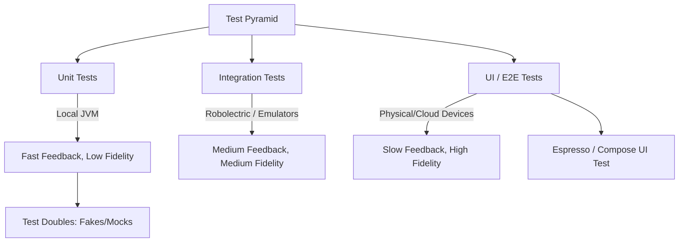

## E3: 테스트 전략 (Unit → Integration → UI → E2E)

**목적:** 안드로이드 애플리케이션의 테스트 계층을 설계하고 피드백 속도, 유지보수 비용, 신뢰성의 균형을 맞추는 품질 계약을 이해한다.

### 이 주제를 읽기 전에
- **테스트 피라미드**: 단위 테스트, 통합 테스트, UI 테스트의 비율과 특징
- **안드로이드 환경의 제약**: 안드로이드 프레임워크 종속성이 테스트 속도와 격리에 미치는 영향
- **관련 주제**: [B1: 컴포넌트 생명주기와 태스크](B1-component-lifecycle-and-task.md)

### 전체 조망도

### 테스트 계층 설계와 품질 계약

#### 3.1. 피드백 비용과 리스크에 따른 테스트 계층 선택
테스트 계층은 단순히 코드 양에 의해 결정되는 것이 아니라, 빠른 피드백을 얻기 위한 비용과 실제 환경에서의 실패 리스크를 균형 있게 고려해 선택해야 합니다.
- [테스트 계층은 피드백 비용과 리스크에 의해 선택된다](../../06_testing_performance/testing/testing-quality-contracts/test-layer-is-chosen-by-feedback-cost-and-risk.md)

#### 3.2. 테스트 계층별 실패 신호
단위 테스트는 로직의 결함을 짚어내고, 통합 테스트는 모듈 간의 연결 실패를, UI/E2E 테스트는 시스템 전체의 사용자 경험 단절을 알려주는 서로 다른 실패 신호를 제공합니다.
- [단위, 통합, UI, E2E 테스트는 서로 다른 실패 신호를 갖는다](../../06_testing_performance/testing/testing-quality-contracts/unit-integration-ui-e2e-tests-have-different-failure-signals.md)

#### 3.3. Test Doubles: Fake vs Mock
외부 의존성을 대체할 때, 상태 기반의 동작을 유지해야 한다면 Fake를 사용하고 상호작용 검증에 초점을 둔다면 Mock을 사용합니다. 이는 행위의 소유권에 따라 결정됩니다.
- [테스트 더블은 행동 소유권에 따라 Fake와 Mock을 선택한다](../../06_testing_performance/testing/testing-quality-contracts/test-doubles-choose-between-fake-and-mock-by-behavior-ownership.md)

#### 3.4. Espresso와 비동기 UI 테스트
Espresso는 기본적으로 뷰의 동기적 UI 테스트를 지원하며, 비동기 작업(네트워크, 애니메이션 등)을 기다리기 위해서는 Idling Resource를 사용해 동기화해야 합니다.
- [Espresso는 비동기 대기를 위한 Idling Resource와 함께 동기적 뷰 UI 테스트를 담당한다](../../06_testing_performance/testing/testing-quality-contracts/espresso-owns-synchronous-view-ui-tests-with-idling-resource-for-async-waits.md)

#### 3.5. Compose UI 테스트와 Semantics
선언형 UI인 Compose 환경에서 UI 테스트는 뷰 ID 대신 안정적인 선택자와 접근성 트리(Semantics)를 기반으로 컴포넌트를 찾고 상호작용을 검증해야 합니다.
- [Compose UI 테스트는 안정적인 선택자와 시맨틱을 사용해야 한다](../../06_testing_performance/testing/testing-quality-contracts/compose-ui-tests-should-use-stable-selectors-and-semantics.md)

### 4. 이 주제와 연결된 Worked Example
- (테스트 전반에 관한 구체적 예제는 다른 사례 분석의 검증 과정에 포함되어 있습니다. 특히 [01. 앱 아이콘 탭에서 첫 프레임까지](../worked-examples/01-app-icon-tap-to-first-frame.md)에서 테스트 가능한 시작 흐름을 참고하세요.)

### 5. 이 주제와 연결된 Diagnostic Runbook
- 일반적인 로직 버그 외에 테스트 관련 런북은 없으나, UI 멈춤을 파악하는 데는 [07. 화면 버벅임 및 프레임 드롭](../diagnostic-runbooks/07-jank-dropped-frames.md) 진단 방식이 결합될 수 있습니다.

### 6. 더 깊이 들어갈 때 (Learning Spine)
- [11. Observation, Testing, and Quality Feedback](../learning-spine/11-observation-testing-and-quality-feedback.md)
