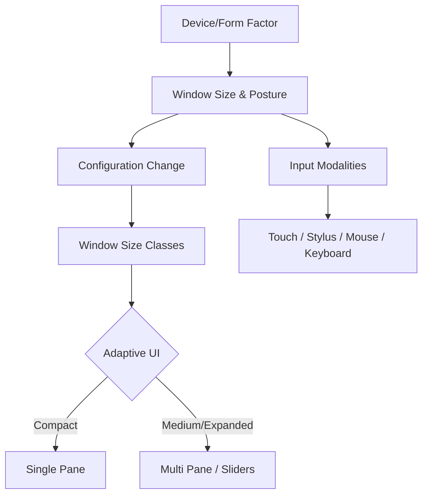

## F1: 대화면·폴더블 적응형 레이아웃

**목적:** 폼 팩터의 다양화(폴더블, 태블릿, 데스크톱 윈도우 모드)에 대응하여 앱이 다양한 창 크기와 자세(Posture)에 적응하는 원리와 계약을 이해한다.

### 이 주제를 읽기 전에
- **뷰와 레이아웃 시스템**: 화면을 그리는 기본 단위와 크기 계산 원리
- **Configuration Changes**: 화면 회전, 크기 변경 시 안드로이드 시스템이 컴포넌트 생명주기를 어떻게 다루는지의 원리
- **관련 주제**: [B1: 컴포넌트 생명주기와 태스크](B1-component-lifecycle-and-task.md)

### 전체 조망도

### 3. 하위 개념 및 원자 노트 합성

#### 3.1. 크기 변경은 스케일링이 아닌 구조의 재배치
적응형 레이아웃은 단순히 요소의 크기를 늘리는 것이 아니라, 화면 공간에 맞춰 내비게이션, 콘텐츠 목록, 세부 정보 창 등 전체적인 구조를 재배치하는 과정입니다.
- [적응형 레이아웃은 스케일이 아니라 구조를 변경한다](../../07_platforms/large-screens/adaptive-layout-structure.md)

#### 3.2. Window Size Class (WSC)
앱은 기기 모델이 아닌, 앱이 현재 점유하고 있는 '창 크기(Window Size)'를 기준으로 컴팩트(Compact), 미디엄(Medium), 확장(Expanded) 클래스로 나누어 대응해야 합니다.
- [Window Size Class는 기기 타입이 아니라 앱 창을 분류한다](../../07_platforms/large-screens/window-size-class-classification.md)

#### 3.3. 폴더블 기기의 자세(Posture)
폴더블 기기는 화면이 접힌 상태, 반쯤 접힌 테이블탑(Tabletop) 모드, 완전히 펼친 상태 등 다양한 자세(Posture)를 가지며, 이는 크기 변경과 더불어 중요한 레이아웃 입력으로 작용합니다.
- [폴더블 자세(Posture)는 기기 카테고리가 아니라 레이아웃 입력이다](../../07_platforms/large-screens/foldable-posture-layout.md)

#### 3.4. 멀티 윈도우와 생명주기 분리
큰 화면에서는 여러 앱이 동시에 띄워지는 멀티 윈도우 모드가 활성화됩니다. 이는 앱이 항상 전체 화면을 독점하고 포커스를 갖는다는 기존의 단일 화면 가정을 깹니다.
- [멀티 윈도우 생명주기는 단일 전체 화면 가정을 깬다](../../07_platforms/large-screens/multi-window-lifecycle-boundaries.md)

#### 3.5. 대화면 환경의 다양한 입력 장치
태블릿과 데스크톱 모드 등에서는 터치뿐만 아니라 물리 키보드, 마우스(포인터), 스타일러스 펜이 필수적인 일차 입력 장치로 사용됩니다.
- [키보드, 포인터, 스타일러스는 대화면의 주요 입력 장치이다](../../07_platforms/large-screens/large-screen-input-modalities.md)

### 4. 이 주제와 연결된 Worked Example
- [03. 딥링크에서 올바른 Task와 Screen State로 연결 (멀티 윈도우 환경 포함)](../worked-examples/03-deep-link-to-correct-task-and-screen-state.md)

### 5. 이 주제와 연결된 Diagnostic Runbook
- [03. 프로세스 종료 및 상태 손실 (상태 복원 실패)](../diagnostic-runbooks/03-process-death-state-loss.md) (창 크기 조절 시 Configuration Change 대응)

### 6. 더 깊이 들어갈 때 (Learning Spine)
- [12. Compatibility, Update, and Form Factor](../learning-spine/12-compatibility-update-and-form-factor.md)
- [07. Input, Resource Selection, and Display Frame](../learning-spine/07-input-resource-selection-and-display-frame.md)
