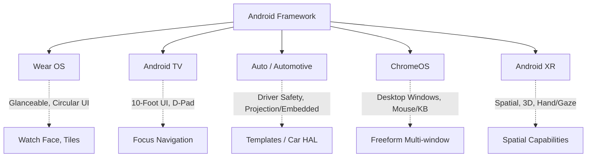

## F2: 폼 팩터별 계약 (Wear OS / TV / Auto / ChromeOS / XR)

**목적:** 모바일 기기를 넘어 웨어러블, TV, 자동차, 데스크톱, 혼합현실 등 각 안드로이드 폼 팩터가 요구하는 고유한 입력 방식과 런타임 제약(Contract)을 이해한다.

### 이 주제를 읽기 전에
- **안드로이드 생태계**: 안드로이드 OS가 다양한 하드웨어에 어떻게 커스텀되어 배포되는지에 대한 기초
- **UI 입력 이벤트**: 터치, 키보드, 마우스 등 입력 이벤트 처리 흐름
- **관련 주제**: [F1: 대화면·폴더블 적응형 레이아웃](F1-large-screen-adaptive-layout.md)

### 전체 조망도

### 3. 하위 개념 및 원자 노트 합성

#### 3.1. Wear OS (스마트워치)
Wear OS 앱은 짧은 상호작용에 최적화되어 있으며, 휴대전화 컴패니언 앱에 종속되지 않고 시계 단독으로도 실행될 수 있어야 합니다.
- [Wear OS 앱은 컴패니언 휴대전화 앱과 독립적으로 실행될 수 있다](../../07_platforms/wear/wear/wear-os-apps-can-run-independently-of-a-companion-phone-app.md)

#### 3.2. Android TV (10-Foot UI)
TV 앱은 터치스크린이 없음을 명시적으로 선언해야 하며, 사용자가 10피트 떨어져서 리모컨(D-Pad)으로 조작하므로 요소 간의 명확한 포커스 기반 내비게이션이 필수입니다.
- [10-Foot UI는 포커스 기반 내비게이션을 요구한다](../../07_platforms/tv/tv/10-foot-ui-requires-focus-based-navigation.md)

#### 3.3. Android Auto & Automotive OS
운전자 안전이 최우선인 차량 환경에서, 휴대전화 화면을 투사하는 Auto와 차량에 내장된 Automotive OS는 구조적으로 다릅니다. UI는 제한된 템플릿 내에서만 렌더링됩니다.
- [Android Auto는 프로젝션이고, Android Automotive OS는 임베디드 OS이다](../../07_platforms/auto/auto/android-auto-is-projection-android-automotive-os-is-an-embedded-os.md)

#### 3.4. ChromeOS (데스크톱)
ChromeOS의 Android runtime은 세대와 기기 구성에 따라 다르다. 초기 ARC++는 container 기반이었고, 최신 ARCVM 구현은 Android stack을 별도 virtual machine에서 실행한다. 앱은 구현 방식을 추측하기보다 resizable window, 키보드·마우스·터치, focus, density와 lifecycle 변화 같은 관찰 가능한 desktop contract에 대응한다.
- [ChromeOS는 데스크톱 윈도우에 매핑된 컨테이너/가상머신에서 안드로이드 앱을 실행한다](../../07_platforms/chromeos/chromeos/chromeos-runs-android-apps-in-a-container-mapped-to-desktop-windows.md)

#### 3.5. Android XR (공간 컴퓨팅)
XR(혼합현실) 환경은 기존 2D 평면을 넘어선 공간적 폼 팩터입니다. 앱은 런타임에 기기의 공간 표시(Spatial) 능력을 확인하고 3D 상호작용에 대응해야 합니다.
- [Android XR은 단순 평면 포트가 아닌 공간적 폼 팩터이다](../../07_platforms/xr/xr/android-xr-is-spatial-form-factor-not-flat-port.md)

### 4. 이 주제와 연결된 Worked Example
- 폼 팩터 특화 예제는 없으나, 범용적인 UI 응답성은 [01. 앱 아이콘 탭에서 첫 프레임까지](../worked-examples/01-app-icon-tap-to-first-frame.md)를 참고하여 각 플랫폼의 이벤트 루프에 적용할 수 있습니다.

### 5. 이 주제와 연결된 Diagnostic Runbook
- 폼 팩터 관련 권한 및 하드웨어 센서 접근 실패 진단 시: [04. 권한 거부 및 정책 위반](../diagnostic-runbooks/04-permission-denial.md)

### 6. 더 깊이 들어갈 때 (Learning Spine)
- [12. Compatibility, Update, and Form Factor](../learning-spine/12-compatibility-update-and-form-factor.md)
- [07. Input, Resource Selection, and Display Frame](../learning-spine/07-input-resource-selection-and-display-frame.md)

### 공식 근거

- [ARC++와 ARCVM resource management](https://chromeos.dev/en/posts/improving-performance-with-new-arc-resource-management-features)
- [ChromeOS에서 Android 앱 최적화](https://developer.android.com/topic/arc)

검증일: 2026-08-06. ARC++의 container 세대와 ARCVM virtual-machine 구현을 분리했다.
