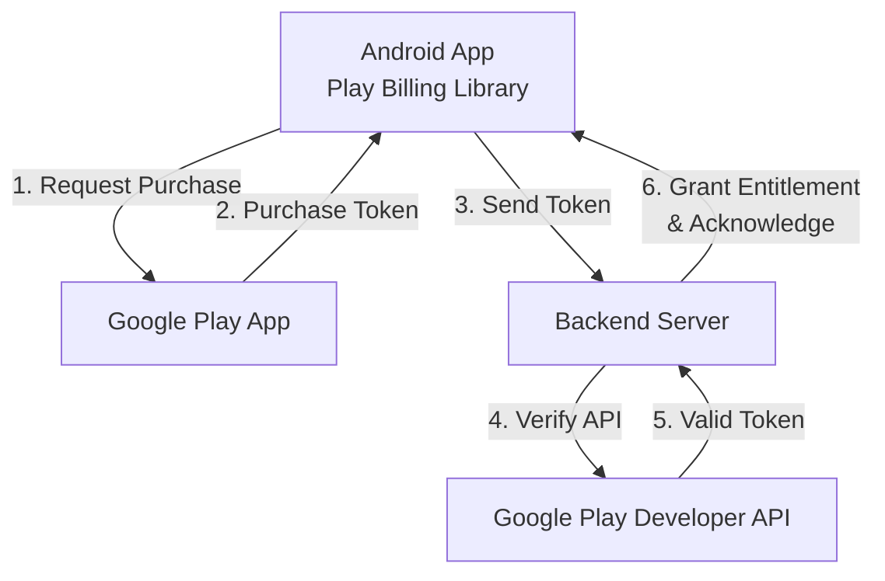

## 인앱 결제 (Google Play Billing)
**Purpose Statement**: Google Play Billing 라이브러리를 통해 인앱 상품과 구독을 판매하고, 구매 상태를 안전하게 검증 및 관리하는 전체 과정을 조망한다.

### 1. 이 주제를 읽기 전에
- Google Play Console 계정과 앱 서명 방식
- 앱 배포 및 서명 구조
- 백엔드 서버와의 API 연동 및 보안 통신

### 2. 전체 조망도

### 3. 하위 개념 및 원자 노트 합성

**Play Billing Library 필수 사용**
Android 앱에서 디지털 콘텐츠를 판매하기 위해선 반드시 Google Play Billing Library를 사용해야 합니다. 다른 우회 결제 수단을 제공하는 것은 정책 위반입니다.
- [Play Billing Library is the only approved in-app purchase path](../../03_packaging_deployment/distribution/billing-contracts/play-billing-library-is-the-only-approved-in-app-purchase-path.md)

**제품 및 구독의 수명 주기**
일회성 상품(In-app Products)과 정기 결제(Subscriptions)는 서로 다른 상태 및 수명 주기를 가집니다. 구독은 갱신, 취소, 유예 상태 등을 추적해야 합니다.
- [Product and subscription purchases have different lifecycles](../../03_packaging_deployment/distribution/billing-contracts/product-and-subscription-purchases-have-different-lifecycles.md)

**서버 측 검증 필수**
클라이언트에서 받은 구매 결과는 조작될 수 있으므로, 반드시 보안 백엔드 서버를 통해 Google Play Developer API와 통신하여 Purchase Token을 검증해야 합니다.
- [Server-side purchase token verification is required, not client judgment](../../03_packaging_deployment/distribution/billing-contracts/server-side-purchase-token-verification-is-required-not-client-judgment.md)

**구매 승인(Acknowledge)의 중요성**
결제 완료 후 3일 이내에 앱 또는 서버에서 구매 승인(Acknowledge)을 하지 않으면, 결제가 자동으로 환불되고 사용자의 권한이 회수됩니다.
- [Unacknowledged purchases are refunded within three days](../../03_packaging_deployment/distribution/billing-contracts/unacknowledged-purchases-are-refunded-within-three-days.md)

### 4. 이 주제와 연결된 Worked Example
- [08 Signed Artifact through Play Delivery to Update](../worked-examples/08-signed-artifact-through-play-delivery-to-update.md) (결제 및 배포 파이프라인 연관)

### 5. 이 주제와 연결된 Diagnostic Runbook
- [05 Background Work Delayed or Not Running](../diagnostic-runbooks/05-background-work-delayed-or-not-running.md) (서버 간 결제 상태 동기화 실패 시)
- [08 Install Update Failure](../diagnostic-runbooks/08-install-update-failure.md)

### 6. 더 깊이 들어갈 때 (Learning Spine)
- [03 Source to Installed Package](../learning-spine/03-source-to-installed-package.md) (Play Store 정책과 연관)
- [08 Data Storage Network and Offline Recovery](../learning-spine/08-data-storage-network-and-offline-recovery.md) (결제 내역의 안전한 로컬/서버 동기화)
- [09 Identity Permission and Independent Security Gates](../learning-spine/09-identity-permission-and-independent-security-gates.md) (위변조 방지와 검증 모델)
