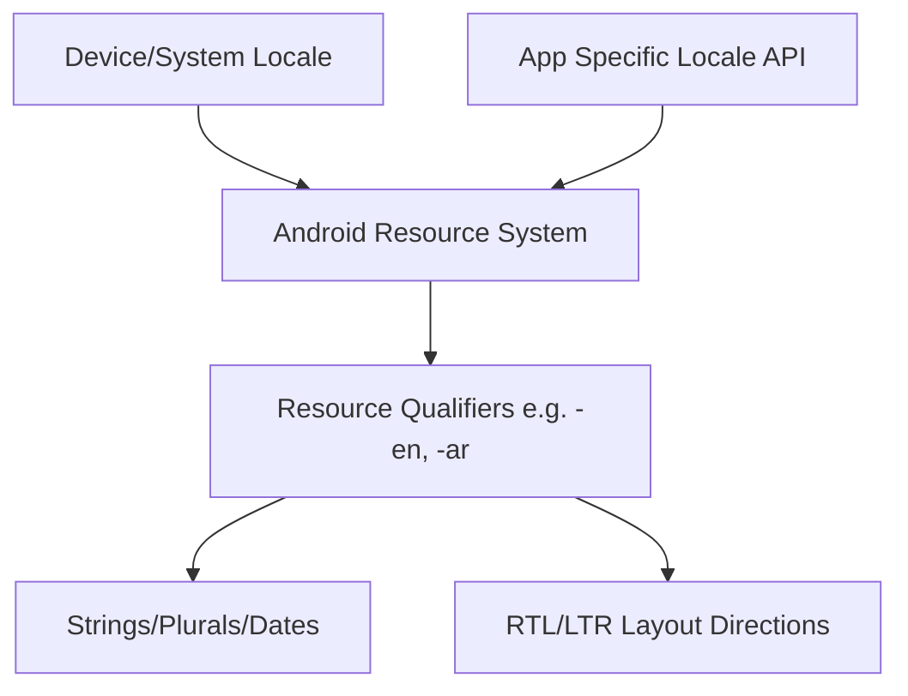

## G10 · 지역화(Localization)와 RTL 레이아웃 대응

> **이 문서의 목적**: Android 앱이 전 세계 다양한 언어와 문화권 사용자를 위해 제공하는 다국어 지원, 리소스 분기 처리, 그리고 우측에서 좌측으로 읽는(RTL) 텍스트 및 레이아웃 처리 방식을 종합한다.

### 1. 이 주제를 읽기 전에
- **사전 지식**: 안드로이드 리소스 폴더 구조, `strings.xml`, `dp` 및 레이아웃 시스템.
- **연관 주제**: 접근성(Accessibility), 사용자 설정 저장, UI 디자인 가이드라인.

### 2. 전체 조망도

### 3. 리소스 한정자와 RTL 처리의 계약

안드로이드의 리소스 식별자 시스템은 현재 기기 상태와 언어 설정에 맞춰 가장 적합한 텍스트와 UI 요소를 자동으로 선택한다. 앱 단위 언어 설정(Per-app language)과 RTL 레이아웃 미러링 규칙을 활용해 일관된 다국어 사용자 경험을 설계해야 한다.

- [리소스 한정자(Resource Qualifiers)는 런타임 로케일에 따라 문자열을 선택함](../../02_app_framework/ui/system/localization-contracts/resource-qualifiers-select-strings-by-runtime-locale.md): `-en`, `-ko` 등의 폴더 구조를 통해 기기의 언어 설정에 따라 올바른 텍스트와 자산을 제공하는 기본 메커니즘을 정의합니다.
- [앱별 언어 설정(setApplicationLocales)은 시스템 로케일을 무시함](../../02_app_framework/ui/system/localization-contracts/per-app-language-with-setapplicationlocales-overrides-system-locale.md): 기기의 기본 언어와 독립적으로 특정 앱에만 다른 언어를 적용할 수 있도록 지원하는 Android 13 이상(및 하위 호환)의 설정을 다룹니다.
- [RTL 미러링은 start/end에 대해 자동이지만 아이콘은 수동 처리됨](../../02_app_framework/ui/system/localization-contracts/rtl-mirroring-is-automatic-for-start-end-but-manual-for-icons.md): 좌우 여백과 배치는 `start`/`end` 속성으로 자동 반전되지만, 벡터 드로어블의 방향성은 명시적으로 반전 속성을 선언해야 함을 설명합니다.

### 4. 이 주제와 연결된 Worked Example
- [07 Compose Jank From UI State to SurfaceFlinger](../worked-examples/07-compose-jank-from-ui-state-to-surfaceflinger.md)

### 5. 이 주제와 연결된 Diagnostic Runbook
- [07 Jank Dropped Frames](../diagnostic-runbooks/07-jank-dropped-frames.md)

### 6. 더 깊이 들어갈 때 (Learning Spine)
- [07 Input Resource Selection and Display Frame](../learning-spine/07-input-resource-selection-and-display-frame.md)
- [12 Compatibility Update and Form Factor](../learning-spine/12-compatibility-update-and-form-factor.md)
