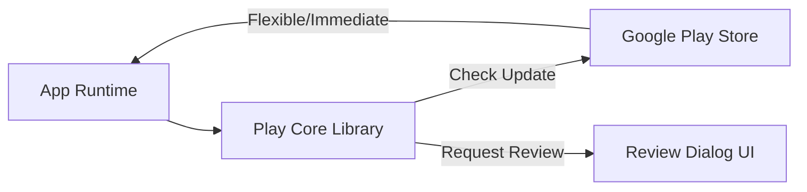

## G11 · Play Core 서비스와 배포 및 리뷰 관리

> **이 문서의 목적**: 사용자가 앱 스토어를 방문하지 않고도 앱 내에서 최신 버전으로 업데이트하거나 리뷰를 남길 수 있도록 돕는 Google Play Core 기능의 설계와 동작 방식을 종합한다.

### 1. 이 주제를 읽기 전에
- **사전 지식**: Google Play Console 배포, 앱 버전 코드 관리, AAB 패키징.
- **연관 주제**: 출시 트랙 관리, Play App Signing.

### 2. 전체 조망도

### 3. 앱 내 업데이트와 리뷰의 할당량 제어

In-App Update와 In-App Review는 사용자 경험을 방해하지 않고 적절한 시점에 최신 버전을 유도하거나 피드백을 수집하는 데 중요한 역할을 한다. 각 기능은 Play Store의 할당량 정책과 사용자 방해 방지 규칙에 의해 엄격하게 제한된다.

- [인앱 업데이트의 유연한(Flexible) 흐름과 즉각적인(Immediate) 흐름은 차단 방식이 다름](../../03_packaging_deployment/distribution/release/in-app-update-flows.md): 백그라운드 다운로드를 허용하는 방식과 필수 업데이트를 위해 앱 사용을 완전히 차단하는 방식의 차이점을 정의합니다.
- [인앱 리뷰 API는 리뷰를 요청할 뿐 보장하지 않음](../../03_packaging_deployment/distribution/release/in-app-review-api.md): 사용자에게 리뷰 창을 띄울지 여부는 시스템의 내부 할당량과 알고리즘이 결정하며, 개발자가 호출을 강제할 수 없음을 이해합니다.
- [Play app signing은 업로드 키와 앱 서명 키를 분리한다](../../03_packaging_deployment/distribution/release/play-app-signing.md): Play Core 기능이 제대로 동작하기 위해 필요한 분할 배포(Dynamic Delivery) 모델과 App Bundle 구조를 설명합니다.
- [앱 업데이트는 애플리케이션 ID, 버전 코드 및 서명 호환성을 요구함](../../03_packaging_deployment/distribution/release/app-update-compatibility.md): 배포와 업데이트가 성공하기 위한 패키지 서명 및 버전 정책의 무결성을 보장하는 규칙을 정의합니다.

### 4. 이 주제와 연결된 Worked Example
- [08 Signed Artifact Through Play Delivery to Update](../worked-examples/08-signed-artifact-through-play-delivery-to-update.md)

### 5. 이 주제와 연결된 Diagnostic Runbook
- [08 Install Update Failure](../diagnostic-runbooks/08-install-update-failure.md)

### 6. 더 깊이 들어갈 때 (Learning Spine)
- [03 Source to Installed Package](../learning-spine/03-source-to-installed-package.md)
- [12 Compatibility Update and Form Factor](../learning-spine/12-compatibility-update-and-form-factor.md)
