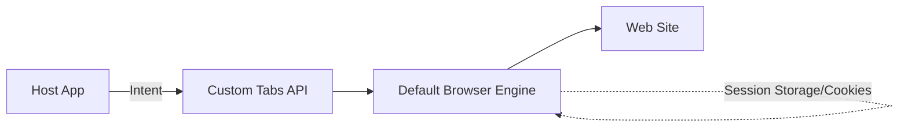

## G12 · Custom Tabs와 브라우저 통합 탐색

> **이 문서의 목적**: 앱 내부에서 안전하게 웹 컨텐츠를 렌더링하면서 사용자의 브라우저 세션(쿠키, 자동완성)을 공유할 수 있도록 지원하는 Custom Tabs의 동작 원리와 WebView와의 차이점을 종합한다.

### 1. 이 주제를 읽기 전에
- **사전 지식**: WebView, Intent 통신, 브라우저 세션(Cookie).
- **연관 주제**: 외부 앱 연동, Deep Link, OAuth 인증 흐름.

### 2. 전체 조망도

### 3. Custom Tabs와 WebView의 신뢰 경계

Custom Tabs는 앱의 프로세스를 벗어나 기본 브라우저의 신뢰 경계 안에서 웹 페이지를 띄운다. 이를 통해 비밀번호 자동 완성, 로그인 세션 공유 등 브라우저 고유의 보안과 편의성을 앱 내부 경험처럼 제공할 수 있다.

- [Custom Tabs는 앱 WebView 프로세스가 아닌 브라우저 신뢰 경계를 공유함](../../02_app_framework/navigation/custom-tabs/custom-tabs-contracts/custom-tabs-share-browser-trust-boundary-instead-of-app-webview-process.md): WebView가 앱 내부에 격리된 샌드박스라면, Custom Tabs는 시스템 브라우저의 엔진과 세션을 그대로 활용하여 보안 인증과 사용자 경험을 향상시킨다는 차이를 설명합니다.

### 4. 이 주제와 연결된 Worked Example
- [03 Deep Link to Correct Task and Screen State](../worked-examples/03-deep-link-to-correct-task-and-screen-state.md)

### 5. 이 주제와 연결된 Diagnostic Runbook
- [04 Permission Denial](../diagnostic-runbooks/04-permission-denial.md)

### 6. 더 깊이 들어갈 때 (Learning Spine)
- [05 Independent Lifetimes of Screen Process Task and State](../learning-spine/05-independent-lifetimes-of-screen-process-task-and-state.md)
- [09 Identity Permission and Independent Security Gates](../learning-spine/09-identity-permission-and-independent-security-gates.md)
