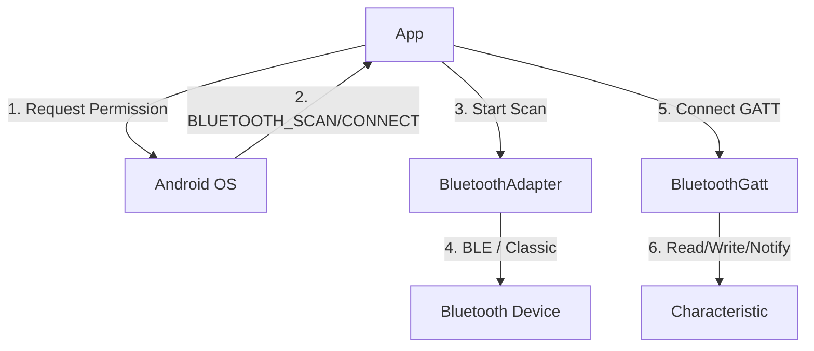

## G2 · Bluetooth Classic·BLE

> **이 문서의 목적**: Android 시스템에서 Bluetooth Classic과 BLE(Bluetooth Low Energy)의 차이를 이해하고, 스캔, 연결, 통신에 이르는 하드웨어 제어 및 권한 관리를 파악한다.

### 1. 이 주제를 읽기 전에
- Android 위치 권한과 하드웨어 스캔의 관계
- 백그라운드 실행 제한과 배터리 관리
- 비동기 콜백 기반의 하드웨어 통신 패턴

### 2. 전체 조망도

### 3. Bluetooth 통신의 권한과 배터리 제약

**Bluetooth 권한의 변화 (Android 12+)**
과거에는 Bluetooth 스캔을 위해 위치 권한이 필요했으나, Android 12부터는 물리적 위치를 유추하지 않는 한 새로운 런타임 권한(`BLUETOOTH_SCAN`, `BLUETOOTH_CONNECT`)으로 대체할 수 있다.
- [Android 12 Bluetooth runtime permissions conditionally replace location permission](../../04_system_services/device-capabilities/bluetooth/android-12-bluetooth-runtime-permissions-conditionally-replace-location-permission.md)

**배터리 제약과 BLE 스캔 필터**
백그라운드에서 진행되는 무분별한 BLE 스캔은 배터리를 급격히 소모하므로, OS는 Scan Filter가 없는 백그라운드 스캔을 엄격히 차단하거나 지연시킨다.
- [BLE background scanning is battery-constrained and needs scan filters](../../04_system_services/device-capabilities/bluetooth/ble-background-scanning-is-battery-constrained-and-needs-scan-filters.md)

**Classic vs BLE (GATT)**
대용량 데이터 스트리밍(오디오 등)에 적합한 Bluetooth Classic과, 간헐적인 소량 데이터 전송에 특화된 BLE(GATT 기반 구조)는 전혀 다른 연결 모델을 가진다.
- [Bluetooth Classic and BLE GATT are different connection models](../../04_system_services/device-capabilities/bluetooth/bluetooth-classic-and-ble-gatt-are-different-connection-models.md)

**GATT 콜백 상태 머신 관리**
BLE 통신에서 `BluetoothGattCallback`은 비동기적이고 순차적으로 동작한다. 연결 상태, 서비스 발견, 읽기/쓰기 완료 등을 추적하는 명시적인 상태 머신(State Machine)이 필수다.
- [BluetoothGatt callback connection needs an explicit state machine](../../04_system_services/device-capabilities/bluetooth/bluetoothgatt-callback-connection-needs-an-explicit-state-machine.md)

### 4. 이 주제와 연결된 Worked Example
- [05 Process Death Recovery of Edit State and Background Work](../worked-examples/05-process-death-recovery-of-edit-state-and-background-work.md) (백그라운드 스캔 중단 방지)
- [06 Permission Granted But API Fails](../worked-examples/06-permission-granted-but-api-fails.md) (Bluetooth 권한 및 위치 서비스 꺼짐 이슈)

### 5. 이 주제와 연결된 Diagnostic Runbook
- [04 Permission Denial](../diagnostic-runbooks/04-permission-denial.md) (Android 12+ 블루투스 권한 대응)
- [05 Background Work Delayed or Not Running](../diagnostic-runbooks/05-background-work-delayed-or-not-running.md) (백그라운드 스캔 제한)

### 6. 더 깊이 들어갈 때 (Learning Spine)
- [09 Identity Permission and Independent Security Gates](../learning-spine/09-identity-permission-and-independent-security-gates.md) (블루투스 권한과 사용자 프라이버시)
- [10 Device Capability Discovery and Background Execution](../learning-spine/10-device-capability-discovery-and-background-execution.md) (하드웨어 기능 의존성과 배터리 제약)
