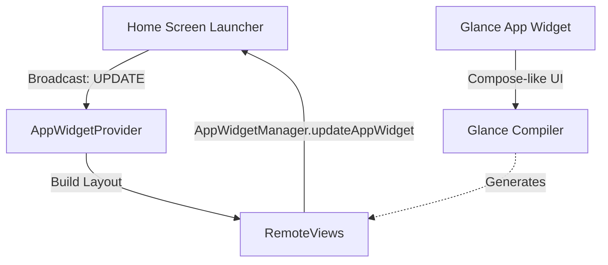

## App Widget과 Glance
**Purpose Statement**: 홈 스크린에 제공되는 App Widget의 수명 주기, RemoteViews의 렌더링 한계, 그리고 이를 Compose 스타일로 추상화한 Glance 프레임워크를 이해한다.

### 1. 이 주제를 읽기 전에
- BroadcastReceiver의 수명 주기
- Android UI 스레드와 백그라운드 제약
- Jetpack Compose 선언형 UI 패러다임

### 2. 전체 조망도

### 3. 하위 개념 및 원자 노트 합성

**AppWidgetProvider는 BroadcastReceiver다**
위젯 컴포넌트(`AppWidgetProvider`)는 상주하는 프로세스가 아니라 인텐트 발생 시 잠깐 깨어나는 BroadcastReceiver 기반이므로, 오래 걸리는 작업은 WorkManager 등으로 위임해야 합니다.
- [AppWidgetProvider lifecycle runs through broadcasts, not a persistent process](../../02_app_framework/app-widgets/app-widget-contracts/appwidgetprovider-lifecycle-runs-through-broadcasts-not-a-persistent-process.md)

**위젯 설정 화면 (Configuration Activity)**
사용자가 홈 스크린에 위젯을 핀(Pin)할 때 단 한 번 실행되어 초기 환경(색상, 타겟 데이터 등)을 세팅하는 Configuration Activity를 제공할 수 있습니다.
- [Widget configuration Activity runs once at pin time](../../02_app_framework/app-widgets/app-widget-contracts/widget-configuration-activity-runs-once-at-pin-time.md)

**RemoteViews의 태생적 한계**
위젯 UI는 홈 화면(Launcher)의 프로세스에서 렌더링되므로, Custom View를 사용할 수 없으며 시스템이 허용한 일부 뷰(TextView, ImageView 등) 패밀리만 직렬화된 `RemoteViews`로 전달해야 합니다.
- [RemoteViews restricts widget layouts to a fixed View subset](../../02_app_framework/app-widgets/app-widget-contracts/remoteviews-restricts-widget-layouts-to-a-fixed-view-subset.md)

**Glance의 역할**
Jetpack Glance는 Compose의 문법을 위젯 작성에 사용할 수 있게 해주지만, 내부적으로는 여전히 `RemoteViews`로 번역되므로 Compose UI의 모든 기능(애니메이션 등)이 지원되지는 않습니다.
- [Glance renders App Widgets through RemoteViews, not Compose UI](../../02_app_framework/app-widgets/app-widget-contracts/glance-renders-app-widgets-through-remoteviews-not-compose-ui.md)

**최소 업데이트 주기의 한계**
`updatePeriodMillis` 속성은 시스템 배터리 관리를 위해 보통 최소 30분 주기로 제한되며, 보장된 정확한 실행 타이머가 아니라 'Best-effort' 주기로 동작합니다.
- [updatePeriodMillis is a best-effort minimum interval, not a guarantee](../../02_app_framework/app-widgets/app-widget-contracts/updateperiodmillis-is-a-best-effort-minimum-interval-not-a-guarantee.md)

### 4. 이 주제와 연결된 Worked Example
- [01 App Icon Tap to First Frame](../worked-examples/01-app-icon-tap-to-first-frame.md) (런처와 프로세스 상호작용)
- [03 Deep Link to Correct Task and Screen State](../worked-examples/03-deep-link-to-correct-task-and-screen-state.md) (위젯 클릭 시 앱 네비게이션)

### 5. 이 주제와 연결된 Diagnostic Runbook
- [03 Process Death State Loss](../diagnostic-runbooks/03-process-death-state-loss.md) (Receiver 종료 후 작업 유실)
- [05 Background Work Delayed or Not Running](../diagnostic-runbooks/05-background-work-delayed-or-not-running.md) (위젯 갱신 주기 지연)

### 6. 더 깊이 들어갈 때 (Learning Spine)
- [04 Manifest to Component Execution](../learning-spine/04-manifest-to-component-execution.md) (BroadcastReceiver 선언과 실행 모델)
- [06 Main Thread Binder Coroutine and Durable Work Lifetime](../learning-spine/06-main-thread-binder-coroutine-and-durable-work-lifetime.md) (짧은 생명주기에서의 작업 위임)
