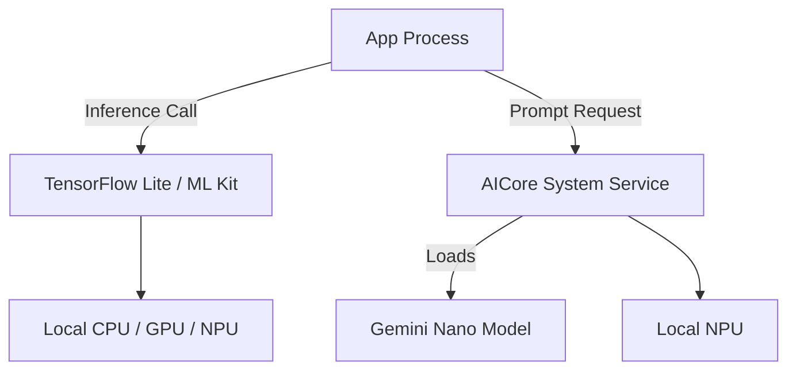

## G4 · 온디바이스 AI/ML (ML Kit, TFLite, AICore)

> **이 문서의 목적**: 네트워크 연결 없이 디바이스 내에서 AI/ML 추론을 수행하는 방법론과, 시스템 서비스인 AICore 및 TFLite의 구조적 특징을 이해한다.

### 1. 이 주제를 읽기 전에
- 안드로이드 시스템 메모리 제약과 NDK/GPU 활용
- 네트워크 레이턴시와 오프라인 동작
- Play Services와 ML Kit 배포 모델

### 2. 전체 조망도

### 3. 오프라인 추론과 시스템 모델 공유

**네트워크 통신 없는 오프라인 추론**
온디바이스 AI는 데이터가 기기 외부로 유출되지 않으므로 프라이버시가 보호되며, 네트워크 대기 시간이 없어 실시간 피드백(카메라 렌즈 분석 등)이 가능하다.
- [On-device inference skips the network round-trip cloud inference needs](../../04_system_services/device-capabilities/on-device-ai-contracts/on-device-inference-skips-the-network-round-trip-cloud-inference-needs.md)

**AICore와 공유 시스템 모델 (Gemini Nano)**
개별 앱이 거대한 파운데이션 모델을 직접 포함(Bundle)하면 APK 크기가 비대해집니다. Android 14+의 AICore는 시스템 수준에서 Gemini Nano 모델을 관리하고 앱들에게 API를 통해 공유합니다.
- [AICore manages Gemini Nano as a shared system model, not a bundled asset](../../04_system_services/device-capabilities/on-device-ai-contracts/aicore-manages-gemini-nano-as-a-shared-system-model-not-a-bundled-asset.md)

**기능 가용성 (Availability) 검사 필수**
모든 안드로이드 기기가 NPU를 갖추고 있거나 시스템 AI 모델을 다운로드해 둔 것은 아니다. 따라서 On-device API를 호출하기 전에 하드웨어 지원 여부와 모델 가용성을 먼저 확인하고 다운로드를 트리거해야 한다.
- [On-device AI feature availability must be checked before use](../../04_system_services/device-capabilities/on-device-ai-contracts/on-device-ai-feature-availability-must-be-checked-before-use.md)

### 4. 이 주제와 연결된 Worked Example
- [02 Photo Capture Preview Save Upload](../worked-examples/02-photo-capture-preview-save-upload.md) (카메라 프레임과 실시간 ML Vision 분석)
- [05 Process Death Recovery of Edit State and Background Work](../worked-examples/05-process-death-recovery-of-edit-state-and-background-work.md) (백그라운드에서의 긴 추론 작업)

### 5. 이 주제와 연결된 Diagnostic Runbook
- [07 Jank Dropped Frames](../diagnostic-runbooks/07-jank-dropped-frames.md) (Main Thread에서 무거운 ML 모델 추론 시)
- [02 ANR](../diagnostic-runbooks/02-anr.md)

### 6. 더 깊이 들어갈 때 (Learning Spine)
- [10 Device Capability Discovery and Background Execution](../learning-spine/10-device-capability-discovery-and-background-execution.md) (하드웨어 능력 탐색)
- [09 Identity Permission and Independent Security Gates](../learning-spine/09-identity-permission-and-independent-security-gates.md) (사용자 데이터의 프라이버시 보존 로컬 처리)
