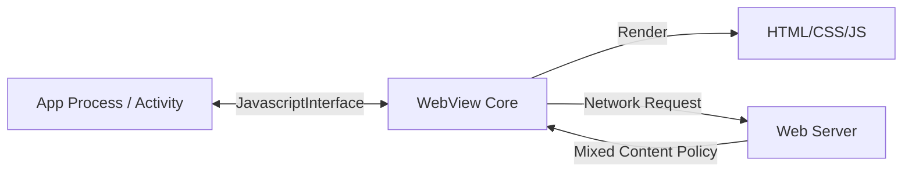

## G5 · WebView

> **이 문서의 목적**: 웹 콘텐츠를 앱 내부에 통합하는 WebView의 프로세스 구조, 네이티브-웹 간 통신 브릿지, 그리고 보안 정책을 이해한다.

### 1. 이 주제를 읽기 전에
- Android 보안 샌드박스와 권한 모델
- Activity 생명주기와 메모리 누수 방지
- HTTPS와 네트워크 보안(Cleartext Traffic)

### 2. 전체 조망도

### 3. 웹뷰의 보안 격리와 수명주기

**Untrusted 웹 콘텐츠와 앱 프로세스**
WebView는 외부의 신뢰할 수 없는 웹 페이지를 로드하여 앱의 권한 프로세스 안에서 실행한다. 따라서 WebSandbox(멀티프로세스 모드) 등으로 격리하고, 잠재적인 XSS 등으로부터 네이티브 환경을 보호해야 한다.
- [WebView runs untrusted web content inside the trusted app process](../../02_app_framework/ui/system/webview/webview-runs-untrusted-web-content-inside-the-trusted-app-process.md)

**JavaScript Interface의 노출 제한**
웹에서 네이티브 코드를 호출할 수 있게 해주는 `addJavascriptInterface`는 `@JavascriptInterface` 어노테이션이 붙은 메서드만 노출하도록 제한하여, 웹 스크립트가 리플렉션을 통해 네이티브 객체를 장악하는 취약점을 방지한다.
- [addJavascriptInterface exposes only annotated methods to web content](../../02_app_framework/ui/system/webview/addjavascriptinterface-exposes-only-annotated-methods-to-web-content.md)

**Activity와 다른 WebView의 소멸 주기**
WebView 엔진 자체는 Activity보다 무겁고 비동기적으로 동작하기 때문에, Activity가 파괴될 때 명시적으로 `WebView.destroy()`를 호출하여 엔진 리소스와 백그라운드 타이머 등을 해제해야 메모리 누수가 발생하지 않는다.
- [WebView destroy lifecycle differs from Activity](../../02_app_framework/ui/system/webview/webview-destroy-lifecycle-differs-from-activity.md)

**안전 브라우징 및 Mixed Content 정책**
HTTPS 페이지 안에서 HTTP 리소스를 로딩하는 Mixed Content는 최신 WebView에서 기본적으로 차단되며, WebView 역시 Chrome의 세이프 브라우징 목록에 의존하여 악성 사이트를 필터링한다.
- [WebView HTTPS mixed content and safe browsing policy](../../02_app_framework/ui/system/webview/webview-https-mixed-content-and-safe-browsing-policy.md)

### 4. 이 주제와 연결된 Worked Example
- [03 Deep Link to Correct Task and Screen State](../worked-examples/03-deep-link-to-correct-task-and-screen-state.md) (웹뷰와 앱 간 딥링크 전환)
- [01 App Icon Tap to First Frame](../worked-examples/01-app-icon-tap-to-first-frame.md) (초기 로딩 지연)

### 5. 이 주제와 연결된 Diagnostic Runbook
- [03 Process Death State Loss](../diagnostic-runbooks/03-process-death-state-loss.md) (웹뷰 상태 복원 실패)
- [04 Permission Denial](../diagnostic-runbooks/04-permission-denial.md) (웹뷰 내 위치나 마이크 권한 요청 처리)

### 6. 더 깊이 들어갈 때 (Learning Spine)
- [09 Identity Permission and Independent Security Gates](../learning-spine/09-identity-permission-and-independent-security-gates.md) (Network Security Config와 웹뷰 보안)
- [05 Independent Lifetimes of Screen Process Task and State](../learning-spine/05-independent-lifetimes-of-screen-process-task-and-state.md) (WebView 엔진의 독립적 수명주기)
